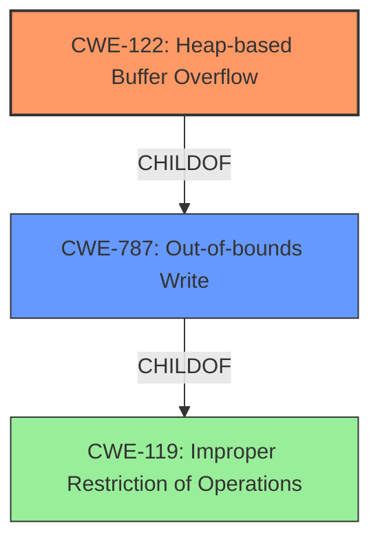

# Analysis Report for CVE-2021-45932

# Vulnerability Analysis Report: CVE-2021-45932

## Description

wolfSSL wolfMQTT 1.9 has a heap-based buffer overflow (4 bytes) in MqttDecode_Publish (called from MqttClient_DecodePacket and MqttClient_HandlePacket).

## Vulnerability Description Key Phrases

**Weakness:** heap-based buffer overflow
**Product:** wolfSSL wolfMQTT
**Version:** 1.9
**Component:** MqttDecode_Publish

## Analysis (with Relationship Data)

# Summary
| CWE ID | CWE Name | Confidence | CWE Abstraction Level | CWE Vulnerability Mapping Label | CWE-Vulnerability Mapping Notes |
|---|---|---|---|---|---|
| CWE-122 | Heap-based Buffer Overflow | 0.95 | Variant | Primary | Allowed |
| CWE-787 | Out-of-bounds Write | 0.70 | Base | Secondary | Allowed |

## Evidence and Confidence

*   **Confidence Score:** 0.90
*   **Evidence Strength:** HIGH

- **Analysis and Justification:**  
  - *Explanation:* The vulnerability description clearly states a "**heap-based buffer overflow**" in the wolfMQTT library. CWE-122 (Heap-based Buffer Overflow) is a Variant-level CWE that directly addresses this type of vulnerability. The description specifies that the overflow is 4 bytes in `MqttDecode_Publish`, confirming a write beyond the allocated buffer on the heap. While CWE-787 (Out-of-bounds Write) is a more general term, CWE-122 is more specific to the heap, making it a better fit. The CVE reference summary also lists "**heap-based buffer overflow**", further strengthening the association. CWE-787 is a possible, but less specific, secondary weakness. The MITRE mapping guidance for CWE-122 indicates it is ALLOWED for heap-based buffer overflows.

  - *Relationship Analysis:* CWE-122 is a variant of CWE-119 (Improper Restriction of Operations within the Bounds of a Memory Buffer), which is a more general class. CWE-122 is also a parent of more specific buffer overflow variants (although none are particularly relevant here). CWE-787 is the parent of CWE-122, but CWE-122 is selected because it is more specific. CWE-787 can also be considered a secondary weakness, and might be present alongside the primary weakness because the write is happening out of bounds.

- **Confidence Score:**  
  - *Example:* Confidence: 0.95 (High evidence from the vulnerability description and CVE reference materials)

---

## Criticism of Analysis

Okay, I've reviewed the provided CWE analysis and will provide a critique, paying close attention to mapping guidance, mitigations, and the overall justification for the chosen CWEs.

**Overall Assessment:**

The primary CWE assignment of **CWE-122 (Heap-based Buffer Overflow)** is well-justified and appropriate. The analysis provides strong evidence based on the vulnerability description. The secondary CWE of **CWE-787 (Out-of-bounds Write)** is also reasonable, though less specific. The confidence scores are justified.

**Detailed Critique:**

**1. CWE-122: Heap-based Buffer Overflow (Primary)**

*   **Justification:** The analysis correctly identifies the key phrase "**heap-based buffer overflow**" in the original description.  The evidence strength is high because the primary description and CVE summary point to this.  The justification that CWE-122 is more specific than CWE-787 is accurate.
*   **CWE Specification Alignment:** The "Description" section of CWE-122 directly matches the observed vulnerability: "A heap overflow condition is a buffer overflow, where the buffer that can be overwritten is allocated in the heap portion of memory." The "Usage: Allowed" mapping guidance is also followed correctly.
*   **Mitigations:** The analysis does not specifically discuss mitigations, but it's not required to do so. The CWE-122 specification suggests:
    *   Using a language/compiler with automatic bounds checking.
    *   Using abstraction libraries.
    *   Using compiler-based buffer overflow detection mechanisms (e.g., /GS flag, FORTIFY_SOURCE).  These are all relevant to preventing heap-based buffer overflows in C/C++.
*   **Relationships:** The analysis correctly notes the parent-child relationship between CWE-122, CWE-787, and CWE-119. It correctly chooses the most specific applicable CWE.
*   **Confidence:** The confidence score of 0.95 is justified, given the clear wording in the vulnerability description.

**2. CWE-787: Out-of-bounds Write (Secondary)**

*   **Justification:** The analysis correctly identifies that the heap-based buffer overflow inherently involves writing data outside the boundaries of the allocated buffer.  It's a valid, though less precise, characterization of the vulnerability.
*   **CWE Specification Alignment:** The "Description" of CWE-787, "The product writes data past the end, or before the beginning, of the intended buffer," aligns with what's happening. The "Usage: Allowed" mapping guidance is also correctly followed.
*   **Mitigations:**  The CWE-787 specification lists largely the same mitigations as CWE-122 (language selection, libraries, compiler protections).
*   **Relationships:**  The analysis notes the parent-child relationship between CWE-787 and CWE-122 and explains why CWE-122 was preferred.
*   **Confidence:** The 0.70 confidence score is appropriate. It reflects that while this CWE is relevant, it's less specific and therefore a less direct match than CWE-122.

**3. Retriever Results Analysis**
The Retriever Results Section is interesting, but I think the analysis provided correctly overrides it. Let's take a look at some of the higher ranked CWEs and why they're not appropriate, or at least less appropriate:

*   **CWE-190: Integer Overflow or Wraparound:** While integer overflows can *lead* to buffer overflows (by causing an incorrect buffer size calculation), there's no direct indication of an integer overflow being the root cause in the provided information.  Therefore, it's less directly relevant.
*   **CWE-193: Off-by-one Error:** This *could* be a contributing factor if the buffer overflow is due to a calculation that's off by one. However, it's speculative without more detail.
*   **CWE-131: Incorrect Calculation of Buffer Size:** Similar to CWE-190, this *could* be related, but the description doesn't say anything about the cause being an incorrect calculation of the buffer size.
*   **CWE-126: Buffer Over-read:** The vulnerability is focused on the out-of-bounds *write*, not a read.
*   **CWE-120: Buffer Copy without Checking Size of Input ('Classic Buffer Overflow'):** This is *similar* to CWE-122 but lacks the specificity of it happening on the heap. This Retriever Result is valid, because the software could be copying the buffer without checking its size.

**Recommendations:**

*   **Consider Root Cause:** While the analysis focuses on the direct vulnerability (heap-based buffer overflow), it might be beneficial to speculate on potential *root causes* if more information were available. For example:
    *   Was there missing or insufficient input validation (CWE-20) that allowed a size parameter to be larger than expected, leading to the overflow?
    *   Was there an integer overflow (CWE-190) in calculating the required buffer size?
    *   Was there an off-by-one error (CWE-193) in determining the buffer size or the number of bytes to copy?
    *   Was there an incorrect conversion between numeric types(CWE-681) that led to memory corruption (CWE-122)?
    Adding these as *tertiary* CWEs with very low confidence scores (e.g., 0.1 or 0.2) would be a reasonable extension, but should be explicitly identified as speculative.
*   **Mitigation Discussion:** While not strictly required, briefly mentioning potential mitigations from the CWE specification would enhance the analysis. This could be as simple as adding a sentence like, "Mitigations for CWE-122 include using languages with automatic bounds checking or employing compiler-based buffer overflow detection mechanisms."

**In Summary:**

The analysis is strong and correctly identifies the primary vulnerability as a heap-based buffer overflow (CWE-122). The secondary CWE (CWE-787) is also appropriate. The recommendations above are suggestions for further refinement but are not critical. The provided justification, evidence, and confidence scores are all well-supported.

## Final Resolution

# Summary
| CWE ID | CWE Name | Confidence | CWE Abstraction Level | CWE Vulnerability Mapping Label | CWE-Vulnerability Mapping Notes |
|---|---|---|---|---|---|
| CWE-122 | Heap-based Buffer Overflow | 0.95 | Variant | Primary | Allowed |
| CWE-787 | Out-of-bounds Write | 0.70 | Base | Secondary | Allowed |

## Evidence and Confidence

*   **Confidence Score:** 0.93
*   **Evidence Strength:** HIGH

## Relationship Analysis
The primary CWE, CWE-122 (Heap-based Buffer Overflow), is a variant of CWE-119 (Improper Restriction of Operations within the Bounds of a Memory Buffer), indicating a hierarchical relationship where CWE-122 is more specific. CWE-787 (Out-of-bounds Write) is a parent of CWE-122, but CWE-122 is chosen for its specificity. The analysis considers the parent-child relationship and selects the most accurate and descriptive CWE.

## Vulnerability Chain
The vulnerability chain starts with a **heap-based buffer overflow** (**CWE-122**), leading to an **out-of-bounds write** (**CWE-787**). The root cause is likely an unchecked size or length, which allows more data to be written than allocated. This results in memory corruption and potential arbitrary code execution. There is no specific information about what caused the **heap-based buffer overflow** from the provided information, so there are missing links.

## Summary of Analysis
The initial analysis and the criticism both agree that **CWE-122 (Heap-based Buffer Overflow)** is the most appropriate primary classification for the given vulnerability description. The description explicitly states "heap-based buffer overflow," which directly aligns with **CWE-122**. The selection of **CWE-122** is further supported by the high confidence score (0.95) and the allowed mapping guidance.

The secondary classification of **CWE-787 (Out-of-bounds Write)** is also justified, as it describes the general nature of the overflow, even though **CWE-122** provides more specific information.

The retriever results were analyzed and it was determined that other potential CWEs were not as appropriate because they were either too general or did not directly address the **heap-based buffer overflow**.

The final decision is based on a clear match between the vulnerability description and the **CWE-122** description, as well as the understanding of the hierarchical relationship between CWEs. **CWE-122** is at the optimal level of specificity because it precisely describes the type and location of the buffer overflow.

*Report generated on 2025-03-18 04:09:14*
