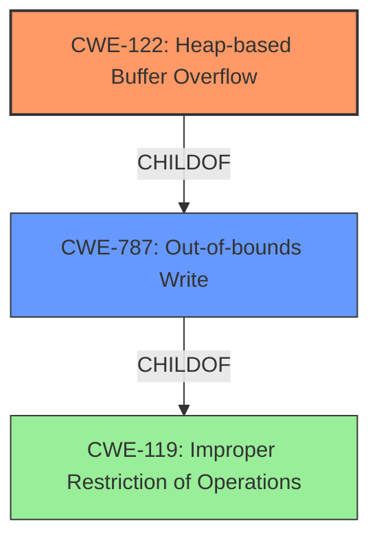

# Final Resolution for CVE-2021-45932

# Summary
| CWE ID | CWE Name | Confidence | CWE Abstraction Level | CWE Vulnerability Mapping Label | CWE-Vulnerability Mapping Notes |
|---|---|---|---|---|---|
| CWE-122 | Heap-based Buffer Overflow | 0.95 | Variant | Primary | Allowed |
| CWE-787 | Out-of-bounds Write | 0.70 | Base | Secondary | Allowed |

## Evidence and Confidence

*   **Confidence Score:** 0.93
*   **Evidence Strength:** HIGH

## Relationship Analysis
The primary CWE, CWE-122 (Heap-based Buffer Overflow), is a variant of CWE-119 (Improper Restriction of Operations within the Bounds of a Memory Buffer), indicating a hierarchical relationship where CWE-122 is more specific. CWE-787 (Out-of-bounds Write) is a parent of CWE-122, but CWE-122 is chosen for its specificity. The analysis considers the parent-child relationship and selects the most accurate and descriptive CWE.

## Vulnerability Chain
The vulnerability chain starts with a **heap-based buffer overflow** (**CWE-122**), leading to an **out-of-bounds write** (**CWE-787**). The root cause is likely an unchecked size or length, which allows more data to be written than allocated. This results in memory corruption and potential arbitrary code execution. There is no specific information about what caused the **heap-based buffer overflow** from the provided information, so there are missing links.

## Summary of Analysis
The initial analysis and the criticism both agree that **CWE-122 (Heap-based Buffer Overflow)** is the most appropriate primary classification for the given vulnerability description. The description explicitly states "heap-based buffer overflow," which directly aligns with **CWE-122**. The selection of **CWE-122** is further supported by the high confidence score (0.95) and the allowed mapping guidance.

The secondary classification of **CWE-787 (Out-of-bounds Write)** is also justified, as it describes the general nature of the overflow, even though **CWE-122** provides more specific information.

The retriever results were analyzed and it was determined that other potential CWEs were not as appropriate because they were either too general or did not directly address the **heap-based buffer overflow**.

The final decision is based on a clear match between the vulnerability description and the **CWE-122** description, as well as the understanding of the hierarchical relationship between CWEs. **CWE-122** is at the optimal level of specificity because it precisely describes the type and location of the buffer overflow.