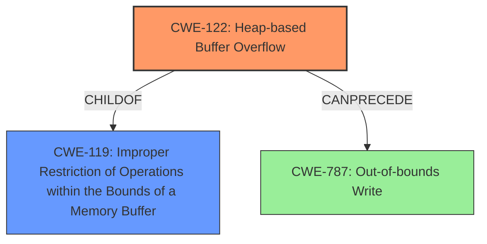

# Final Resolution for CVE-2021-45933

# Summary
| CWE ID | CWE Name | Confidence | CWE Abstraction Level | CWE Vulnerability Mapping Label | CWE-Vulnerability Mapping Notes |
|---|---|---|---|---|---|
| **CWE-122** | **Heap-based Buffer Overflow** | 0.95 | Variant | Allowed | Primary **CWE** |
| **CWE-119** | **Improper Restriction of Operations within the Bounds of a Memory Buffer** | 0.4 | Class | Discouraged | Secondary Candidate |

## Evidence and Confidence

*   **Confidence Score:** 0.95
*   **Evidence Strength:** HIGH

## Relationship Analysis
The primary **CWE** selected is **CWE-122 (Heap-based Buffer Overflow)**, which is a variant of **CWE-119 (Improper Restriction of Operations within the Bounds of a Memory Buffer)**. The analysis correctly identifies that the vulnerability is specifically a heap-based buffer overflow, making **CWE-122** the more precise choice. While **CWE-787 (Out-of-bounds Write)** could also apply, **CWE-122** offers better specificity. The abstraction level influenced the decision as **CWE-122** (Variant) is more specific than **CWE-119** (Class).

## Vulnerability Chain
The vulnerability chain starts with the handling of a crafted MQTT publish packet. A weakness in the `MqttDecode_Publish` function leads to a **heap-based buffer overflow**. This allows writing data beyond the allocated buffer, potentially overwriting adjacent heap metadata or other sensitive data, leading to a potential crash or arbitrary code execution. The root cause is likely in the insufficient bounds checking during the decoding of the MQTT packet, specifically in how the size of the publish packet is handled.

## Summary of Analysis
The initial analysis and criticism both strongly support the selection of **CWE-122 (Heap-based Buffer Overflow)** as the primary **CWE**. The vulnerability description explicitly states a "**heap-based buffer overflow**" occurs in `MqttDecode_Publish`. The CVE Reference Links Content Summary confirms this by stating "Heap-buffer-overflow in `MqttDecode_Publish` function." and includes "**weaknesses**: [Heap-buffer-overflow]". This direct evidence warrants high confidence.

The relationship analysis confirms that **CWE-122** is a specific type of buffer overflow, making it more appropriate than the general **CWE-119**. The mapping guidance supports this decision, as **CWE-122** is at the Variant level and provides a more precise description of the weakness.

The analysis considered other potential **CWEs**, such as integer overflow issues, but the evidence points to the heap overflow as the most direct cause of the vulnerability. The selection of **CWE-122** is at the optimal level of specificity, providing a clear and accurate representation of the vulnerability.