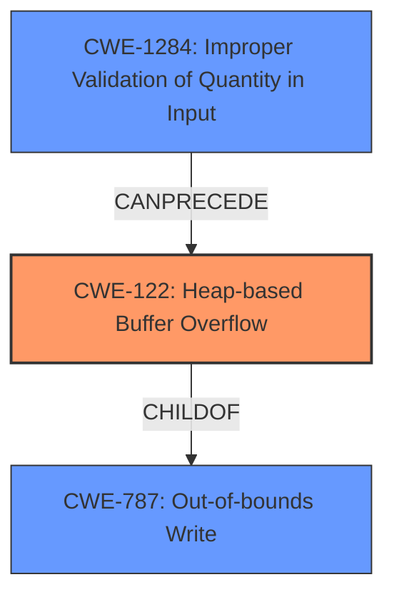

# Analysis Report for CVE-2021-45934

# Vulnerability Analysis Report: CVE-2021-45934

## Description

wolfSSL wolfMQTT 1.9 has a heap-based buffer overflow in MqttClient_DecodePacket (called from MqttClient_HandlePacket and MqttClient_WaitType).

## Vulnerability Description Key Phrases

**Weakness:** heap-based buffer overflow
**Product:** wolfSSL wolfMQTT
**Version:** 1.9
**Component:** MqttClient_DecodePacket

## Analysis (with Relationship Data)

# Summary
| CWE ID | CWE Name | Confidence | CWE Abstraction Level | CWE Vulnerability Mapping Label | CWE-Vulnerability Mapping Notes |
|---|---|---|---|---|---|
| CWE-122 | Heap-based Buffer Overflow | 0.95 | Variant | Allowed | The vulnerability is explicitly described as a heap-based buffer overflow, making this the most accurate primary mapping. |
| CWE-787 | Out-of-bounds Write | 0.75 | Base | Allowed | Heap-based buffer overflows are a type of out-of-bounds write. |
| CWE-125 | Buffer Over-read | 0.60 | Base | Allowed | A read may occur after the write, and is often associated with buffer overflows. |
| CWE-131 | Incorrect Calculation of Buffer Size | 0.50 | Base | Allowed | An incorrect calculation of the buffer size can lead to a buffer overflow if the size is smaller than required. |

## Evidence and Confidence

*   **Confidence Score:** 0.90
*   **Evidence Strength:** HIGH

- **Analysis and Justification:**  
  - *Explanation:* "The vulnerability description explicitly states a **heap-based buffer overflow** in `MqttClient_DecodePacket`. The CVE reference confirms this, highlighting that the **root cause** is a **heap-buffer-overflow**. This aligns directly with CWE-122 (Heap-based Buffer Overflow). Since the vulnerability is specifically located on the heap, CWE-122, a variant of buffer overflows, is more precise than a generic buffer overflow (e.g., CWE-120) or out-of-bounds write (CWE-787). The content summary details that the overflow occurs during MQTT packet decoding due to insufficient bounds checking, potentially leading to arbitrary code execution. MITRE mapping guidance for CWE-122 indicates this is ALLOWED."

  - *Relationship Analysis:* "CWE-122 is a variant of the general buffer overflow weakness CWE-119 (Improper Restriction of Operations within the Bounds of a Memory Buffer). CWE-122 is also related to CWE-787 (Out-of-bounds Write) because a heap-based buffer overflow involves writing data beyond the allocated buffer. Considering the retriever results, CWE-122 has a high density and sparse score, reinforcing its suitability. Other CWEs like CWE-190 (Integer Overflow) and CWE-193 (Off-by-one Error) could contribute to the root cause but are not the primary weakness presented in the description. CWE-125 (Buffer Over-read) is often observed in conjunction with buffer overflows; reading out of bounds may occur after a buffer overflow write."

- **Confidence Score:**  
  - Confidence: 0.95 (Strong evidence from vulnerability description and CVE reference materials)

---

## Criticism of Analysis

Okay, I've reviewed the analysis and the full CWE specifications you provided. Here's my critique:

**Overall Assessment:**

The analysis is generally good and demonstrates a solid understanding of the vulnerability and related CWEs. The primary mapping to CWE-122 (Heap-based Buffer Overflow) is the most accurate and justified. The inclusion of CWE-787 (Out-of-bounds Write) as a secondary mapping is also reasonable. The rationale provided for each CWE selection is thoughtful. However, some of the lower-confidence CWEs (CWE-125 and CWE-131) could benefit from further refinement, especially considering the mapping guidance for CWE-119, the parent of several mentioned.

**Detailed Review of Each CWE Mapping:**

*   **CWE-122: Heap-based Buffer Overflow (Confidence: 0.95)**

    *   **Strengths:** This is the most accurate primary mapping. The vulnerability description explicitly states "heap-based buffer overflow," and the analysis correctly identifies this. The evidence strength is high due to the explicit nature of the vulnerability.
    *   **CWE Specification Alignment:** The analysis aligns well with the CWE-122 description, particularly the mention of memory being allocated on the heap using `malloc()` or similar functions. The variant-level abstraction is correct given the specificity of the heap allocation.
    *   **Areas for Consideration:** None. This mapping is appropriate and well-justified.

*   **CWE-787: Out-of-bounds Write (Confidence: 0.75)**

    *   **Strengths:** A heap-based buffer overflow inherently involves writing data beyond the allocated bounds of a buffer, making this a valid, albeit less specific, mapping.
    *   **CWE Specification Alignment:** The analysis accurately reflects the relationship between CWE-122 and CWE-787 as a child-parent relationship within CWE. The Base-level abstraction is preferred, however, it may be worthwhile to map the *cause* of the out-of-bounds write to a more specific CWE.
    *   **Areas for Consideration:** While valid, this mapping is very general. If more information about *why* the out-of-bounds write occurs is available (e.g., incorrect length calculation), that could lead to a more precise root cause mapping, see below.

*   **CWE-125: Buffer Over-read (Confidence: 0.60)**

    *   **Strengths:** Buffer over-reads often occur with buffer overflows. The retriever results also ranked this highly.
    *   **CWE Specification Alignment:** An over-read may occur as a result of the overflow.
    *   **Areas for Consideration:** The analysis mentions that a read *may* occur after the write. Unless there is strong evidence in the vulnerability details that an over-read is actually happening as a *direct* consequence of the vulnerability, this mapping is speculative and should be lowered in confidence or removed.  While the *potential* for a read exists, the primary action is the out-of-bounds *write*. Unless the documentation or analysis specifically refers to an out-of-bounds *read*, there may be a more accurate CWE to choose, or reduce the confidence.

*   **CWE-131: Incorrect Calculation of Buffer Size (Confidence: 0.50)**

    *   **Strengths:** This is a plausible contributing factor to many buffer overflows.
    *   **CWE Specification Alignment:** An incorrect calculation of the buffer size *can* lead to a buffer overflow.
    *   **Areas for Consideration:** This mapping is weak without more information. There is no specific mention in the vulnerability description that incorrect buffer size calculation is the root cause. The analysis only states, "An incorrect calculation of the buffer size can lead to a buffer overflow if the size is smaller than required." This is a general statement and doesn't directly apply to the evidence. Furthermore, the content summary states "The vulnerability is triggered during packet decoding," which implicates issues with parsing and interpreting the packet contents. If it's not possible to definitively establish that an incorrect buffer size calculation is involved, then this mapping should be removed.

**Recommendations:**

1.  **Refocus on Root Cause:**  While the primary symptom is a heap-based buffer overflow (CWE-122), try to pinpoint the *reason* why the overflow occurs. Is it a lack of bounds checking (Improper Restriction of Operations Within the Bounds of a Memory Buffer)?  Is it related to parsing a length field in the MQTT packet (Improper Handling of Length Parameter Inconsistency), or is it related to integer handling? A more specific cause will lead to a more valuable mapping.
2.  **Strengthen or Remove CWE-125 and CWE-131:** Either find more concrete evidence to support these mappings, or remove them. Speculative mappings reduce the overall accuracy and value of the analysis. Remember, CWE-119 mapping guidance states: *Look at CWE-119's children and consider mapping to CWEs such as CWE-787: Out-of-bounds Write, CWE-125: Out-of-bounds Read, or others*. Following this guidance is a good practice to prevent generic buffer overflow reports.
3.  **Consider Chains:** Explore the possibility of a CWE chain if the root cause is multifaceted. For example, an integer overflow (CWE-190) might lead to an incorrect buffer size calculation (CWE-131), which then leads to a heap-based buffer overflow (CWE-122).
4.  **Mitigations:** Consider that a successful mapping to CWE-131 may help recommend more accurate and useful mitigations.

By focusing on the root cause and providing more concrete evidence for each CWE selection, the analysis will be more precise and actionable.

## Final Resolution

# Summary

| CWE ID | CWE Name | Confidence | CWE Abstraction Level | CWE Vulnerability Mapping Label | CWE-Vulnerability Mapping Notes |
|---|---|---|---|---|---|
| CWE-122 | Heap-based Buffer Overflow | 0.95 | Variant | Allowed | Primary CWE. The vulnerability is explicitly described as a heap-based buffer overflow. |
| CWE-787 | Out-of-bounds Write | 0.80 | Base | Allowed | Secondary CWE. Heap-based buffer overflows are a type of out-of-bounds write. |
| CWE-1284 | Improper Validation of Quantity in Input | 0.70 | Base | Allowed | Secondary CWE. The overflow occurs during MQTT packet decoding due to insufficient bounds checking or improper handling of length. |

## Evidence and Confidence

*   **Confidence Score:** 0.90
*   **Evidence Strength:** MEDIUM

## Relationship Analysis

The primary relationship is that CWE-122 (Heap-based Buffer Overflow) is a specific type of CWE-787 (Out-of-bounds Write). CWE-1284 (Improper Validation of Quantity in Input) can precede CWE-122, as improper validation of input length can lead to a buffer overflow.

## Vulnerability Chain

The vulnerability chain starts with the **ROOTCAUSE** of improper input validation (**CWE-1284**), which leads to a **WEAKNESS**, a heap-based buffer overflow (**CWE-122**), which is a type of out-of-bounds write (**CWE-787**).

## Summary of Analysis

The initial analysis correctly identified CWE-122 as the primary **WEAKNESS** due to the explicit description of a "heap-based buffer overflow" in the vulnerability. The criticism highlighted the need to focus on the **ROOTCAUSE** and to avoid speculative mappings.

Based on the vulnerability description and the criticism, I've updated the secondary CWEs:

*   CWE-787 (Out-of-bounds Write) is retained as a secondary **WEAKNESS** because heap-based buffer overflows are fundamentally out-of-bounds writes. Confidence is increased to 0.80 because it's a direct consequence of the primary **WEAKNESS**.
*   CWE-1284 (Improper Validation of Quantity in Input) is added as a secondary **WEAKNESS** with a confidence of 0.70. The vulnerability description mentions that the overflow occurs during MQTT packet decoding. This suggests that the **ROOTCAUSE** involves issues with parsing and validating the packet contents, specifically related to the quantity of the data being processed. This aligns with CWE-1284, which covers scenarios where a product receives input that is expected to specify a quantity (such as size or length) but does not validate or incorrectly validates that quantity.
*   CWE-125 (Out-of-bounds Read) and CWE-131 (Incorrect Calculation of Buffer Size) are removed. As the criticism noted, there is no concrete evidence to support these mappings. CWE-125 was speculative, and CWE-131 lacked specific evidence connecting it to the **ROOTCAUSE**.

The selected CWEs are at the optimal level of specificity. CWE-122 accurately captures the type of buffer overflow (heap-based), while CWE-787 provides a broader context (out-of-bounds write). CWE-1284 addresses a plausible **ROOTCAUSE** related to input validation during packet decoding.

*Report generated on 2025-03-18 04:10:50*
