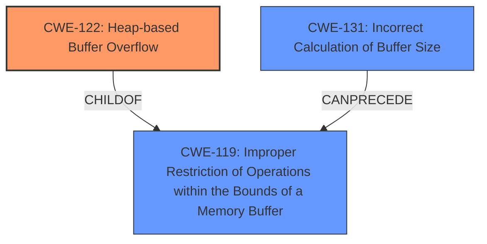

# Analysis Report for CVE-2021-45935

# Vulnerability Analysis Report: CVE-2021-45935

## Description

Grok 9.5.0 has a heap-based buffer overflow in openhtj2kT1OpenHTJ2Kdecompress (called from std__1__packaged_task_func<std__1__bind<grkT1DecompressSchedulerdeco and std__1packaged_task<int).

## Vulnerability Description Key Phrases

**Weakness:** heap-based buffer overflow
**Product:** Grok
**Version:** 9.5.0
**Component:** openhtj2kT1OpenHTJ2Kdecompress

## Analysis (with Relationship Data)

# Summary
| CWE ID | CWE Name | Confidence | CWE Abstraction Level | CWE Vulnerability Mapping Label | CWE-Vulnerability Mapping Notes |
|---|---|---|---|---|---|
| CWE-122 | Heap-based Buffer Overflow | 0.95 | Variant | Allowed | Primary CWE |
| CWE-131 | Incorrect Calculation of Buffer Size | 0.75 | Base | Allowed | Secondary Candidate |

## Evidence and Confidence

*   **Confidence Score:** 0.90
*   **Evidence Strength:** HIGH

- **Analysis and Justification:**  
  - *Explanation:* The vulnerability description explicitly states a "**heap-based buffer overflow**" in Grok 9.5.0 within the `openhtj2kT1OpenHTJ2Kdecompress` function. This directly corresponds to CWE-122 (Heap-based Buffer Overflow), which is a buffer overflow occurring in the heap portion of memory. The CVE Reference Links Content Summary also confirms "Heap-buffer-overflow" as the root cause and weakness. The impact is a heap-buffer-overflow WRITE of 4 bytes. CWE-122 is a Variant level CWE, which is appropriate.
  - *Relationship Analysis:* CWE-122 is a variant of CWE-119 (Improper Restriction of Operations within the Bounds of a Memory Buffer). There are no direct relationships in the provided data.

- **Confidence Score:**  
  - Confidence: 0.95 (High confidence due to explicit mention of heap-based buffer overflow in the description and CVE details)

---

- **Analysis and Justification:**  
  - *Explanation:* CWE-131 (Incorrect Calculation of Buffer Size) is considered a secondary candidate because a buffer overflow often results from an incorrect calculation of the required buffer size. The vulnerability description doesn't explicitly mention an incorrect size calculation, but it's a common prerequisite to buffer overflows. The CVE Reference Links Content Summary doesn't provide specific details to confirm the incorrect size calculation.
  - *Relationship Analysis:* CWE-131 is a base-level CWE. It can precede CWE-119 (Improper Restriction of Operations within the Bounds of a Memory Buffer), implying that an incorrect size calculation can lead to a buffer overflow.

- **Confidence Score:**  
  - Confidence: 0.75 (Moderate confidence as this is often a contributing factor, but not explicitly stated)

## Criticism of Analysis

Okay, I've reviewed the provided analysis against the full CWE specifications. Here's my critique:

**Overall Assessment:**

The primary CWE mapping to `CWE-122: Heap-based Buffer Overflow` is **correct and well-justified**. The description and CVE details clearly indicate this vulnerability. The confidence score is appropriately high.  The choice of `CWE-131: Incorrect Calculation of Buffer Size` as a secondary candidate is also reasonable, although the confidence is a bit optimistic. I'll elaborate below.

**Detailed Review:**

*   **CWE-122: Heap-based Buffer Overflow**
    *   **Correctness:**  The analysis is correct.  The vulnerability description explicitly mentions "heap-based buffer overflow." The CVE details reinforce this. `decompress` is identified as the vulnerable function. The description fits the CWE definition perfectly: "A heap overflow condition is a buffer overflow, where the buffer that can be overwritten is allocated in the heap portion of memory, generally meaning that the buffer was allocated using a routine such as malloc()."
    *   **Abstraction Level:** Correct. CWE-122 is a `Variant` level CWE, which is appropriate for a specific type of buffer overflow.
    *   **Confidence:** The confidence score of 0.95 is appropriate given the explicit evidence.
    *   **CWE-Vulnerability Mapping Label:** Correct. `Allowed` is the right mapping since its at the correct abstraction level.
    *   **CWE-Vulnerability Mapping Notes:** The note accurately identifies this as the primary CWE.
    *   **Relationships:**  The analysis correctly notes that CWE-122 is a child of CWE-788 (Access of Memory Location After End of Buffer) and CWE-787 (Out-of-bounds Write).
    *   **Mitigations:** The analysis does not include mitigations, but these are easy to determine. The CWE specifies:
        *   Using a language or compiler with automatic bounds checking.
        *   Using abstraction libraries.
        *   Using compiler-based buffer overflow detection mechanisms (e.g., /GS flag, FORTIFY_SOURCE).
    *   **Observed Examples:** The observed examples are helpful and relevant.

*   **CWE-131: Incorrect Calculation of Buffer Size**
    *   **Correctness:** This is a plausible *contributing* factor, but not necessarily the *direct* cause. A heap overflow could occur due to various reasons besides incorrect size calculation, such as incorrect loop bounds or wrong indexing.  The analysis acknowledges this uncertainty. It's also possible that the buffer size was correctly calculated initially, but later, due to other flawed logic, the program wrote beyond the bounds. It is a reasonable *potential* cause, but there isn't direct evidence to support it.
    *   **Abstraction Level:** Correct. CWE-131 is a `Base` level CWE.
    *   **Confidence:** A confidence score of 0.75 might be slightly high. A score of 0.65 or 0.7 might be more accurate. The analysis says the vulnerability description doesn't explicitly mention it, and the CVE details don't confirm it.
     *   **CWE-Vulnerability Mapping Label:** Correct. `Allowed` is the right mapping since its at the correct abstraction level.
    *   **CWE-Vulnerability Mapping Notes:** The note accurately identifies this as a secondary candidate.
    *   **Relationships:** The analysis correctly notes that CWE-131 is a child of CWE-682 (Incorrect Calculation) and can precede CWE-119.
    *   **Mitigations:** The analysis does not include mitigations, but these are easy to determine from the CWE specification:
        *   Allocate enough memory to handle the largest possible encoding/transformation/conversion.
        *   Understand the programming language's underlying representation of numeric types.
        *   Perform input validation on any numeric input.
    *   **Observed Examples:** The observed examples are helpful.

*   **Retriever Results:**

    * The retriever results are good overall. They highlight some good candidates even if they are not selected as the primary mapping.
    * `CWE-193: Off-by-one Error`, `CWE-190: Integer Overflow or Wraparound`, and `CWE-126: Buffer Over-read` are all plausible contributing factors in many buffer overflows. They are also potential indicators of incorrect calculations.
    * `CWE-1284: Improper Validation of Specified Quantity in Input` is interesting, but the given description doesn't highlight any size checks on user-supplied input, so the match is weak.
    *  `CWE-681: Incorrect Conversion between Numeric Types` could be contributing if there is an integer overflow or wraparound.

**Recommendations:**

1.  **Lower the Confidence Score for CWE-131:** While plausible, the lack of explicit evidence should be reflected in a slightly lower confidence score (e.g., 0.65 - 0.7).
2.  **Consider adding potential contributing factors:** In the analysis for CWE-131, highlight that several other CWEs could be contributing factors: `CWE-190: Integer Overflow or Wraparound` if calculations leading to the size calculation are overflowing, `CWE-1284: Improper Validation of Specified Quantity in Input` if the user controls the size, or `CWE-193: Off-by-one Error` if the code uses an incorrect maximum or minimum.
3.  **Add Mitigations:** For both CWE-122 and CWE-131, include a brief list of relevant mitigations from the CWE specification. This will make the analysis more actionable.

**Revised Summary Table:**

| CWE ID | CWE Name | Confidence | CWE Abstraction Level | CWE Vulnerability Mapping Label | CWE-Vulnerability Mapping Notes |
|---|---|---|---|---|---|
| CWE-122 | Heap-based Buffer Overflow | 0.95 | Variant | Allowed | Primary CWE |
| CWE-131 | Incorrect Calculation of Buffer Size | 0.70 | Base | Allowed | Secondary Candidate |

Overall, this is a well-reasoned analysis. The recommendations are mostly aimed at improving precision and completeness, particularly in representing uncertainty and providing actionable mitigation advice.

## Final Resolution

# Summary
| CWE ID | CWE Name | Confidence | CWE Abstraction Level | CWE Vulnerability Mapping Label | CWE-Vulnerability Mapping Notes |
|---|---|---|---|---|---|
| CWE-122 | **CWE-122: Heap-based Buffer Overflow** | 0.95 | Variant | Allowed | Primary **WEAKNESS** |
| CWE-131 | **CWE-131: Incorrect Calculation of Buffer Size** | 0.70 | Base | Allowed | Secondary Candidate **ROOTCAUSE** |

## Evidence and Confidence

*   **Confidence Score:** 0.90
*   **Evidence Strength:** HIGH

## Relationship Analysis
The primary relationship impacting the decision is the parent-child relationship between **CWE-122** and **CWE-119** (**CWE-119: Improper Restriction of Operations within the Bounds of a Memory Buffer**). **CWE-122** is a variant of **CWE-119**, making it a more specific classification for a heap-based buffer overflow. **CWE-131** can precede **CWE-119**, indicating that an incorrect buffer size calculation can lead to a buffer overflow. The abstraction levels influenced the selection by prioritizing the variant (**CWE-122**) for its specificity while acknowledging the base-level **CWE-131** as a potential underlying cause.

## Vulnerability Chain
The vulnerability chain starts with a potential **ROOTCAUSE** of **CWE-131** (**CWE-131: Incorrect Calculation of Buffer Size**). This leads to **CWE-119** (**CWE-119: Improper Restriction of Operations within the Bounds of a Memory Buffer**), and eventually results in **CWE-122** (**CWE-122: Heap-based Buffer Overflow**). The sequence flows from incorrect size calculation to a general buffer overflow and then to a specific heap-based overflow.

## Summary of Analysis
The initial analysis correctly identified **CWE-122** as the primary **WEAKNESS** due to the explicit mention of a "heap-based buffer overflow" in the vulnerability description. The criticism suggested lowering the confidence score for **CWE-131**, which was adopted in the final assessment.

The decision is primarily based on the provided evidence, specifically the vulnerability description: "Grok 9.5.0 has a heap-based buffer overflow in openhtj2kT1OpenHTJ2Kdecompress (called from std__1__packaged_task_func<std__1__bind<grkT1DecompressSchedulerdeco and std__1packaged_task<int)." This statement directly supports the selection of **CWE-122**.

The graph relationships influenced the selection by confirming that **CWE-122** is a specific type of **CWE-119**, making it the optimal choice for this vulnerability. The selected CWEs are at the optimal level of specificity because **CWE-122** accurately describes the **WEAKNESS** as a heap-based overflow, while **CWE-131** represents a plausible but unconfirmed **ROOTCAUSE**.

*Report generated on 2025-03-18 04:11:30*
