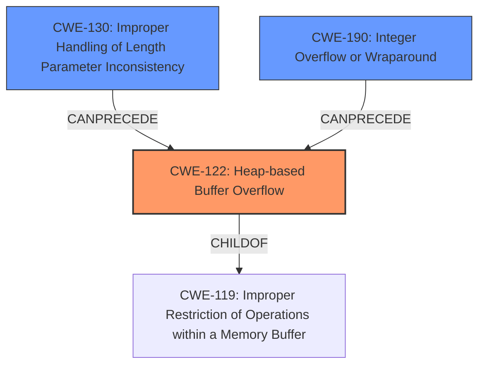

# Final Resolution for CVE-2021-45936

# Summary
| CWE ID | CWE Name | Confidence | CWE Abstraction Level | CWE Vulnerability Mapping Label | CWE-Vulnerability Mapping Notes |
|---|---|---|---|---|---|
| CWE-122 | Heap-based Buffer Overflow | 0.95 | Variant | Allowed | Primary CWE |
| CWE-130 | Improper Handling of Length Parameter Inconsistency | 0.4 | Base | Allowed | Contributing factor: Malformed MQTT packet might have length parameter inconsistency. |
| CWE-190 | Integer Overflow or Wraparound | 0.3 | Base | Allowed | Contributing factor: Integer overflow in buffer size calculation possible. |

## Evidence and Confidence

*   **Confidence Score:** 0.9
*   **Evidence Strength:** MEDIUM

## Relationship Analysis
The primary relationship is that CWE-122 (Heap-based Buffer Overflow) is a variant of the broader class of buffer overflows. The suggested secondary CWEs, CWE-130 (Improper Handling of Length Parameter Inconsistency) and CWE-190 (Integer Overflow or Wraparound), can potentially precede CWE-122 in a vulnerability chain, where incorrect length handling or integer overflows during size calculations can lead to undersized buffer allocation and subsequent heap overflows. The abstraction levels (Variant for CWE-122, Base for CWE-130 and CWE-190) reflect an appropriate level of specificity.

## Vulnerability Chain
The vulnerability chain starts with a potential **ROOTCAUSE** in the form of CWE-190 (**Integer Overflow or Wraparound**) or CWE-130 (**Improper Handling of Length Parameter Inconsistency**). An integer overflow during buffer size calculation (CWE-190) or mishandling of length parameters in the MQTT packet (CWE-130) can lead to an undersized buffer being allocated on the heap. Subsequently, when data is copied into this buffer without proper bounds checking, a **WEAKNESS** occurs: CWE-122 (**Heap-based Buffer Overflow**), which leads to memory corruption and potential arbitrary code execution.

## Summary of Analysis
The initial analysis correctly identified CWE-122 as the primary **WEAKNESS**. The criticism provided valuable insights by suggesting potential contributing factors, specifically CWE-130 and CWE-190, which can precede CWE-122 in a vulnerability chain. The evidence for CWE-122 is strong, as the vulnerability description explicitly mentions a heap-based buffer overflow. The decision to include CWE-130 and CWE-190 as secondary CWEs is based on the possibility that these issues contribute to the overflow by causing an undersized buffer to be allocated.

The inclusion of CWE-130 is justified by the context of the vulnerability, which involves handling MQTT packets. The size of the data to be copied into the buffer is likely derived from length fields within the packet. If these length fields are not properly validated or if there are inconsistencies between the declared length and the actual data size, it can lead to the overflow.

The inclusion of CWE-190 is justified by the potential for integer overflows during buffer size calculations. If the code calculates the size of the buffer by adding multiple values together, an integer overflow can occur, resulting in a smaller-than-expected buffer being allocated.

The selected CWEs are at the optimal level of specificity. CWE-122 is a variant that specifically describes heap-based buffer overflows. CWE-130 and CWE-190 are base-level CWEs that describe specific types of errors that can contribute to the overflow.

The evidence strength is rated as MEDIUM due to the lack of explicit confirmation that CWE-130 or CWE-190 are present. However, the context of the vulnerability and the potential for these issues to contribute to the overflow warrant their inclusion as secondary CWEs. The overall confidence score is reduced to 0.9 to reflect the uncertainty regarding the presence of CWE-130 and CWE-190.