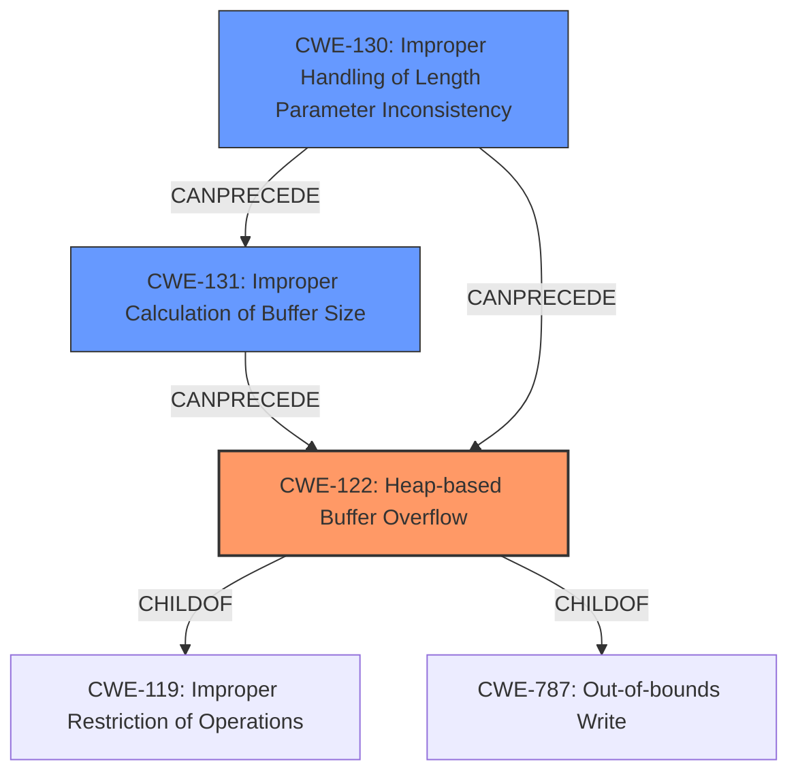

# Final Resolution for CVE-2021-45938

# Summary
| CWE ID  | CWE Name                      | Confidence | CWE Abstraction Level | CWE Vulnerability Mapping Label | CWE-Vulnerability Mapping Notes |
|---------|-------------------------------|------------|-----------------------|---------------------------------|-------------------------------|
| CWE-122 | Heap-based Buffer Overflow | 0.85       | Variant               | Allowed                         | Primary CWE                    |
| CWE-131 | Improper Calculation of Buffer Size  | 0.40       | Base               | Allowed                         | Contributing Factor                    |
| CWE-130 | Improper Handling of Length Parameter Inconsistency    | 0.40       | Base               | Allowed                         | Contributing Factor                    |

## Evidence and Confidence

*   **Confidence Score:** 0.80
*   **Evidence Strength:** MEDIUM

## Relationship Analysis
The initial analysis correctly identified **CWE-122 (Heap-based Buffer Overflow)** as the primary issue. This is a variant of **CWE-119 (Improper Restriction of Operations within the Bounds of a Memory Buffer)** and a specific type of **out-of-bounds write (CWE-787)**. The criticism highlighted the potential for **CWE-130 (Improper Handling of Length Parameter Inconsistency)** and **CWE-131 (Improper Calculation of Buffer Size)** to contribute to the vulnerability. The analysis has now been updated to include these as contributing factors. **CWE-130** can precede **CWE-131**, as an inconsistent length parameter can lead to an incorrect buffer size calculation. Both **CWE-130** and **CWE-131** can precede **CWE-122**, as they create the conditions for a heap overflow. The abstraction levels influenced the selection, with **CWE-122** chosen for its specificity, and **CWE-130** and **CWE-131** added at the Base level to capture the root causes.

## Vulnerability Chain
The vulnerability chain starts with an **improper handling of a length parameter inconsistency (CWE-130)**, potentially within an MQTT message. This leads to an **incorrect calculation of the buffer size (CWE-131)**. Subsequently, when data is copied into the heap buffer, a **heap-based buffer overflow (CWE-122)** occurs due to insufficient buffer size. This can result in overwriting adjacent heap metadata or other data structures, leading to unpredictable behavior or potentially allowing an attacker to execute arbitrary code. There is no missing link in this chain, as each step logically follows from the previous one.

## Summary of Analysis
The initial analysis correctly identified **CWE-122 (Heap-based Buffer Overflow)** as the primary **WEAKNESS**, based on the vulnerability description that clearly states a "**heap-based buffer overflow**" in `MqttClient_DecodePacket`. The **ROOTCAUSE** of this overflow, however, might be related to how the buffer size is calculated or how the length parameter is handled.

The criticism raised important points about considering other relevant CWEs. Specifically, it suggested considering **CWE-130 (Improper Handling of Length Parameter Inconsistency)** and **CWE-131 (Improper Calculation of Buffer Size)**. These CWEs are relevant because MQTT involves parsing messages with length fields, and inconsistencies or errors in handling these fields could lead to an incorrect buffer size calculation, ultimately resulting in a heap overflow.

The inclusion of **CWE-130** and **CWE-131** is justified by the context of MQTT and the potential for length-related errors. While the vulnerability description does not explicitly mention these errors, their relevance to the protocol and the potential contribution to the **HEAP OVERFLOW** warrant their inclusion. Therefore, these have been added as contributing factors.

The selected CWEs are at the optimal level of specificity. **CWE-122** accurately describes the type of buffer overflow, while **CWE-130** and **CWE-131** capture potential root causes related to length handling and buffer size calculation in the MQTT context.