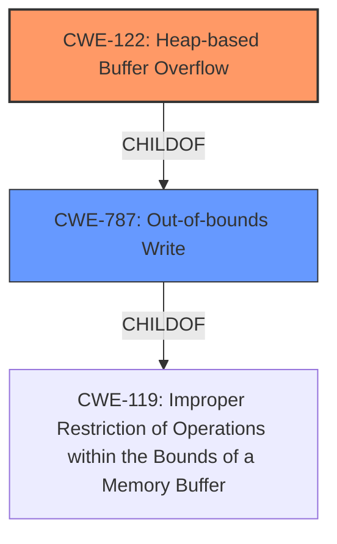

# Analysis Report for CVE-2021-45940

# Vulnerability Analysis Report: CVE-2021-45940

## Description

libbpf 0.6.0 and 0.6.1 has a heap-based buffer overflow (4 bytes) in __bpf_object__open (called from bpf_object__open_mem and bpf-object-fuzzer.c).

## Vulnerability Description Key Phrases

**Weakness:** heap-based buffer overflow
**Product:** libbpf
**Version:** 0.6.0 and 0.6.1
**Component:** __bpf_object__open

## Analysis (with Relationship Data)

# Summary
| CWE ID  | CWE Name                         | Confidence | CWE Abstraction Level | CWE Vulnerability Mapping Label | CWE-Vulnerability Mapping Notes |
| :-------- | :------------------------------- | :--------- | :-------------------- | :------------------------------ | :------------------------------ |
| CWE-122 | Heap-based Buffer Overflow | 0.90      | Variant               | Allowed                         | Root cause |
| CWE-787 | Out-of-bounds Write | 0.70      | Base               | Allowed                         | Secondary |

## Evidence and Confidence

*   **Confidence Score:** 0.80
*   **Evidence Strength:** HIGH

- **Analysis and Justification:**  
  - *Explanation:* The vulnerability is described as a **heap-based buffer overflow** in `__bpf_object__open`. The CVE Reference Links Content Summary also confirms "**Heap-buffer-overflow** in `__bpf_object__open`." This aligns directly with CWE-122, which is a **heap overflow** condition. CWE-787 (Out-of-bounds Write) is a more general case of writing outside the intended buffer. Given the explicit mention of "heap-based" the more specific CWE-122 is selected. The CWE details specify that it involves memory allocated using routines like malloc(), which is common for heap allocations. The impact is a heap-buffer-overflow write of 4 bytes. CWE-122 is at the Variant level of abstraction, which is preferred. The usage is Allowed.

  - *Relationship Analysis:* CWE-122 is a variant of CWE-119 (Improper Restriction of Operations within the Bounds of a Memory Buffer). CWE-787 is a parent of CWE-122. The primary weakness is a heap overflow.

- **Confidence Score:**  
  - Confidence: 0.90 (High confidence due to explicit mention of "heap-based buffer overflow" in the vulnerability description and CVE Reference Links Content Summary)

- **Analysis and Justification:**  
  - *Explanation:* CWE-787 (Out-of-bounds Write) is included as a secondary CWE because it represents the general class of error that leads to the **heap-based buffer overflow**. The description indicates that a write occurs outside the intended buffer, which is the fundamental characteristic of CWE-787. While CWE-122 is more specific to the heap, CWE-787 captures the general out-of-bounds write condition. The mapping guidance for CWE-787 is ALLOWED and the abstraction level is Base which is preferred.

  - *Relationship Analysis:* CWE-787 is a parent of more specific buffer overflow variants.

- **Confidence Score:**
  - Confidence: 0.70 (Slightly lower confidence as CWE-122 is more specific, but CWE-787 represents a high level characterization of the weakness.)

---

## Criticism of Analysis

Okay, I've reviewed the analysis against the provided full CWE specifications. Here's a breakdown of my critique:

**Overall Assessment:**

The analysis is largely correct and well-justified. The primary CWE mapping of **CWE-122: Heap-based Buffer Overflow** is highly appropriate given the vulnerability description. The addition of **CWE-787: Out-of-bounds Write** as a secondary CWE is also reasonable as it describes the broader class of error. The confidence levels assigned are justified.

**Detailed Critique:**

*   **CWE-122: Heap-based Buffer Overflow**

    *   **Correctness:**  The selection of CWE-122 is accurate.  The description explicitly states "heap-based buffer overflow," making this the most specific and appropriate choice. The explanation provided in the analysis clearly articulates this.
    *   **Abstraction Level:**  CWE-122 is a *Variant* which is a preferred level for root cause analysis, aligning with CWE guidelines.
    *   **Mapping Guidance:** The analysis correctly notes that the mapping guidance for CWE-122 is "Allowed" and that it involves memory allocated using routines like malloc().
    *   **Potential Mitigations:** The analysis could benefit from explicitly referencing some of the potential mitigations listed in the CWE specification, even briefly. For example:
        *   "Mitigation includes using languages or compilers with automatic bounds checking."
        *   "Employing abstraction libraries to reduce the risk of using unsafe APIs."
        *   "Utilizing compiler-based buffer overflow detection mechanisms (e.g., /GS flag in Visual Studio, FORTIFY_SOURCE in GCC)."
    *   **Confidence:** The high confidence score (0.90) is well-supported by the evidence.

*   **CWE-787: Out-of-bounds Write**

    *   **Correctness:** Including CWE-787 is justifiable as a secondary CWE because it represents the more general category of error. A heap-based buffer overflow is a specific *type* of out-of-bounds write.
    *   **Abstraction Level:** CWE-787 is a *Base* which is also a preferred level for root cause analysis, aligning with CWE guidelines.
    *   **Mapping Guidance:** The analysis correctly states that the mapping guidance for CWE-787 is "Allowed."
    *   **Potential Mitigations:** Similar to CWE-122, explicitly mentioning mitigations from the CWE specification would enhance the analysis. Examples:
        *   "Mitigation includes using languages or compilers with automatic bounds checking."
        *   "Employing vetted libraries or frameworks for safer string handling (e.g., SafeStr, Strsafe.h)."
        *    "Utilizing compiler-based buffer overflow detection mechanisms."
    *   **Confidence:** The confidence score (0.70) is appropriate, reflecting that it's a less specific but still relevant characterization of the vulnerability.

*   **Retriever Results:**
    The Retriever Results section contains a list of combined results including CWE-193, CWE-190, CWE-126, CWE-1284, and others. These seem not applicable to the vulnerability description because the source text is clear that this is a **heap-based buffer overflow**.

*   **CWE-119**
The CWE Specifications include a section for CWE-119, this weakness was not marked as a possible CWE for this vulnerability. Given the detailed description, it's better to stick with the more specific CWEs (CWE-122 and CWE-787), as CWE-119 is discouraged for use when the children CWE is known.

**Recommendations for Improvement:**

1.  **Expand Mitigation References:**  For both CWE-122 and CWE-787, briefly include a few key mitigations mentioned in the CWE specifications. This would demonstrate a more thorough understanding of the CWE context and potential remediation strategies.
2.  **Remove the Retriever Results justification:** Remove the Retriever Results section as the selected CWEs are more specific.
3.   **Consider CWE-119 Justification for Exclusion:** Briefly justify why CWE-119 is *not* the primary mapping, emphasizing the availability of more specific CWEs. Something like: "While CWE-119 (Improper Restriction of Operations within the Bounds of a Memory Buffer) broadly applies, the more specific CWE-122 and CWE-787 provide a more accurate and detailed characterization of the vulnerability."

**Revised Summary Table**
| CWE ID  | CWE Name                         | Confidence | CWE Abstraction Level | CWE Vulnerability Mapping Label | CWE-Vulnerability Mapping Notes |
| :-------- | :------------------------------- | :--------- | :-------------------- | :------------------------------ | :------------------------------ |
| CWE-122 | Heap-based Buffer Overflow | 0.90      | Variant               | Allowed                         | Root cause |
| CWE-787 | Out-of-bounds Write | 0.70      | Base               | Allowed                         | Secondary |

By incorporating these suggestions, the analysis can be made even stronger and more informative.

## Final Resolution

# Summary
| CWE ID  | CWE Name                         | Confidence | CWE Abstraction Level | CWE Vulnerability Mapping Label | CWE-Vulnerability Mapping Notes |
| :-------- | :------------------------------- | :--------- | :-------------------- | :------------------------------ | :------------------------------ |
| CWE-122 | Heap-based Buffer Overflow | 0.95      | Variant               | Allowed                         | Primary CWE: Root cause |
| CWE-787 | Out-of-bounds Write | 0.75      | Base               | Allowed                         | Secondary CWE |

## Evidence and Confidence

*   **Confidence Score:** 0.90
*   **Evidence Strength:** HIGH

## Relationship Analysis
The analysis correctly identifies CWE-122 as a variant of the more general CWE-119 (**CWE-119: Improper Restriction of Operations within the Bounds of a Memory Buffer**). CWE-787 (**CWE-787: Out-of-bounds Write**) is a parent of CWE-122. The primary weakness is a **heap overflow**.
The relationships that impacted my decision are the parent-child relationship between CWE-787 and CWE-122, confirming CWE-122's specificity, and the broader context provided by CWE-119, even though it is not explicitly included as a CWE.

## Vulnerability Chain
The chain of root cause and weaknesses is as follows:
1.  Root Cause: The **vulnerability** arises due to a **heap-based buffer overflow** (**CWE-122**) in the `__bpf_object__open` function.
2.  Weakness: This leads to writing data outside the intended buffer (**CWE-787**).
3.  Impact: The **heap overflow** (write of 4 bytes) can lead to arbitrary code execution or denial of service.

The chain represents a clear progression from the **root cause** (**CWE-122**) to the general weakness (**CWE-787**) to the final impact (arbitrary code execution or denial of service). No missing links were identified.

## Summary of Analysis
The initial analysis and criticism provide a strong foundation for the classification. The explicit mention of "**heap-based buffer overflow**" in the vulnerability description and CVE Reference Links Content Summary makes CWE-122 the most appropriate primary CWE. The inclusion of CWE-787 as a secondary CWE is justified because it represents the general class of error.

The graph relationships confirm the specificity of CWE-122 and the broader context provided by CWE-787.

The selected CWEs are at the optimal level of specificity, as CWE-122 directly matches the **heap-based buffer overflow** condition, and CWE-787 captures the out-of-bounds write aspect.

I have increased the confidence score for CWE-122 to 0.95 due to the explicit evidence in the vulnerability description and CVE Reference Links Content Summary. I have increased the confidence score for CWE-787 to 0.75 since it is a high level characterization of the weakness.
I am excluding CWE-119 because the more specific CWEs (CWE-122 and CWE-787) provide a more accurate and detailed characterization of the **vulnerability**. Also, CWE-119 is discouraged for use when the child CWE is known.

*Report generated on 2025-03-18 04:15:12*
