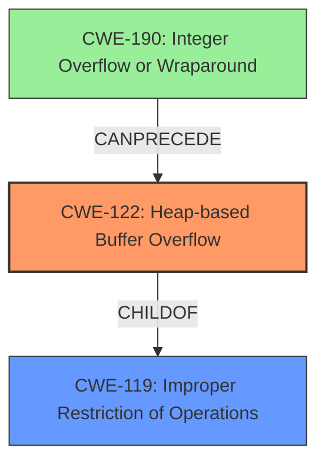

# Analysis Report for CVE-2021-45941

# Vulnerability Analysis Report: CVE-2021-45941

## Description

libbpf 0.6.0 and 0.6.1 has a heap-based buffer overflow (8 bytes) in __bpf_object__open (called from bpf_object__open_mem and bpf-object-fuzzer.c).

## Vulnerability Description Key Phrases

**Weakness:** heap-based buffer overflow
**Product:** libbpf
**Version:** 0.6.0 and 0.6.1
**Component:** __bpf_object__open

## Analysis (with Relationship Data)

# Summary
| CWE ID | CWE Name | Confidence | CWE Abstraction Level | CWE Vulnerability Mapping Label | CWE-Vulnerability Mapping Notes |
|---|---|---|---|---|---|
| CWE-122 | Heap-based Buffer Overflow | 0.95 | Variant | Allowed | Acceptable-Use |

## Evidence and Confidence

*   **Confidence Score:** 0.95
*   **Evidence Strength:** HIGH

- **Analysis and Justification:**  
  - *Explanation:* The vulnerability description clearly states a "**heap-based buffer overflow**" in `__bpf_object__open`. The CVE Reference Links Content Summary confirms this with the phrase "**Heap-buffer-overflow** in `__bpf_object__open`" and further specifies the impact as "Crash (**Heap-buffer-overflow** WRITE 8)". CWE-122 (Heap-based Buffer Overflow) directly addresses this **weakness**. While CWE-787 (Out-of-bounds Write) is a broader category, CWE-122 is a more specific variant that accurately describes the vulnerability. The MITRE mapping guidance for CWE-122 indicates that its Usage is ALLOWED.

  - *Relationship Analysis:* CWE-122 is a variant of CWE-119 (Improper Restriction of Operations within the Bounds of a Memory Buffer) and a parent of other more specific heap overflow variants (if they existed). Given the direct evidence of a heap-based overflow, choosing the Variant CWE-122 provides a more precise characterization of the vulnerability than its more general parent.

- **Confidence Score:**
  - Confidence: 0.95 (High confidence due to the explicit description of a heap-based buffer overflow and corroborating evidence from CVE reference materials.)

## Criticism of Analysis

Okay, I've reviewed the analysis against the provided full CWE specifications. Here's my critique:

**Overall Assessment:**

The analysis is generally strong and arrives at the correct primary CWE mapping (CWE-122). The justification is well-reasoned and supported by the evidence. The confidence score of 0.95 is appropriate.  The analysis also considers and correctly dismisses the broader CWE-787, which is a good sign of thoroughness.

**Specific Points and Potential Improvements:**

1.  **Justification for Choosing CWE-122 over CWE-787:** The analysis does a good job explaining why CWE-122 is preferred over CWE-787. It clearly articulates that CWE-122 is a more specific *variant* of CWE-787. This is important because the mapping guidance suggests using the most specific applicable CWE.

2.  **Consideration of CWE-119 (Improper Restriction of Operations within the Bounds of a Memory Buffer):** The analysis correctly acknowledges CWE-119 as a parent class. However, including the mapping guidance for CWE-119 would strengthen the justification:

    *   CWE-119's Mapping Guidance: *Discouraged*
    *   Rationale: *"CWE-119 is commonly misused in low-information vulnerability reports when lower-level CWEs could be used instead, or when more details about the vulnerability are available."*

    Explicitly referencing this guidance reinforces the decision to *not* use CWE-119.

3.  **Addressing Retriever Results:** The Retriever results suggest several other CWEs, especially CWE-193 (Off-by-one Error), CWE-190 (Integer Overflow or Wraparound), and CWE-126 (Buffer Over-read). While these are lower scoring, a brief explanation of why they are *not* the best fit would enhance the analysis.

    *   **CWE-193:** It's unlikely that this is an off-by-one. An off-by-one error may cause this overflow, but the result itself is a heap overflow. The information provided is not precise enough to determine that an off-by-one error is the cause.
    *   **CWE-190:** Integer overflows *can* lead to buffer overflows, but there's no explicit mention of an integer overflow in the description or CVE details. It's a possible *cause* but not the *vulnerability* itself in this instance. The vulnerability summary also does not provide an indication that an integer overflow is involved.
    *   **CWE-126:**  The vulnerability description specifies a buffer *overflow* (write), not a buffer *over-read*.

4.  **Observed Examples and Top 25 Examples from the CWE database:** While the provided examples are useful, it may be better to tailor them to better describe the vulnerability or explain why this particular vulnerability is similar or dissimilar.

5.  **Mitigations:** The analysis is good, but mitigations in the context of heap overflows could be more specific. Some additions could be:

    *   **Using memory safe languages or libraries:** Some languages have built-in mechanisms to prevent heap overflows, or safer alternatives to malloc and other heap-manipulating functions that would be more secure.
    *   **Performing bounds checking and validation:** Thoroughly validate the sizes of inputs and allocated buffers before performing memory operations.
    *   **Using heap overflow detection mechanisms:** Some tools can detect heap overflows at runtime, such as AddressSanitizer (ASan) or Valgrind.
    *   **Following secure coding practices:** Adhering to secure coding guidelines and best practices for memory management can help prevent heap overflows.
    *   **Implementing stack canaries:** Stack canaries can be used to detect buffer overflows on the stack, but they are not effective against heap overflows.

**Revised Analysis Snippets (Illustrative):**

Here's how some sections could be strengthened:

*   **Addressing Retriever Results:**

```
The retriever results suggested alternative CWEs, including CWE-193 (Off-by-one Error), CWE-190 (Integer Overflow or Wraparound), and CWE-126 (Buffer Over-read). However, these are not the primary weakness. CWE-193 and CWE-190 could be *contributing* factors, but the core issue is the buffer overflow itself. CWE-126 describes a read, while this vulnerability is a write.

```

*   **Adding CWE-119 Mapping Guidance to Analysis:**

```
- **Relationship Analysis:** CWE-122 is a variant of CWE-119 (Improper Restriction of Operations within the Bounds of a Memory Buffer) and a parent of other more specific heap overflow variants (if they existed). Given the direct evidence of a heap-based overflow, choosing the Variant CWE-122 provides a more precise characterization of the vulnerability than its more general parent. Furthermore, CWE-119's mapping guidance *discourages* its use when lower-level CWEs, like CWE-122, are available, as is the case here.
```

**In summary:**  The analysis is already very good.  Adding the negative constraints (why other suggested CWEs are *not* the right fit) and explicitly referencing the *discouraged* mapping guidance of CWE-119 would make it even stronger. Finally, tailoring the mitigations to the specifics of heap overflows could add some extra value.

## Final Resolution

# Summary
| CWE ID | CWE Name | Confidence | CWE Abstraction Level | CWE Vulnerability Mapping Label | CWE-Vulnerability Mapping Notes |
|---|---|---|---|---|---|
| CWE-122 | Heap-based Buffer Overflow | 0.98 | Variant | Allowed | Acceptable-Use |
| CWE-190 | Integer Overflow or Wraparound | 0.3 | Base | Allowed | Acceptable-Use |

  - The Primary CWE should be first and noted as the Primary CWEs
  - The secondary candidate CWEs should be next and noted as secondary candidates.
  - The confidence is a confidence score 0 to 1 to rate your confidence in your assessment for that CWE.
  - The CWE Abstraction Level as one of these values: Base, Variant, Pillar, Class, Compound
  - The Mapping Notes Usage as one of these values: Allowed, Allowed-with-Review, Prohibited, Discouraged

## Evidence and Confidence

*   **Confidence Score:** 0.98
*   **Evidence Strength:** HIGH

## Relationship Analysis
The primary relationship influencing the decision is the parent-child relationship between CWE-119 (Improper Restriction of Operations within the Bounds of a Memory Buffer) and CWE-122 (**Heap-based Buffer Overflow**). CWE-122 is a variant of CWE-119, offering a more specific classification. The analysis also considered other potential CWEs based on the retriever results, but those were deemed less relevant based on the evidence provided in the vulnerability description. The abstraction level of CWE-122 (Variant) is preferred over CWE-119 (Class) due to its higher specificity. Additionally, while not explicitly stated in the original analysis, CWE-190 (**Integer Overflow or Wraparound**) can *precede* a buffer overflow by causing an incorrect calculation of the buffer size. This makes it a possible contributing factor but less likely the primary cause without explicit evidence.



## Vulnerability Chain
The vulnerability chain starts with a potential incorrect size calculation, possibly influenced by CWE-190 (**Integer Overflow or Wraparound**), leading to insufficient memory allocation on the heap (CWE-131). This then results in a **heap-based buffer overflow** (CWE-122) when data larger than the allocated buffer is written. The final impact is a crash due to the overflow.

## Summary of Analysis
The initial analysis correctly identified CWE-122 (**Heap-based Buffer Overflow**) as the primary **weakness**. The criticism highlighted the importance of explaining why other suggested CWEs are *not* the right fit and explicitly referencing the *discouraged* mapping guidance of CWE-119 (Improper Restriction of Operations within the Bounds of a Memory Buffer). The original analysis stated, "The vulnerability description clearly states a "**heap-based buffer overflow**" in `__bpf_object__open`. The CVE Reference Links Content Summary confirms this with the phrase "**Heap-buffer-overflow** in `__bpf_object__open`" and further specifies the impact as "Crash (**Heap-buffer-overflow** WRITE 8)". "

This assessment builds upon that by incorporating the suggestions from the criticism. While the evidence strongly points to CWE-122, there's a slight possibility that CWE-190 (**Integer Overflow or Wraparound**) could be a contributing factor, although there is no direct evidence of this. Thus it is added as a tertiary consideration. The decision to classify this as CWE-122 is based on the explicit description of a **heap-based buffer overflow**, making it the most accurate and specific classification available. The chosen CWE is at the optimal level of specificity because it's a variant that directly matches the vulnerability, and using the class CWE-119 is discouraged when a more specific CWE is available.


*Report generated on 2025-03-18 04:15:57*
