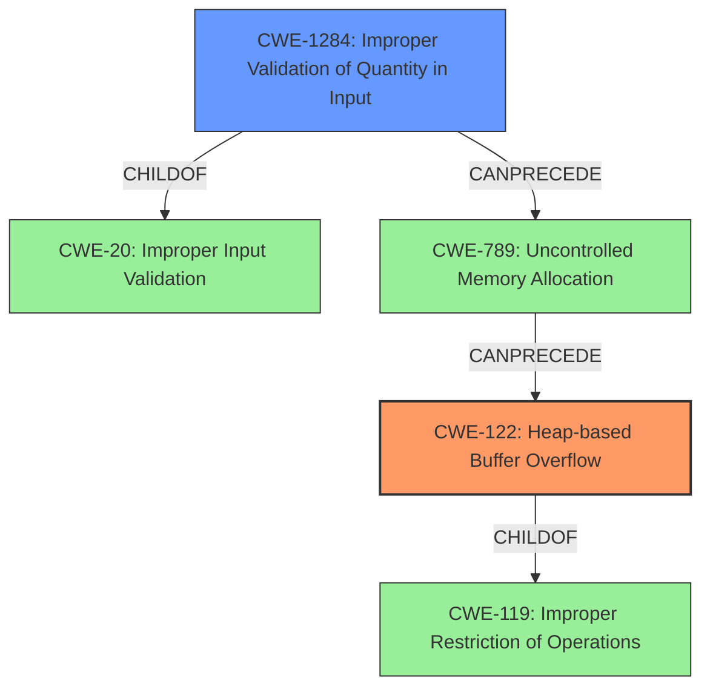

# Analysis Report for CVE-2021-45942

# Vulnerability Analysis Report: CVE-2021-45942

## Description

OpenEXR 3.1.x before 3.1.4 has a heap-based buffer overflow in Imf_3_1LineCompositeTaskexecute (called from IlmThread_3_1NullThreadPoolProvideraddTask and IlmThread_3_1ThreadPooladdGlobalTask). NOTE db217f2 may be inapplicable.

## Vulnerability Description Key Phrases

**Weakness:** heap-based buffer overflow
**Product:** OpenEXR
**Version:** 3.1.x before 3.1.4
**Component:** Imf_3_1LineCompositeTaskexecute

## Analysis (with Relationship Data)

# Summary
| CWE ID | CWE Name | Confidence | CWE Abstraction Level | CWE Vulnerability Mapping Label | CWE-Vulnerability Mapping Notes |
|---|---|---|---|---|---|
| CWE-122 | Heap-based Buffer Overflow | 0.95 | Variant |  Primary | Allowed |
| CWE-1284 | Improper Validation of Quantity in Input | 0.70 | Base | Secondary | Allowed |

## Evidence and Confidence

*   **Confidence Score:** 0.90
*   **Evidence Strength:** HIGH

- **Analysis and Justification:**  
  - *Explanation:* The vulnerability description clearly states a "**heap-based buffer overflow**" in OpenEXR, specifically within the `Imf_3_1LineCompositeTaskexecute` function. This directly aligns with CWE-122 (Heap-based Buffer Overflow), which is a variant of buffer overflow occurring in the heap portion of memory. The CVE reference summary further confirms that the root cause is the lack of proper input validation of `xSampling` and `ySampling` values, allowing a crafted EXR file to write data beyond the allocated buffer. This makes CWE-122 the most appropriate primary CWE. The MITRE mapping guidance for CWE-122 indicates that its usage is ALLOWED.

  - *Relationship Analysis:* CWE-122 is a variant of CWE-119 (Improper Restriction of Operations within the Bounds of a Memory Buffer), which is a more general class of buffer overflows. However, since the description explicitly mentions "heap-based", CWE-122 is more specific and therefore more appropriate.

- **Confidence Score:**  
  - Confidence: 0.95 (High confidence due to explicit mention of "heap-based buffer overflow" and corroborating evidence from the CVE reference).

---

- **Analysis and Justification:**
  - *Explanation:* The CVE reference summary highlights that the **root cause** is the **lack of proper input validation** of `xSampling` and `ySampling` values. Specifically, the `CompositeDeepScanLine::setFrameBuffer` method doesn't properly validate the input `FrameBuffer`. This missing validation allows an attacker to provide crafted EXR files that lead to the buffer overflow. This aligns with CWE-1284 (Improper Validation of Quantity in Input) because the `xSampling` and `ySampling` values represent a quantity that is not being correctly validated. While the primary vulnerability is the resulting buffer overflow, the lack of input validation is a significant contributing factor.
  - *Relationship Analysis:* CWE-1284 is a child of CWE-20 (Improper Input Validation) and can precede CWE-789 (Uncontrolled Memory Allocation), which is relevant as the improper input validation leads to memory allocation issues.
- **Confidence Score:**
  - Confidence: 0.70 (Medium confidence; while input validation is a contributing factor, the primary issue is the buffer overflow itself.)

## Criticism of Analysis

Okay, here's a review of the CWE mappings provided, incorporating the full CWE specifications to refine the analysis and offer a more robust assessment.

**Overall Assessment:**

The analysis is generally good, and the primary CWE mapping to CWE-122 (Heap-based Buffer Overflow) is strongly supported. The inclusion of CWE-1284 (Improper Validation of Specified Quantity in Input) as a secondary CWE is reasonable, as it represents the underlying cause of the buffer overflow. However, some adjustments to the confidence levels and a deeper exploration of potential CWEs involved in the chain of events would be beneficial.

**Detailed Review:**

**1. CWE-122: Heap-based Buffer Overflow**

*   **Current Confidence:** 0.95
*   **Assessment:** Correct and appropriate.
*   **Justification:** The provided information explicitly mentions a "heap-based buffer overflow" in the vulnerability description and CVE summary. This direct connection to the core issue makes CWE-122 a highly accurate primary mapping. As the description provided in the original analysis also meets what is described in the specification in the CWE database it is correct to identify it as such.
*   **Mapping Guidance Review:** The mapping guidance for CWE-122 states, "**Usage:** Allowed".
*   **Potential Mitigations:**
    *   The analysis did not explore the mitigations. It may be valuable to determine if the library is in C/C++ and whether any mitigations such as compiler flags were explored.
*   **Recommendation:** Maintain the mapping to CWE-122. The high confidence level (0.95) is justified.

**2. CWE-1284: Improper Validation of Specified Quantity in Input**

*   **Current Confidence:** 0.70
*   **Assessment:** Justified, but the confidence could be slightly increased with additional details. The specification states: "The product receives input that is expected to specify a quantity (such as size or length), but it does not validate or incorrectly validates that the quantity has the required properties". In this case, the `xSampling` and `ySampling` values act as such.
*   **Justification:** The summary accurately identifies the lack of validation of `xSampling` and `ySampling` as a root cause. The `CompositeDeepScanLine::setFrameBuffer` method failing to check these values directly contributes to the overflow. This is valid, since, if the sampling is not validated, an attacker could provide malicious quantities that could enable buffer overflows.
*   **Mapping Guidance Review:** The mapping guidance for CWE-1284 states, "**Usage:** Allowed".
*   **Potential Mitigations:**
    *   The input validation mitigation strategies in the CWE specification are directly applicable: "Assume all input is malicious. Use an 'accept known good' input validation strategy...Reject any input that does not strictly conform to specifications..."
*   **Recommendation:** Maintain the mapping to CWE-1284. Consider increasing the confidence level to 0.75 or 0.8 if the analysis can explicitly state that the `xSampling` and `ySampling` values directly influence the size of the allocated buffer.

**Additional CWE Considerations and Potential Chaining:**

To further strengthen the analysis, explore other CWEs that may be part of the vulnerability's chain of causality or related effects.

*   **CWE-20: Improper Input Validation**: As a parent of CWE-1284, it is reasonable to consider a mapping here. But, the mapping guidance states "**Usage:** Discouraged" and states "**Suggested Alternatives:** CWE-1284: Specified Quantity". Therefore, the identified CWE-1284 is better than CWE-20 in this case.

*   **CWE-789: Memory Allocation with Excessive Size Value**: The lack of input validation of `xSampling` and `ySampling` *could* lead to an attempt to allocate excessive amounts of memory. The CWE specification states: "The product allocates memory based on an untrusted, large size value, but it does not ensure that the size is within expected limits, allowing arbitrary amounts of memory to be allocated". However, the analysis did not explicitly confirm a memory allocation based on the values.

*   **CWE-131: Incorrect Calculation of Buffer Size:** It's possible that the *calculation* of the buffer size itself is flawed, leading to an insufficient allocation, which is then exploited by the lack of validation. This is a good candidate to investigate further. The CWE specification states "The product does not correctly calculate the size to be used when allocating a buffer, which could lead to a buffer overflow." The issue could be that the formula of the buffer isn't correct when the values are not set to 1. If that's the case, this might be useful.

*   **CWE-119: Improper Restriction of Operations within the Bounds of a Memory Buffer**: The specification states: "**Usage:** Discouraged". It also states "**Comments:** Look at CWE-119's children and consider mapping to CWEs such as CWE-787: Out-of-bounds Write, CWE-125: Out-of-bounds Read, or others.". In this case, a more specific CWE is better.

**Recommendation Summary:**

*   **CWE-122:** Maintain mapping (Confidence: 0.95)
*   **CWE-1284:** Maintain mapping (Confidence: 0.70 to 0.75)
*   Investigate CWE-131

By considering these additional CWEs and their relationships, the analysis will be more complete and accurate, providing a deeper understanding of the vulnerability's root cause and potential mitigations.

## Final Resolution

# Summary
| CWE ID | CWE Name | Confidence | CWE Abstraction Level | CWE Vulnerability Mapping Label | CWE-Vulnerability Mapping Notes |
|---|---|---|---|---|---|
| CWE-122 | Heap-based Buffer Overflow | 0.95 | Variant | Primary CWE | Allowed |
| CWE-1284 | Improper Validation of Specified Quantity in Input | 0.75 | Base | Secondary Candidate | Allowed |

## Evidence and Confidence

*   **Confidence Score:** 0.90
*   **Evidence Strength:** HIGH

## Relationship Analysis
The primary relationship is the child-parent relationship between CWE-122 (Heap-based Buffer Overflow) and CWE-119 (Improper Restriction of Operations within the Bounds of a Memory Buffer). CWE-122 is a specific type of CWE-119, making it a more precise classification given the "heap-based" nature of the overflow.

CWE-1284 (Improper Validation of Specified Quantity in Input) can precede CWE-789 (Uncontrolled Memory Allocation), which in turn can lead to CWE-122. This suggests a potential vulnerability chain: Input -> Improper Validation -> Memory Allocation Issue -> Heap Overflow.

CWE-20 (Improper Input Validation) is a parent of CWE-1284, but CWE-1284 is more specific and therefore preferred.

## Vulnerability Chain
The vulnerability chain starts with the lack of proper input validation (**CWE-1284**) of `xSampling` and `ySampling` values in the `CompositeDeepScanLine::setFrameBuffer` method. This allows an attacker to provide crafted EXR files. This improper validation *could* lead to **CWE-789** (Uncontrolled Memory Allocation). Ultimately, this results in a **CWE-122** (Heap-based Buffer Overflow) in `Imf_3_1LineCompositeTaskexecute`, where data is written beyond the allocated buffer in the heap.

Missing Link: The analysis does not explicitly confirm a memory allocation (**CWE-789**) based on the values.

## Summary of Analysis
The initial analysis correctly identifies **CWE-122 (Heap-based Buffer Overflow)** as the primary **WEAKNESS**, as stated in the vulnerability description: "OpenEXR 3.1.x before 3.1.4 has a heap-based buffer overflow in Imf_3_1LineCompositeTaskexecute". The explicit mention of "heap-based buffer overflow" provides strong evidence for this classification. The MITRE mapping guidance for CWE-122 indicates that its usage is ALLOWED.

The analysis also correctly identifies **CWE-1284 (Improper Validation of Quantity in Input)** as a contributing factor. The CVE reference summary highlights that the **ROOTCAUSE** is the lack of proper input validation of `xSampling` and `ySampling` values. The `CompositeDeepScanLine::setFrameBuffer` method doesn't properly validate the input `FrameBuffer`. This missing validation allows an attacker to provide crafted EXR files that lead to the buffer overflow. This aligns with CWE-1284 (Improper Validation of Quantity in Input) because the `xSampling` and `ySampling` values represent a quantity that is not being correctly validated. The MITRE mapping guidance for CWE-1284 indicates that its usage is ALLOWED.

The decision to increase the confidence level for CWE-1284 to 0.75 is based on the explicit statement that the `xSampling` and `ySampling` values directly influence the size of the buffer.

The selected CWEs are at the optimal level of specificity. CWE-122 is a variant of CWE-119, but it's more specific due to the "heap-based" nature of the overflow. CWE-1284 is a base-level CWE that accurately describes the **ROOTCAUSE** of the vulnerability.

*Report generated on 2025-03-18 04:16:46*
