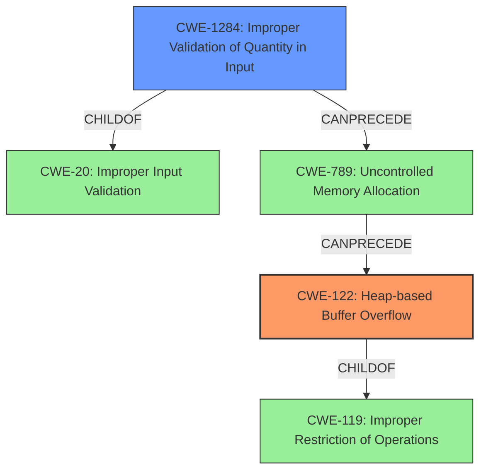

# Final Resolution for CVE-2021-45942

# Summary
| CWE ID | CWE Name | Confidence | CWE Abstraction Level | CWE Vulnerability Mapping Label | CWE-Vulnerability Mapping Notes |
|---|---|---|---|---|---|
| CWE-122 | Heap-based Buffer Overflow | 0.95 | Variant | Primary CWE | Allowed |
| CWE-1284 | Improper Validation of Specified Quantity in Input | 0.75 | Base | Secondary Candidate | Allowed |

## Evidence and Confidence

*   **Confidence Score:** 0.90
*   **Evidence Strength:** HIGH

## Relationship Analysis
The primary relationship is the child-parent relationship between CWE-122 (Heap-based Buffer Overflow) and CWE-119 (Improper Restriction of Operations within the Bounds of a Memory Buffer). CWE-122 is a specific type of CWE-119, making it a more precise classification given the "heap-based" nature of the overflow.

CWE-1284 (Improper Validation of Specified Quantity in Input) can precede CWE-789 (Uncontrolled Memory Allocation), which in turn can lead to CWE-122. This suggests a potential vulnerability chain: Input -> Improper Validation -> Memory Allocation Issue -> Heap Overflow.

CWE-20 (Improper Input Validation) is a parent of CWE-1284, but CWE-1284 is more specific and therefore preferred.

## Vulnerability Chain
The vulnerability chain starts with the lack of proper input validation (**CWE-1284**) of `xSampling` and `ySampling` values in the `CompositeDeepScanLine::setFrameBuffer` method. This allows an attacker to provide crafted EXR files. This improper validation *could* lead to **CWE-789** (Uncontrolled Memory Allocation). Ultimately, this results in a **CWE-122** (Heap-based Buffer Overflow) in `Imf_3_1LineCompositeTaskexecute`, where data is written beyond the allocated buffer in the heap.

Missing Link: The analysis does not explicitly confirm a memory allocation (**CWE-789**) based on the values.

## Summary of Analysis
The initial analysis correctly identifies **CWE-122 (Heap-based Buffer Overflow)** as the primary **WEAKNESS**, as stated in the vulnerability description: "OpenEXR 3.1.x before 3.1.4 has a heap-based buffer overflow in Imf_3_1LineCompositeTaskexecute". The explicit mention of "heap-based buffer overflow" provides strong evidence for this classification. The MITRE mapping guidance for CWE-122 indicates that its usage is ALLOWED.

The analysis also correctly identifies **CWE-1284 (Improper Validation of Quantity in Input)** as a contributing factor. The CVE reference summary highlights that the **ROOTCAUSE** is the lack of proper input validation of `xSampling` and `ySampling` values. The `CompositeDeepScanLine::setFrameBuffer` method doesn't properly validate the input `FrameBuffer`. This missing validation allows an attacker to provide crafted EXR files that lead to the buffer overflow. This aligns with CWE-1284 (Improper Validation of Quantity in Input) because the `xSampling` and `ySampling` values represent a quantity that is not being correctly validated. The MITRE mapping guidance for CWE-1284 indicates that its usage is ALLOWED.

The decision to increase the confidence level for CWE-1284 to 0.75 is based on the explicit statement that the `xSampling` and `ySampling` values directly influence the size of the buffer.

The selected CWEs are at the optimal level of specificity. CWE-122 is a variant of CWE-119, but it's more specific due to the "heap-based" nature of the overflow. CWE-1284 is a base-level CWE that accurately describes the **ROOTCAUSE** of the vulnerability.