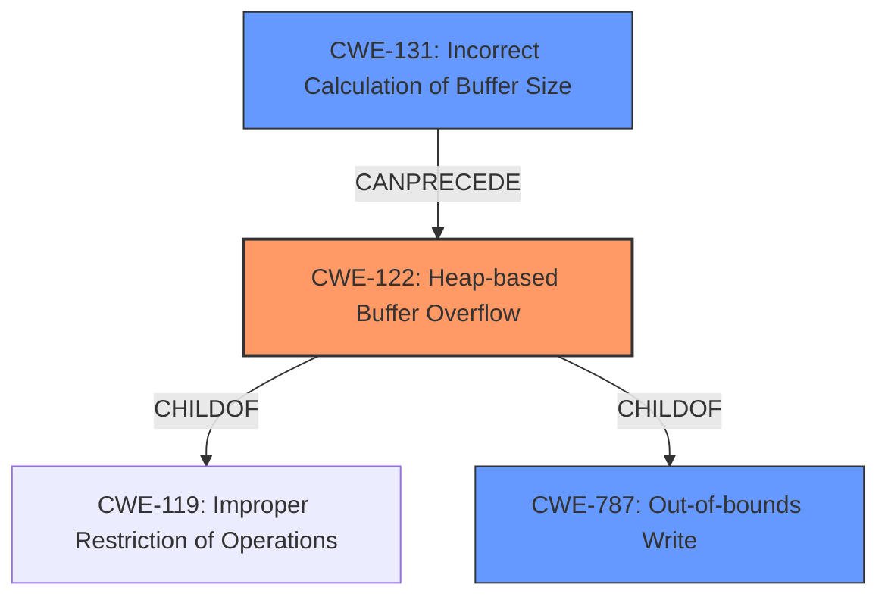

# Final Resolution for CVE-2021-45948

# Summary
| CWE ID | CWE Name | Confidence | CWE Abstraction Level | CWE Vulnerability Mapping Label | CWE-Vulnerability Mapping Notes |
|---|---|---|---|---|---|
| CWE-122 | **Heap-based Buffer Overflow** | 1.0 | Variant | Allowed | Primary CWE |
| CWE-131 | **Incorrect Calculation of Buffer Size** | 0.5 | Base | Allowed | Secondary Candidate |
| CWE-787 | **Out-of-bounds Write** | 0.4 | Base | Allowed | Secondary Candidate |

## Evidence and Confidence

*   **Confidence Score:** 0.9
*   **Evidence Strength:** MEDIUM

## Relationship Analysis
The primary relationship that impacted the decision was the hierarchical relationship between CWE-122 (**Heap-based Buffer Overflow**) and its parent CWE-119 (**Improper Restriction of Operations within the Bounds of a Memory Buffer**). CWE-122 is a variant of CWE-119, making it a more specific and accurate classification for this vulnerability. The possibility of a vulnerability chain involving CWE-131 (**Incorrect Calculation of Buffer Size**) leading to CWE-122 was also considered. CWE-787 (**Out-of-bounds Write**) is a parent of CWE-122, but it is too general and represents more of the consequence of the overflow rather than the root cause.

## Vulnerability Chain
The vulnerability chain starts with a potential **incorrect calculation of the buffer size (CWE-131)**. This could lead to a **heap-based buffer overflow (CWE-122)**, resulting in an **out-of-bounds write (CWE-787)**.

## Summary of Analysis
The initial analysis correctly identifies CWE-122 (**Heap-based Buffer Overflow**) as the primary weakness. The vulnerability description explicitly mentions a heap-based buffer overflow.

The criticism provided valuable suggestions, particularly exploring potential vulnerability chains. Based on this, CWE-131 (**Incorrect Calculation of Buffer Size**) is added as a secondary candidate with increased confidence, as it's a plausible root cause for the overflow. "The product does not correctly calculate the size to be used when allocating a buffer, which could lead to a buffer overflow." This aligns with the possibility that the `_m3d_safestr` function might have a flawed size calculation.

CWE-787 (**Out-of-bounds Write**) remains a secondary candidate, but it's more descriptive of the consequence of the overflow.

The selected CWEs are at the optimal level of specificity. CWE-122 is a variant that specifically addresses heap-based overflows, while CWE-131 is a base CWE that captures the potential root cause of an incorrect size calculation.

The final decision is primarily based on the vulnerability description stating a heap-based buffer overflow, along with the understanding that such overflows often stem from incorrect size calculations.