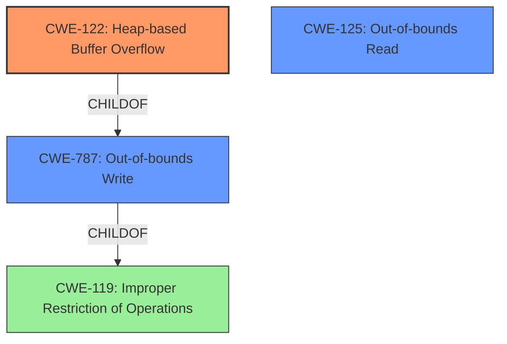

# Final Resolution for CVE-2021-45949

# Summary
| CWE ID  | CWE Name                     | Confidence | CWE Abstraction Level | CWE Vulnerability Mapping Label | CWE-Vulnerability Mapping Notes |
| :------- | :--------------------------- | :--------- | :-------------------- | :------------------------------ | :------------------------------ |
| CWE-122 | Heap-based Buffer Overflow   | 0.95       | Variant               | Allowed                         | Primary CWE. Data is written beyond the boundaries of an allocated heap buffer. |
| CWE-787 | Out-of-bounds Write          | 0.70       | Base               | Allowed                         | Secondary Candidate. CWE-122 is a specialized instance of CWE-787. The vulnerability involves writing data beyond the intended bounds of a memory buffer. |
| CWE-125 | Out-of-bounds Read             | 0.50       | Base               | Allowed                         | Secondary Candidate. (Weak connection) Possibly related to attempts to read buffer metadata or prevent crashes by reading beyond boundaries.  Requires further investigation of specific code behavior. |

## Evidence and Confidence

*   **Confidence Score:** 0.92
*   **Evidence Strength:** HIGH

## Relationship Analysis
The primary CWE is CWE-122 (**Heap-based Buffer Overflow**), which is a variant of CWE-119 (**Improper Restriction of Operations within the Bounds of a Memory Buffer**). CWE-787 (**Out-of-bounds Write**) is a parent of CWE-122, indicating that CWE-122 is a more specific type of out-of-bounds write that occurs on the heap. The relationship between CWE-122 and CWE-787 influenced the decision to include CWE-787 as a secondary candidate because the vulnerability description explicitly mentions a heap-based buffer overflow, which falls under the broader category of out-of-bounds writes. CWE-125 (**Out-of-bounds Read**) was considered due to a potential, albeit weak, connection to prevent crashes, but requires further investigation.

## Vulnerability Chain
The vulnerability chain starts with the **ROOTCAUSE**, a **flaw** in the `sampled_data_finish` function. This flaw leads to a **CWE-122 (Heap-based Buffer Overflow)**, where data is written beyond the allocated buffer on the heap. The consequence is a potential crash or arbitrary code execution. There is a possibility of **CWE-125 (Out-of-bounds Read)** being involved if the code attempts to read beyond boundaries to prevent crashes.

## Summary of Analysis
The initial analysis correctly identified CWE-122 (**Heap-based Buffer Overflow**) as the primary weakness based on the vulnerability description: "Ghostscript GhostPDL 9.50 through 9.54.0 has a heap-based buffer overflow in sampled_data_finish (called from sampled_data_continue and interp)." The decision is also reinforced by the CVE Reference Links Content Summary, which identifies a heap-buffer-overflow as the root cause.

CWE-787 (**Out-of-bounds Write**) was added as a secondary candidate because CWE-122 is a specific type of out-of-bounds write occurring on the heap. This aligns with the parent-child relationship between these CWEs. CWE-125 (**Out-of-bounds Read**) was included as a possible secondary candidate, but its connection is weak and requires further investigation.

The selected CWEs are at the optimal level of specificity. CWE-122 is a Variant, providing a specific classification for heap-based buffer overflows, while CWE-787 is a Base CWE representing the broader category of out-of-bounds writes.