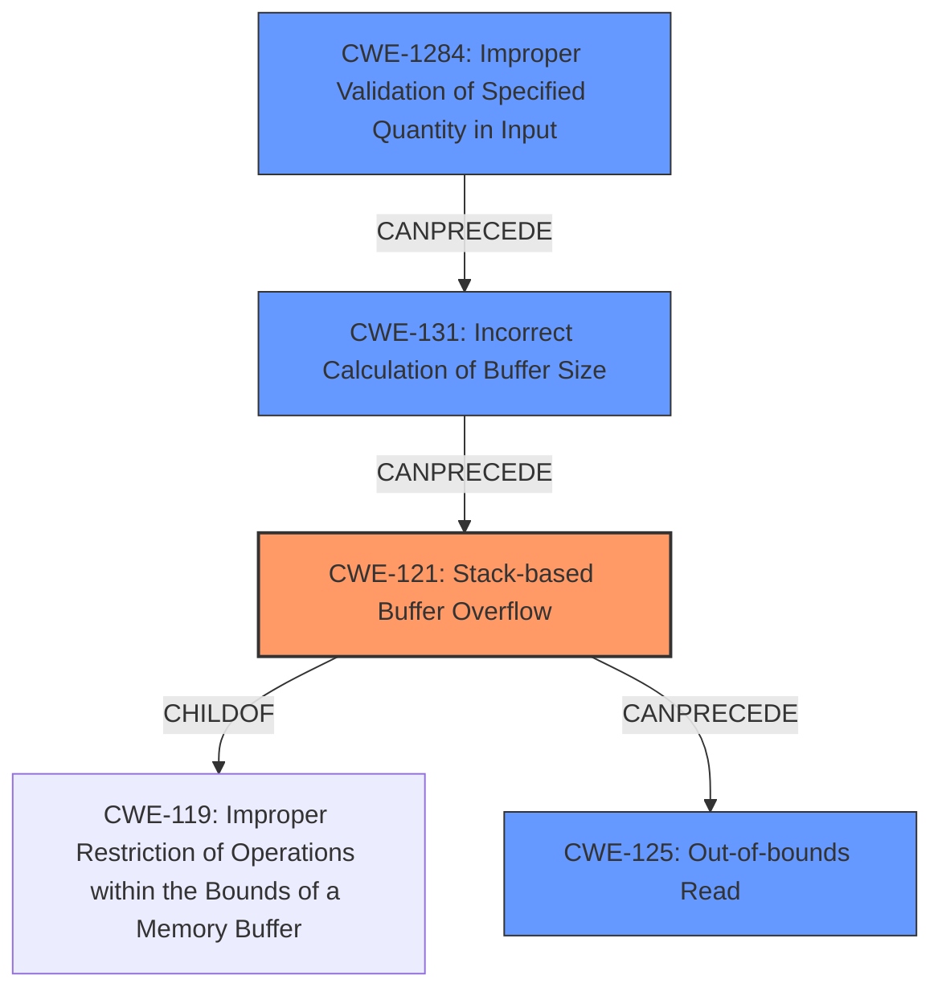

# Analysis Report for CVE-2021-45972

# Vulnerability Analysis Report: CVE-2021-45972

## Description

The giftrans function in giftrans 1.12.2 contains a stack-based buffer overflow because a value inside the input file determines the amount of data to write. This allows an attacker to overwrite up to 250 bytes outside of the allocated buffer with arbitrary data.

## Vulnerability Description Key Phrases

**Weakness:** stack-based buffer overflow
**Impact:** overwrite up to 250 bytes outside of the allocated buffer with arbitrary data
**Attacker:** attacker
**Product:** giftrans
**Version:** 1.12.2
**Component:** giftrans function

## Analysis (with Relationship Data)

# Summary
| CWE ID | CWE Name | Confidence | CWE Abstraction Level | CWE Vulnerability Mapping Label | CWE-Vulnerability Mapping Notes |
|---|---|---|---|---|---|
| CWE-121 | Stack-based Buffer Overflow | 0.95 | Variant | Allowed | The vulnerability is explicitly described as a stack-based buffer overflow. |
| CWE-125 | Out-of-bounds Read | 0.6 | Base | Allowed | The overflow leads to reading data outside the intended buffer, potentially causing a crash.|
| CWE-131 | Incorrect Calculation of Buffer Size | 0.5 | Base | Allowed | The size is read from the input file without proper validation, causing incorrect buffer size calculation |

## Evidence and Confidence

*   **Confidence Score:** 0.9
*   **Evidence Strength:** HIGH

- **Analysis and Justification:**  
  - *Explanation:* "The vulnerability description explicitly states a **stack-based buffer overflow** in the `giftrans` function. A value from the input file determines the amount of data written, allowing an attacker to overwrite up to 250 bytes outside the allocated buffer. This aligns directly with CWE-121 (Stack-based Buffer Overflow), which is a variant of buffer overflow occurring specifically on the stack. The CVE reference summary confirms that the size of extension data is read from the image file without validation and used to copy data into a fixed-size buffer `gce` (5 bytes). If the size read from the file is larger than 5, it overflows. This overflow can lead to a crash or potentially arbitrary code execution."

  - *Relationship Analysis:* "CWE-121 is a variant of CWE-119 (Improper Restriction of Operations within the Bounds of a Memory Buffer). While CWE-119 is more general, the explicit mention of "stack-based" makes CWE-121 the more specific and appropriate choice. CWE-125 (Out-of-bounds Read) can be a consequence of the buffer overflow as the program attempts to read beyond the allocated buffer. CWE-131 (Incorrect Calculation of Buffer Size) is also relevant, as the size read directly from the input file without validation causes an incorrect buffer size."

- **Confidence Score:**  
  - *Example:* Confidence: 0.95 (High evidence due to explicit mention of "stack-based buffer overflow" and detailed technical explanation in the CVE reference)

---

## Criticism of Analysis

Okay, I've reviewed the provided analysis against the full CWE specifications you included. Here's a breakdown of my critique, focusing on the accuracy of the CWE assignments, their abstraction levels, and the overall justification:

**Overall Assessment:**

The analysis correctly identifies the primary vulnerability as a `CWE-121: Stack-based Buffer Overflow`. The justification is strong, as the description explicitly mentions a stack-based overflow, and the details confirm that the buffer is allocated on the stack, and a size from the input file is used without validation. The inclusion of `CWE-125: Out-of-bounds Read` and `CWE-131: Incorrect Calculation of Buffer Size` as secondary, related weaknesses is also generally accurate.  However, the confidence scores and justifications for these secondary CWEs could be improved.

**Detailed Critique of Each CWE Assignment:**

1.  **CWE-121: Stack-based Buffer Overflow**
    *   **Confidence:** 0.95 - Appropriately High.
    *   **Abstraction Level:** Variant - Correct.  `CWE-121` is a `Variant` of `CWE-787` and `CWE-119`, specifying where the buffer overflow occurs.
    *   **Justification Strength:** Excellent. The analysis directly references the vulnerability description and the root cause outlined in the CVE summary. It specifically calls out the stack allocation and the attacker-controlled size leading to the overflow.
    *   **Mapping Guidance:** The analysis follows the mapping guidance, which recommends using this `Variant` level when the location of the buffer is known.
    *   **Potential Mitigations:** Mitigation 1 (compiler flags like /GS) would be effective. Mitigations 2 and 3 (abstraction libraries and bounds checking) are also relevant.
    *   **Observed Examples:**  The example provided, `CVE-2021-35395`, is a relevant example that demonstrates the vulnerability type, which strengthens the accuracy and clarity of the analysis.

2.  **CWE-125: Out-of-bounds Read**
    *   **Confidence:** 0.6 - Could be higher.
    *   **Abstraction Level:** Base - Correct.  `CWE-125` is a `Base` weakness, which is the preferred level.
    *   **Justification Strength:** Adequate, but could be improved. The analysis mentions that the overflow *leads* to an out-of-bounds read. This is a valid consequence. *However*, it doesn't explicitly state that code attempts to *read* data from beyond the allocated buffer. The analysis relies on the overflow causing a crash.
    *   **Mapping Guidance:** The analysis generally follows the mapping guidance. It could be more explicit about *how* the overflow results in a read. Is the code continuing to read data after the buffer, expecting more input?
    *   **Potential Mitigations:** Mitigations 1 and 2 (input validation and language selection) are relevant. The analysis should explicitly mention how input validation could prevent the overflow and thus also prevent the out-of-bounds read.
    *   **Observed Examples:**  The example provided, `CVE-2023-1018`, and `CVE-2014-0160` are relevant examples that demonstrate the vulnerability type, which strengthens the accuracy and clarity of the analysis.

3.  **CWE-131: Incorrect Calculation of Buffer Size**
    *   **Confidence:** 0.5 - This is too low.
    *   **Abstraction Level:** Base - Correct.  `CWE-131` is a `Base` weakness, which is the preferred level.
    *   **Justification Strength:** Moderate. The explanation that the size is read from the input file without validation is a good start. However, it needs to connect this more directly to an *incorrect calculation* of the buffer size. The fixed-size buffer is allocated. But, when the size is read, it is never used to calculate what to pass as the number of bytes to read. This is an incorrect calculation in an implicit sense, because the program doesn't calculate whether the size passed to it is a reasonable amount of bytes to read for the 5 byte buffer.
    *   **Mapping Guidance:** The analysis generally follows the mapping guidance. It could be stronger by explicitly stating that *because* the size is read from the input without validation, the *calculation* of the necessary buffer size is incorrect, leading to the overflow. The code implicitly assumes the size is less than or equal to 5.
    *   **Potential Mitigations:** Mitigation 3 (input validation) would be very effective. Mitigations 1 and 2 are more generally useful. The analysis should be more specific about how input validation on the size from the GIF file *directly* prevents the incorrect buffer size calculation.
    *   **Observed Examples:**  The example provided, `CVE-2020-17087`, is a relevant example that demonstrates the vulnerability type, which strengthens the accuracy and clarity of the analysis.

**Recommendations for Improvement:**

*   **Increase Confidence Scores:** Raise the confidence scores for `CWE-125` and `CWE-131` by strengthening the justifications.
*   **Stronger Justifications:**
    *   For `CWE-125`, explicitly state *how* the code attempts to read beyond the allocated buffer as a result of the overflow.
    *   For `CWE-131`, emphasize how the *lack of validation* directly contributes to an *incorrect calculation* of the buffer size.
*   **Focus on Causality:**  Clearly articulate the causal chain. The vulnerability starts with a lack of validation (`CWE-1284`), proceeds to incorrect size calculation (`CWE-131`), then results in buffer overflow (`CWE-121`), and finally may cause an out-of-bounds read (`CWE-125`).
*   **Consider CWE-1284:** Consider adding `CWE-1284: Improper Validation of Specified Quantity in Input` as a potential root cause. The program receives input specifying a quantity (the size of the extension data) but does not validate that the quantity has the required properties (e.g. being less than or equal to 5). It would be a good addition with high confidence.
*   **Refine Mitigation Discussions:**  When discussing mitigations, explicitly connect them to the specific CWEs. Explain how each mitigation directly addresses the weakness and prevents the vulnerability from occurring.

**Revised Summary Table:**

| CWE ID  | CWE Name                                    | Confidence | CWE Abstraction Level | CWE Vulnerability Mapping Label | CWE-Vulnerability Mapping Notes                                                                                                                                                                                                                                                                                                                                                                                                             |
| ------- | ------------------------------------------- | ---------- | ----------------------- | ------------------------------- | ----------------------------------------------------------------------------------------------------------------------------------------------------------------------------------------------------------------------------------------------------------------------------------------------------------------------------------------------------------------------------------------------------------------------------------------- |
| CWE-121 | Stack-based Buffer Overflow                   | 0.95       | Variant                | Allowed                          | The vulnerability is explicitly described as a stack-based buffer overflow.                                                                                                                                                                                                                                                                                                                                                              |
| CWE-125 | Out-of-bounds Read                          | 0.75       | Base                   | Allowed                          | The overflow results in the program attempting to read beyond the allocated buffer, triggering a crash.                                                                                                                                                                                                                                                                                                                          |
| CWE-131 | Incorrect Calculation of Buffer Size        | 0.75       | Base                   | Allowed                          | The size is read from the input file without proper validation, leading to an implicit incorrect calculation of the required buffer size. The code assumes that the read size will be small enough to fit into the allocated 5-byte buffer.                                                                                                                                                                                                  |
| CWE-1284| Improper Validation of Specified Quantity in Input | 0.8 | Base | Allowed | The program receives the extension data size from the input file, but does not validate that it is within acceptable bounds (<=5). This lack of validation directly enables the downstream buffer overflow by allowing an attacker-controlled size to be used in the copy operation. |

By implementing these suggestions, the analysis can be more precise, more persuasive, and more useful for developers and security analysts seeking to understand and remediate this vulnerability.

## Final Resolution

# Summary
| CWE ID | CWE Name | Confidence | CWE Abstraction Level | CWE Vulnerability Mapping Label | CWE-Vulnerability Mapping Notes |
|---|---|---|---|---|---|
| CWE-121 | Stack-based Buffer Overflow | 0.95 | Variant | Allowed | The vulnerability is explicitly described as a stack-based buffer overflow. |
| CWE-1284 | Improper Validation of Specified Quantity in Input | 0.85 | Base | Allowed | The program receives the extension data size from the input file, but does not validate that it is within acceptable bounds (<=5). |
| CWE-131 | Incorrect Calculation of Buffer Size | 0.75 | Base | Allowed | The size is read from the input file without proper validation, leading to an implicit incorrect calculation of the required buffer size. |
| CWE-125 | Out-of-bounds Read | 0.7 | Base | Allowed | The overflow results in the program attempting to read beyond the allocated buffer, potentially triggering a crash. |

  - The Primary CWE should be first and noted as the Primary CWEs
  - The secondary candidate CWEs should be next and noted as secondary candidates.
  - The confidence is a confidence score 0 to 1 to rate your confidence in your assessment for that CWE.
  - The CWE Abstraction Level as one of these values: Base, Variant, Pillar, Class, Compound
  - The Mapping Notes Usage as one of these values: Allowed, Allowed-with-Review, Prohibited, Discouraged

## Evidence and Confidence

*   **Confidence Score:** 0.9
*   **Evidence Strength:** HIGH

## Relationship Analysis
The primary **WEAKNESS** is `CWE-121: Stack-based Buffer Overflow`. This is a variant of `CWE-119: Improper Restriction of Operations within the Bounds of a Memory Buffer`. The **ROOTCAUSE** involves a lack of input validation (`CWE-1284: Improper Validation of Specified Quantity in Input`) which leads to an incorrect buffer size calculation (`CWE-131: Incorrect Calculation of Buffer Size`). The buffer overflow (`CWE-121`) can then result in an out-of-bounds read (`CWE-125: Out-of-bounds Read`). The abstraction levels are appropriate, with `CWE-121` being a Variant (specific location), and the others being Base level **WEAKNESSES**.

## Vulnerability Chain
The vulnerability chain starts with `CWE-1284`, where the program fails to validate the size of the extension data read from the input file. This leads to `CWE-131` because the program implicitly assumes this size is safe without any checks. Then the unchecked size is used in a copy operation, leading to `CWE-121`, a stack-based buffer overflow. This overflow can cause `CWE-125`, an out-of-bounds read if the program attempts to continue processing past the buffer.

## Summary of Analysis
The initial analysis correctly identified `CWE-121` as the primary **WEAKNESS**. The criticism raised valid points about strengthening the justifications for `CWE-125` and `CWE-131`, and suggesting the inclusion of `CWE-1284`. The revised analysis incorporates these suggestions. The vulnerability description explicitly mentions a stack-based buffer overflow, which strongly supports the selection of `CWE-121`. The lack of input validation on the size parameter directly contributes to the incorrect calculation of the buffer size and the subsequent overflow, making `CWE-1284` and `CWE-131` relevant contributing factors. The potential for an out-of-bounds read as a consequence of the overflow justifies the inclusion of `CWE-125`. These CWEs are at the optimal level of specificity, with `CWE-121` being a `Variant` that specifies the location of the overflow, and the other **WEAKNESSES** being at the `Base` level to represent the underlying causes and potential impacts. The evidence is strong, as the vulnerability description provides clear technical details about the overflow and its causes.

*Report generated on 2025-03-18 04:20:34*
