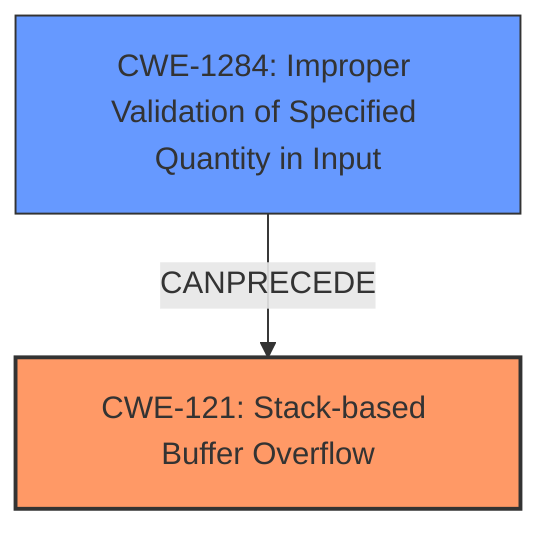

# Final Resolution for CVE-2021-45988

# Summary 
| CWE ID | CWE Name | Confidence | CWE Abstraction Level | CWE Vulnerability Mapping Label | CWE-Vulnerability Mapping Notes |
|---|---|---|---|---|---|
| CWE-121 | Stack-based Buffer Overflow | 0.95 | Variant | Allowed | Primary CWE |
| CWE-1284 | Improper Validation of Specified Quantity in Input | 0.60 | Base | Allowed | Secondary Candidate |

## Evidence and Confidence

*   **Confidence Score:** 0.90
*   **Evidence Strength:** MEDIUM

## Relationship Analysis
The primary relationship is that CWE-1284 can precede CWE-121. The analysis focuses on the direct evidence of a "stack overflow," making CWE-121 the primary classification. The suggestion to include CWE-1284 acknowledges the potential root cause of the overflow related to input validation. However, the vulnerability description focuses on the stack overflow itself.

## Vulnerability Chain
The vulnerability chain starts with **CWE-1284 (Improper Validation of Specified Quantity in Input)**, where the `DnsForwardRule` parameter's size or length is not properly validated. This leads to **CWE-121 (Stack-based Buffer Overflow)** when an oversized `DnsForwardRule` is copied onto the stack, causing a buffer overflow. The impact is a denial of service (DoS).

## Summary of Analysis
The initial analysis correctly identifies **CWE-121 (Stack-based Buffer Overflow)** as the primary **WEAKNESS** due to the explicit mention of "stack overflow" in the vulnerability description: "Tenda routers G1 and G3 v15.11.0.17(9502)_CN were discovered to contain a stack overflow in the function formAddDnsForward." This is strong evidence directly supporting **CWE-121**.

The criticism suggested including **CWE-1284 (Improper Validation of Specified Quantity in Input)** as a contributing factor, which is a valid point. Since the `DnsForwardRule` parameter is the attack vector, it is highly likely that the root cause involves a lack of input validation. While the description emphasizes the stack overflow, the root cause may lie in the missing or insufficient validation of the input that triggers the overflow.

The graph relationships influenced the final selection by highlighting the potential chain from input validation to buffer overflow. While **CWE-121** remains the primary **WEAKNESS** due to the explicit evidence, acknowledging **CWE-1284** provides a more complete picture of the vulnerability.

The selected CWEs are at an appropriate level of specificity. **CWE-121** is a Variant that accurately describes the type of buffer overflow. **CWE-1284** is a Base CWE that identifies the lack of input validation as a potential **ROOTCAUSE**. Together, they provide a comprehensive understanding of the vulnerability.

The confidence score is adjusted to 0.90 to reflect the inclusion of **CWE-1284** as a secondary contributing factor. While the evidence for **CWE-121** is strong, acknowledging the potential **ROOTCAUSE** in **CWE-1284** slightly reduces the confidence in **CWE-121** as the sole classification.