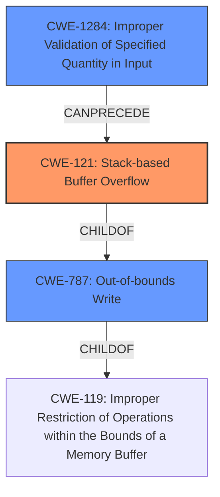

# Analysis Report for CVE-2021-45994

# Vulnerability Analysis Report: CVE-2021-45994

## Description

Tenda routers G1 and G3 v15.11.0.17(9502)_CN were discovered to contain a stack overflow in the function formDelDhcpRule. This vulnerability allows attackers to cause a Denial of Service (DoS) via the delDhcpIndex parameter.

## Vulnerability Description Key Phrases

**Weakness:** stack overflow
**Impact:** Denial of Service (DoS)
**Vector:** delDhcpIndex parameter
**Attacker:** attackers
**Product:** Tenda routers G1 and G3
**Version:** v15.11.0.17(9502)_CN
**Component:** formDelDhcpRule function

## Analysis (with Relationship Data)

# Summary
| CWE ID | CWE Name | Confidence | CWE Abstraction Level | CWE Vulnerability Mapping Label | CWE-Vulnerability Mapping Notes |
|---|---|---|---|---|---|
| CWE-121 | Stack-based Buffer Overflow | 0.9 | Variant | Primary | Allowed |
| CWE-787 | Out-of-bounds Write | 0.6 | Base | Secondary Candidate | Allowed |

## Evidence and Confidence

*   **Confidence Score:** 0.9
*   **Evidence Strength:** HIGH

- **Analysis and Justification:**  
  - *Explanation:* The vulnerability description explicitly states a **stack overflow** in the `formDelDhcpRule` function of Tenda routers. This aligns directly with CWE-121 (Stack-based Buffer Overflow), which is a variant of buffer overflow occurring on the stack. The vulnerability is triggered via the `delDhcpIndex` parameter, leading to a denial of service (DoS). CWE-787 (Out-of-bounds Write) is a broader category that encompasses stack overflows, but CWE-121 is more specific and therefore more appropriate given the provided information.
  
  - *Relationship Analysis:* CWE-121 is a variant of CWE-787 (Out-of-bounds Write) and a child of CWE-119 (Improper Restriction of Operations within the Bounds of a Memory Buffer). The description does not provide enough information to identify a more precise weakness, so CWE-121 represents the best available mapping.

- **Confidence Score:**  
  - Confidence: 0.9 (High confidence due to the explicit mention of "stack overflow" and the clear description of the affected component and parameter.)

## Criticism of Analysis

Okay, let's review the provided CWE analysis for the Tenda router stack overflow vulnerability, considering the full CWE specifications.

**Overall Assessment:**

The analysis is generally good.  The primary mapping to CWE-121 (Stack-based Buffer Overflow) is accurate and well-justified. The reasoning for choosing CWE-121 over the broader CWE-787 is sound.  The confidence level of 0.9 is reasonable given the explicit mention of "stack overflow" in the description.

**Detailed Critique:**

1.  **Primary CWE: CWE-121 (Stack-based Buffer Overflow)**

    *   **Correctness:** The selection of CWE-121 is correct. The description explicitly mentions a stack overflow, making this the most specific and accurate CWE.
    *   **Abstraction Level:**  CWE-121 is a Variant, which is the preferred abstraction level according to CWE's Mapping Guidance.
    *   **Justification:** The justification provided is excellent, explaining why CWE-121 is more appropriate than CWE-787.
    *   **Mitigations:** The analysis doesn't explicitly discuss the mitigations for CWE-121, but it's implied. Considering the mitigations listed in the CWE specifications is useful:

        *   **Compiler-based Overflow Detection:**  Using compilers with /GS (Visual Studio), FORTIFY_SOURCE (GCC), StackGuard, or ProPolice would be a good mitigation strategy. These add canaries to detect stack corruption.
        *   **Abstraction Libraries:**  Using safer string handling functions (like `strncpy` with proper size checking), or dedicated safe string libraries, could help.
        *   **Input Validation:** Implementing bounds checking on the `delDhcpIndex` parameter *before* it's used in any buffer operations is critical.

    *   **CWE Examples:** The observed examples given in the document are relevant to CWE-121.

2.  **Secondary Candidate CWE: CWE-787 (Out-of-bounds Write)**

    *   **Correctness:** While CWE-787 is a parent of CWE-121, it's less specific.  It's valid as a secondary candidate but not the best primary mapping. The analysis correctly identifies it as a broader category.
    *   **Abstraction Level:** CWE-787 is a Base CWE, which is also considered a good abstraction level.
    *   **Justification:** The justification for *not* choosing it as primary is accurate: CWE-121 is more specific.
    *   **Mitigations:** Examining the mitigations for CWE-787 gives additional context:
        *   **Language Selection:** While impractical in many cases, choosing a memory-safe language would eliminate this class of vulnerability.
        *   **Libraries/Frameworks:** Safe string libraries, again, are relevant.
        *   **Compiler-based overflow Detection:** As with CWE-121, this remains a relevant point.

3.  **Retriever Results:**
    *   **CWE-1284 (Improper Validation of Specified Quantity in Input):** The retriever result of CWE-1284 points to a potential root cause. The `delDhcpIndex` parameter likely represents a quantity (an index).  If the code doesn't validate that this index is within the bounds of the DHCP rule array, it could lead to the overflow.  *This is a key observation and a potential area for improving the analysis.*  It might be worth adding CWE-1284 as a tertiary CWE, focusing on the *root cause* of the overflow.
        *Mitigations for CWE-1284:* The "accept known good" input validation strategy is very important here.  A whitelist of valid inputs is not possible, so a range check is necessary.

    *   **CWE-120 (Buffer Copy without Checking Size of Input):** This is closely related to the problem, however, a stack overflow is frequently a result of other improper conditions.
        *   **Mitigations for CWE-120:**  Choosing languages that automatically manage memory can be important.

4.  **CWE-119 (Improper Restriction of Operations within the Bounds of a Memory Buffer):** While it's a parent of both CWE-121 and CWE-787, the analysis correctly avoids mapping directly to it, as it's too general. The comments in the CWE specification itself discourage direct mapping to CWE-119.

**Recommendations for Improvement:**

*   **Add CWE-1284 as a Tertiary CWE:**  Include CWE-1284 (Improper Validation of Specified Quantity in Input) as a tertiary CWE, explicitly discussing how the lack of validation on the `delDhcpIndex` parameter is the *root cause* enabling the stack overflow. Explain how proper input validation (range checking) could prevent the vulnerability.
*   **Expand Mitigation Discussion:** Briefly mention some of the key mitigations from the CWE specifications for CWE-121 and CWE-787 (and CWE-1284, if added), such as compiler-based overflow detection, safe string libraries, and input validation.
*   **Acknowledge Limits:** Note that the analysis is based on the information provided in the vulnerability description. A full code review might reveal more specific weaknesses or contributing factors.

By incorporating these suggestions, the analysis will be more comprehensive and provide a clearer understanding of the vulnerability and its potential mitigations.

## Final Resolution

# Summary
| CWE ID | CWE Name | Confidence | CWE Abstraction Level | CWE Vulnerability Mapping Label | CWE-Vulnerability Mapping Notes |
|---|---|---|---|---|---|
| CWE-121 | Stack-based Buffer Overflow | 0.9 | Variant | Primary | Allowed |
| CWE-1284 | Improper Validation of Specified Quantity in Input | 0.7 | Base | Secondary Candidate | Allowed |
| CWE-787 | Out-of-bounds Write | 0.6 | Base | Secondary Candidate | Allowed |

## Evidence and Confidence

*   **Confidence Score:** 0.8
*   **Evidence Strength:** HIGH

## Relationship Analysis
The primary weakness is a **stack overflow**, which is a specific type of **out-of-bounds write**. The **root cause** is likely due to improper validation of the `delDhcpIndex` parameter.

- CWE-121 (Stack-based Buffer Overflow) is a variant of CWE-787 (Out-of-bounds Write) and a child of CWE-119 (Improper Restriction of Operations within the Bounds of a Memory Buffer).
- CWE-1284 (Improper Validation of Specified Quantity in Input) can precede CWE-121, as lack of input validation can lead to a buffer overflow.
- The abstraction levels influenced the decision, prioritizing the most specific weakness (CWE-121) while also acknowledging the broader context (CWE-787) and **root cause** (CWE-1284).

## Vulnerability Chain
The vulnerability chain starts with the **root cause**, an **Improper Validation of Specified Quantity in Input (CWE-1284)**, specifically the `delDhcpIndex` parameter. This lack of validation leads to a **Stack-based Buffer Overflow (CWE-121)** when the index is used to access a buffer on the stack. The overflow results in an **Out-of-bounds Write (CWE-787)**, causing a denial of service (DoS).

## Summary of Analysis
The initial analysis correctly identified CWE-121 as the primary weakness due to the explicit mention of "stack overflow" in the vulnerability description. The criticism suggested adding CWE-1284 to represent the **root cause** of the vulnerability. This is a valuable addition because it highlights the importance of input validation in preventing buffer overflows.

The graph relationships influenced the final selection by illustrating the hierarchical relationship between CWE-121 and CWE-787, and the chain relationship between CWE-1284 and CWE-121. The abstraction levels were also considered, prioritizing the most specific weakness (CWE-121) while also acknowledging the broader context (CWE-787) and **root cause** (CWE-1284).

The selected CWEs are at the optimal level of specificity because they accurately represent the vulnerability based on the available evidence. CWE-121 is the most specific weakness identified in the description ("stack overflow"). CWE-1284 represents the likely **root cause**, and CWE-787 provides a broader context.

*Report generated on 2025-03-18 04:34:27*
