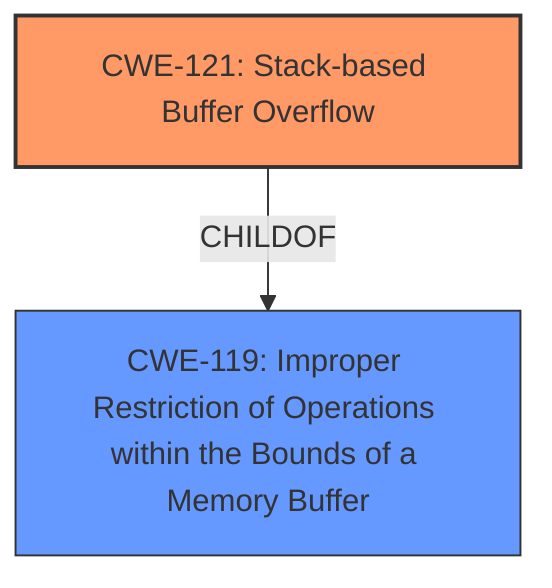

# Final Resolution for CVE-2021-45995

# Summary 
| CWE ID | CWE Name | Confidence | CWE Abstraction Level | CWE Vulnerability Mapping Label | CWE-Vulnerability Mapping Notes |
|---|---|---|---|---|---|
| CWE-121 | Stack-based Buffer Overflow | 0.95 | Variant | Allowed | Primary CWE |
  
## Evidence and Confidence

*   **Confidence Score:** 0.95
*   **Evidence Strength:** HIGH

## Relationship Analysis
The primary relationship considered was the hierarchical relationship, ensuring that a specific CWE (Variant) was chosen over a more general one (Class or Base). CWE-121 is a specific type of buffer overflow, occurring on the stack. The analysis also considered potential chain relationships, such as integer overflows or command injection leading to the buffer overflow, but concluded that there was insufficient evidence to support these. The abstraction level influenced the decision to select CWE-121 (Variant) over CWE-119 (Class) because CWE-121 provides a more precise characterization of the vulnerability.

## Vulnerability Chain
The vulnerability chain consists of a buffer overflow occurring on the stack due to insufficient size validation when handling parameters passed to the `formSetStaticRoute` function.
  - **Root Cause:** Insufficient size validation of input parameters (`staticRouteNet`, `staticRouteMask`, and `staticRouteGateway`).
  - **Weakness:** **Stack-based buffer overflow** (CWE-121).
  - **Impact:** Denial of Service (DoS).

## Summary of Analysis
The initial analysis correctly identified CWE-121 (Stack-based Buffer Overflow) as the primary CWE. The criticism reinforces this decision, emphasizing that the vulnerability description explicitly mentions a "stack overflow" in the `formSetStaticRoute` function, making CWE-121 the most appropriate and specific classification.

The analysis considered alternative CWEs, such as CWE-190 (Integer Overflow or Wraparound), CWE-78 (OS Command Injection), and CWE-120 (Buffer Copy without Checking Size of Input), but correctly determined that there was insufficient evidence to support these as primary or secondary CWEs. The decision to prioritize CWE-121 is based on the explicit mention of a "stack overflow" in the vulnerability description. As stated in the initial analysis, "*The vulnerability description explicitly states a **stack overflow** in the `formSetStaticRoute` function of Tenda routers.*"

The selection of CWE-121 is at the optimal level of specificity because it accurately describes the type and location of the buffer overflow.