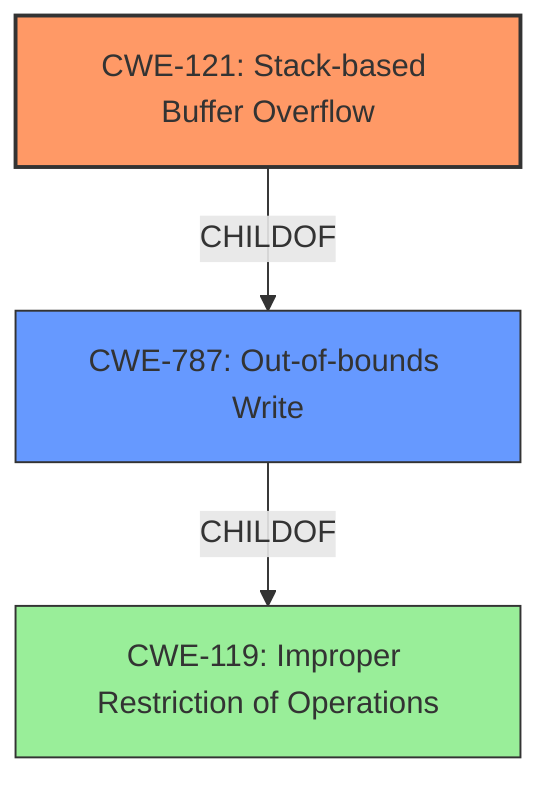

# Final Resolution for CVE-2021-45997

# Summary
| CWE ID | CWE Name | Confidence | CWE Abstraction Level | CWE Vulnerability Mapping Label | CWE-Vulnerability Mapping Notes |
|---|---|---|---|---|---|
| CWE-121 | Stack-based Buffer Overflow | 0.95 | Variant | Allowed | Primary CWE |
| CWE-787 | Out-of-bounds Write | 0.70 | Base | Allowed | Secondary Candidate |

## Evidence and Confidence

*   **Confidence Score:** 0.95
*   **Evidence Strength:** HIGH

## Relationship Analysis
The primary relationship impacting the decision is the parent-child relationship between **CWE-787 (Out-of-bounds Write)** and **CWE-121 (Stack-based Buffer Overflow)**. **CWE-121** is a specific type of **CWE-787** where the buffer is allocated on the stack. The vulnerability description explicitly mentions "stack overflow," making **CWE-121** the more specific and appropriate choice. **CWE-119 (Improper Restriction of Operations within the Bounds of a Memory Buffer)** is a more general class encompassing both, but its use is discouraged when more specific CWEs like **CWE-121** are applicable.

## Vulnerability Chain
The vulnerability chain starts with the lack of proper input validation on parameters like `portMappingServer`, `portMappingProtocol`, etc. This leads to an excessively long input being written to a stack-allocated buffer, resulting in a **CWE-121 (Stack-based Buffer Overflow)**. The consequence of this overflow is a Denial of Service (DoS).

## Summary of Analysis
The initial analysis correctly identifies **CWE-121 (Stack-based Buffer Overflow)** as the primary **WEAKNESS**. The vulnerability description explicitly states "stack overflow," which directly aligns with the definition of **CWE-121**. The analysis also appropriately considers **CWE-787 (Out-of-bounds Write)** as a secondary candidate, acknowledging that it is a more general class of **WEAKNESS**.

The relationship analysis reinforces the choice of **CWE-121** due to its specificity. While **CWE-787** and **CWE-119** are related, they are less specific and therefore less appropriate. The mapping guidance for **CWE-119** discourages its use when more specific CWEs are available.

The decision to classify this vulnerability as **CWE-121 (Stack-based Buffer Overflow)** is based on direct evidence from the vulnerability description ("stack overflow") and the desire to choose the most specific CWE available. This ensures that the classification accurately reflects the nature of the vulnerability. The choice of **CWE-121** as a Variant is appropriate because it is a specialization of the more general **CWE-787**.
The analysis also considers mitigation strategies like stack canaries, which aligns with the nature of stack-based buffer overflows.

I agree with the above analysis. The explicit mention of "stack overflow" in the vulnerability description is strong evidence for **CWE-121 (Stack-based Buffer Overflow)**. The choice of **CWE-121** over **CWE-787 (Out-of-bounds Write)** is justified by its greater specificity. The analysis appropriately considers the relationship between **CWE-121**, **CWE-787**, and **CWE-119 (Improper Restriction of Operations within the Bounds of a Memory Buffer)**, and it correctly notes that **CWE-119** is discouraged when more specific CWEs are available. The analysis uses the evidence appropriately and justifies the selection of the CWE.