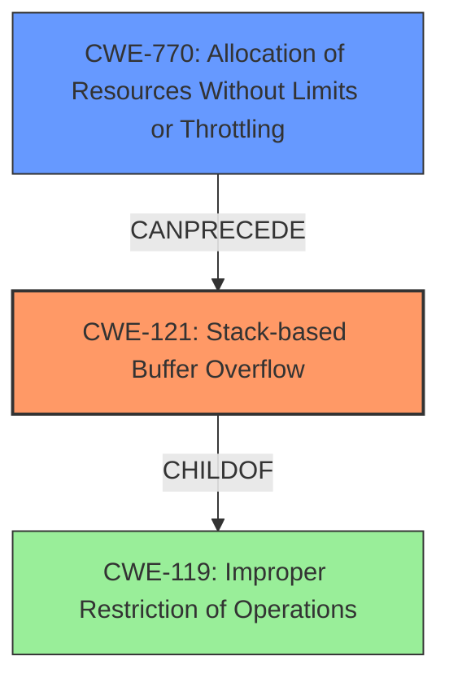

# Analysis Report for CVE-2021-46050

# Vulnerability Analysis Report: CVE-2021-46050

## Description

A Stack Overflow vulnerability exists in Binaryen 103 via the printf_common function.

## Vulnerability Description Key Phrases

**Weakness:** Stack Overflow
**Product:** Binaryen
**Version:** 103
**Component:** printf_common function

## Analysis (with Relationship Data)

# Summary
| CWE ID | CWE Name | Confidence | CWE Abstraction Level | CWE Vulnerability Mapping Label | CWE-Vulnerability Mapping Notes |
|---|---|---|---|---|---|
| CWE-121 | Stack-based Buffer Overflow | 0.95 | Variant | Primary | Allowed |

## Evidence and Confidence

*   **Confidence Score:** 0.95
*   **Evidence Strength:** HIGH

- **Analysis and Justification:**  
  - *Explanation:* The vulnerability is explicitly described as a **Stack Overflow** in the `printf_common` function of Binaryen 103. The CVE Reference Links Content Summary further confirms that the root cause is a stack overflow due to excessive nesting of try-catch blocks, leading to a deep call stack that exceeds available stack space. This directly aligns with the characteristics of CWE-121 (Stack-based Buffer Overflow), which is a buffer overflow where the overwritten buffer is allocated on the stack. The vulnerability leads to a segmentation fault and denial of service. While other CWEs like CWE-770 (Allocation of Resources Without Limits or Throttling) and CWE-789 (Uncontrolled Memory Allocation Size) are related to resource allocation issues, CWE-121 is the most specific and accurate representation of the described **weakness**.
  
  - *Relationship Analysis:* CWE-121 is a variant of CWE-119 (Improper Restriction of Operations within the Bounds of a Memory Buffer). The description clearly indicates the overflow occurs on the stack, making CWE-121 a more precise classification than its parent.

- **Confidence Score:**  
  - Confidence: 0.95 (High evidence from the vulnerability description and CVE reference details)

## Criticism of Analysis

Okay, here's a review of the provided analysis, focusing on the CWE mapping, confidence, and considering alternative CWEs based on the full specifications you provided.

**Overall Assessment:**

The analysis correctly identifies the primary vulnerability as CWE-121, Stack-based Buffer Overflow. The confidence level of 0.95 is appropriate given the clear description of a stack overflow in both the initial description and the CVE reference links. However, it's crucial to also consider the underlying cause related to resource management, potentially adding a secondary CWE or refining the analysis.

**Detailed Review:**

1.  **CWE-121: Stack-based Buffer Overflow**

    *   **Assessment:** The selection of CWE-121 is justified. The vulnerability description explicitly states "Stack Overflow," and the root cause analysis details how deeply nested try-catch blocks lead to an excessive call stack and overflow. The fact that this leads to a crash within `__vfprintf_internal` due to stack exhaustion further reinforces this classification. The extended description of CWE-121 correctly identifies "Stack Overflow" as often being related to stack-based buffer overflows.

    *   **Mapping Guidance Adherence:** The analysis appropriately maps the vulnerability to the *Variant* level (CWE-121), which is the preferred level of abstraction. The description clearly fits the definition: "A stack-based buffer overflow condition is a condition where the buffer being overwritten is allocated on the stack (i.e., is a local variable or, rarely, a parameter to a function)."

    *   **Mitigations:** The suggested mitigations for CWE-121 are relevant:
        *   Using compiler-based buffer overflow detection mechanisms (e.g., /GS flag, FORTIFY_SOURCE)
        *   Using abstraction libraries to abstract risky APIs.
        *   Implementing and performing bounds checking on input (although this specific vulnerability isn't directly caused by external input, but by internal structure nesting).

2.  **Consideration of Alternative CWEs and Potential Chains:**

    *   **CWE-770: Allocation of Resources Without Limits or Throttling & CWE-789: Memory Allocation with Excessive Size Value:** These are strong candidates for consideration. While the ultimate manifestation is a stack overflow, the *root cause* lies in the program's failure to limit the resources (stack space) consumed by deeply nested try-catch blocks. The program *allocates* stack space for each nested block without any throttling mechanism. The excessive number of nested blocks effectively leads to an "Allocation of Resources Without Limits or Throttling" (CWE-770).  CWE-789 could also be considered as it involves memory allocation (on the stack) based on an uncontrolled size (the depth of nesting). Since the stack has a limited size, this is related.

        *   **Why it's important:** Identifying these CWEs allows for a more comprehensive understanding of the vulnerability and can lead to more effective preventative measures.  Simply focusing on the stack overflow might lead to solutions that only address the symptom (e.g., stack canaries) rather than the underlying cause (uncontrolled nesting).

        *   **Recommendation:** Add CWE-770 (or CWE-789) as a secondary CWE, with a note explaining the relationship:  "The stack overflow (CWE-121) is a consequence of allocating stack resources without limits or throttling (CWE-770). Excessive nesting of try-catch blocks leads to uncontrolled stack allocation until the stack limit is reached."

    *   **CWE-400: Uncontrolled Resource Consumption:** This is a broader, more abstract CWE. While technically relevant, CWE-770 is more specific and preferred.

    *   **CWE-1284: Improper Validation of Specified Quantity in Input:** There is no input validation issue mentioned in the description, so this does not seem relevant.

3.  **Retriever Results Review**

    *   The retrievers identify several other CWEs, many of which are related to buffer operations and integer handling. Given the information in the CVE and provided details, the following may be relevant:
       *   **CWE-190:** Integer Overflow or Wraparound: This may be relevant if the number of nested try-catch blocks is controlled by some integer value that is subject to an overflow.
       *   **CWE-126:** Buffer Over-read: This may be relevant if after the stack overflow occurs, there is a read from memory that has been written to.
       *   **CWE-120:** Buffer Copy without Checking Size of Input: This is not relevant as there is not an explicit buffer copy operation occurring.
       *   **CWE-170:** Improper Null Termination: This is not relevant as the vulnerability is not related to strings or null termination.
       *   **CWE-676:** Use of Potentially Dangerous Function: This may be relevant as there was a crash within the `__vfprintf_internal` function.
       *   **CWE-125:** Out-of-bounds Read: This may be relevant if after the stack overflow occurs, there is a read from memory that has been written to.
       *   **CWE-193:** Off-by-one Error: This is not relevant.
       *   **CWE-197:** Numeric Truncation Error: This does not seem relevant.

**Revised Summary Table (incorporating the above):**

| CWE ID  | CWE Name                                             | Confidence | CWE Abstraction Level | CWE Vulnerability Mapping Label | CWE-Vulnerability Mapping Notes                                                                                                                                |
| ------- | ---------------------------------------------------- | ---------- | ----------------------- | ------------------------------- | -------------------------------------------------------------------------------------------------------------------------------------------------------------- |
| CWE-121 | Stack-based Buffer Overflow                          | 0.95       | Variant                 | Primary                         | Allowed                                                                                                                                                          |
| CWE-770 | Allocation of Resources Without Limits or Throttling | 0.75       | Base                    | Secondary                       | Allowed. Root cause: Excessive nesting leads to uncontrolled stack allocation. Contributes to CWE-121.                                                          |

**Recommendations:**

*   **Maintain High Confidence in CWE-121:** The primary classification as a Stack-based Buffer Overflow is accurate.
*   **Add Secondary CWE for Root Cause:** Include CWE-770 (Allocation of Resources Without Limits or Throttling) as a secondary CWE to capture the underlying resource management issue.
*   **Elaborate on the Relationship:** Clearly explain in the "CWE-Vulnerability Mapping Notes" how CWE-770 contributes to the stack overflow.
*   **Consider Mitigation at the Root Cause:** When suggesting mitigations, emphasize limiting nesting depth or using alternative resource management techniques to prevent uncontrolled stack allocation.
*   **Re-evaluate Retriever Results:** Perform further analysis to confirm the findings of CWE-190, CWE-126, and CWE-676 based on the crash report.

By adding the secondary CWE and elaborating on the relationship, the analysis will provide a more complete and actionable understanding of the vulnerability.

## Final Resolution

# Summary
| CWE ID | CWE Name | Confidence | CWE Abstraction Level | CWE Vulnerability Mapping Label | CWE-Vulnerability Mapping Notes |
|---|---|---|---|---|---|
| **CWE-121** | **Stack-based Buffer Overflow** | 0.95 | Variant | Primary | Allowed |
| **CWE-770** | **Allocation of Resources Without Limits or Throttling** | 0.75 | Base | Secondary | Allowed. Root cause: Excessive nesting leads to uncontrolled stack allocation. Contributes to **CWE-121**. |

## Evidence and Confidence

*   **Confidence Score:** 0.90
*   **Evidence Strength:** HIGH

## Relationship Analysis
The primary relationship is that **CWE-770** (Allocation of Resources Without Limits or Throttling) can precede **CWE-121** (Stack-based Buffer Overflow). The excessive allocation of stack resources, without limits, due to nested try-catch blocks leads directly to the stack overflow condition. **CWE-121** is a variant of **CWE-119** (Improper Restriction of Operations within the Bounds of a Memory Buffer), providing a more specific classification.

## Vulnerability Chain
The vulnerability chain starts with **CWE-770** (**Allocation of Resources Without Limits or Throttling**), where the software fails to restrict the amount of stack space allocated for nested try-catch blocks. This leads to the consumption of excessive stack memory. When the stack limit is reached, a **CWE-121** (**Stack-based Buffer Overflow**) occurs, resulting in a segmentation fault and denial of service.

## Summary of Analysis
The initial analysis correctly identifies **CWE-121** as the primary **weakness**, given that the vulnerability is explicitly described as a stack overflow. However, the criticism highlights the importance of considering the root cause. "The program *allocates* stack space for each nested block without any throttling mechanism. The excessive number of nested blocks effectively leads to an "Allocation of Resources Without Limits or Throttling" (**CWE-770**)." By including **CWE-770** as a secondary **weakness**, the analysis provides a more complete understanding of the vulnerability. The graph relationships show that **CWE-770** can precede **CWE-121**, which accurately reflects the vulnerability chain.

**CWE-121** is at the Variant level, which is the preferred level of abstraction. **CWE-770** is at the Base level, which is also a preferred level of abstraction. These choices ensure the classification is as specific as possible while still accurately representing the root cause and impact of the vulnerability. The retriever results also support the selection of **CWE-770** as a potential contributing factor.

*Report generated on 2025-03-18 04:38:23*
