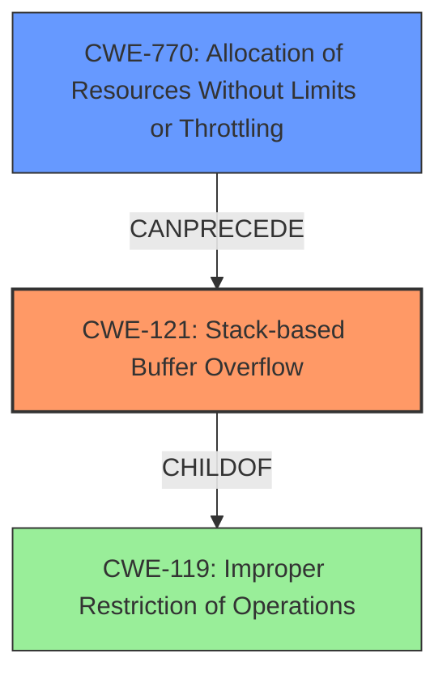

# Final Resolution for CVE-2021-46050

# Summary
| CWE ID | CWE Name | Confidence | CWE Abstraction Level | CWE Vulnerability Mapping Label | CWE-Vulnerability Mapping Notes |
|---|---|---|---|---|---|
| **CWE-121** | **Stack-based Buffer Overflow** | 0.95 | Variant | Primary | Allowed |
| **CWE-770** | **Allocation of Resources Without Limits or Throttling** | 0.75 | Base | Secondary | Allowed. Root cause: Excessive nesting leads to uncontrolled stack allocation. Contributes to **CWE-121**. |

## Evidence and Confidence

*   **Confidence Score:** 0.90
*   **Evidence Strength:** HIGH

## Relationship Analysis
The primary relationship is that **CWE-770** (Allocation of Resources Without Limits or Throttling) can precede **CWE-121** (Stack-based Buffer Overflow). The excessive allocation of stack resources, without limits, due to nested try-catch blocks leads directly to the stack overflow condition. **CWE-121** is a variant of **CWE-119** (Improper Restriction of Operations within the Bounds of a Memory Buffer), providing a more specific classification.

## Vulnerability Chain
The vulnerability chain starts with **CWE-770** (**Allocation of Resources Without Limits or Throttling**), where the software fails to restrict the amount of stack space allocated for nested try-catch blocks. This leads to the consumption of excessive stack memory. When the stack limit is reached, a **CWE-121** (**Stack-based Buffer Overflow**) occurs, resulting in a segmentation fault and denial of service.

## Summary of Analysis
The initial analysis correctly identifies **CWE-121** as the primary **weakness**, given that the vulnerability is explicitly described as a stack overflow. However, the criticism highlights the importance of considering the root cause. "The program *allocates* stack space for each nested block without any throttling mechanism. The excessive number of nested blocks effectively leads to an "Allocation of Resources Without Limits or Throttling" (**CWE-770**)." By including **CWE-770** as a secondary **weakness**, the analysis provides a more complete understanding of the vulnerability. The graph relationships show that **CWE-770** can precede **CWE-121**, which accurately reflects the vulnerability chain.

**CWE-121** is at the Variant level, which is the preferred level of abstraction. **CWE-770** is at the Base level, which is also a preferred level of abstraction. These choices ensure the classification is as specific as possible while still accurately representing the root cause and impact of the vulnerability. The retriever results also support the selection of **CWE-770** as a potential contributing factor.