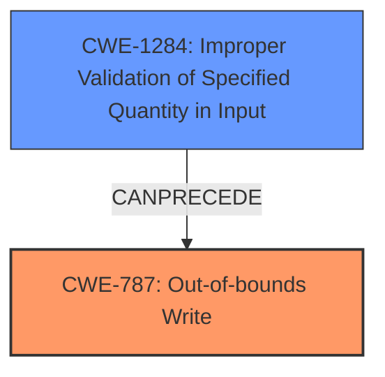

# Final Resolution for CVE-2021-46153

# Summary

| CWE ID | CWE Name | Confidence | CWE Abstraction Level | CWE Vulnerability Mapping Label | CWE-Vulnerability Mapping Notes |
|---|---|---|---|---|---|
| **CWE-787** | **Out-of-bounds Write** | 0.95 | Base | Primary | Allowed |
| **CWE-1284** | **Improper Validation of Specified Quantity in Input** | 0.60 | Base | Secondary | Allowed |

## Evidence and Confidence

*   **Confidence Score:** 0.90
*   **Evidence Strength:** HIGH

## Relationship Analysis
The primary weakness is **CWE-787 (Out-of-bounds Write)**, a Base level CWE. The secondary weakness is **CWE-1284 (Improper Validation of Specified Quantity in Input)**. **CWE-1284** can precede **CWE-787** if the improperly validated quantity is used to determine the size of a buffer or the number of elements to write, leading to an **out-of-bounds write**.

## Vulnerability Chain
The vulnerability chain starts with **CWE-1284 (Improper Validation of Specified Quantity in Input)**. If a quantity such as buffer size or the number of elements to write is not validated, it can lead to an **out-of-bounds write**, represented by **CWE-787**. The **out-of-bounds write** can then lead to arbitrary code execution.

## Summary of Analysis
The initial analysis correctly identified **CWE-787 (Out-of-bounds Write)** as the primary weakness, which is supported by the vulnerability description stating a **memory corruption** vulnerability while parsing NEU files. The criticism suggested replacing **CWE-20 (Improper Input Validation)** with a more specific CWE.

The vulnerability description states "Affected application contains a **memory corruption** vulnerability while parsing NEU files. This could allow an attacker to execute code in the context of the current process." This provides strong evidence for **CWE-787**.

The criticism also correctly pointed out that the justification for including **CWE-125 (Out-of-bounds Read)** was weak. Therefore, **CWE-125** was removed. The suggestion to use **CWE-1284 (Improper Validation of Specified Quantity in Input)** is considered a good suggestion, as it specifies what input validation issue is occurring. The vulnerability description states the issue occurs while parsing NEU files, which suggests that a quantity is being read from the file which affects the buffer size. Therefore, the final decision is to use **CWE-787** as the primary weakness and **CWE-1284** as the secondary weakness. Both are at the Base level of abstraction.