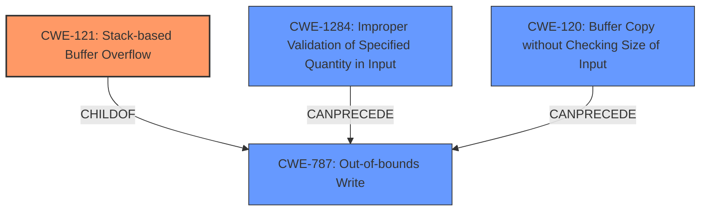

# Final Resolution for CVE-2021-46155

# Summary
| CWE ID | CWE Name | Confidence | CWE Abstraction Level | CWE Vulnerability Mapping Label | CWE-Vulnerability Mapping Notes |
|---|---|---|---|---|---|
| CWE-121 | Stack-based Buffer Overflow | 0.95 | Variant | Primary | Allowed. The vulnerability is explicitly a **stack-based buffer overflow**. This specifies the location of the buffer and is more specific than CWE-787 (**Out-of-bounds Write**). |
| CWE-787 | **Out-of-bounds Write** | 0.95 | Base | Secondary | Allowed. The vulnerability involves writing data past the end of a buffer. This CWE is a parent of CWE-121 and is generally a good fit for buffer overflows. |
| CWE-1284 | Improper Validation of Specified Quantity in Input | 0.7 | Base | Secondary | Allowed. The **root cause** stems from not validating the size of the input from the NEU file. This can lead to CWE-787/CWE-121. Mitigation: "Accept Known Good" strategy would prevent this. |
| CWE-120 | Buffer Copy without Checking Size of Input | 0.5 | Base | Tertiary | Allowed with Review. If a simple memory copy was used without checking bounds, this is a better CWE for this. Requires more information about the code. |

## Evidence and Confidence

*   **Confidence Score:** 0.95
*   **Evidence Strength:** HIGH

## Relationship Analysis
The primary relationship is the hierarchical relationship between CWE-787 (**Out-of-bounds Write**) and CWE-121 (**Stack-based Buffer Overflow**), where CWE-121 is a variant of CWE-787. This indicates that CWE-121 provides a more specific classification since the buffer overflow is explicitly located on the stack. CWE-1284 (**Improper Validation of Specified Quantity in Input**) CanPrecede CWE-787, because improper input validation can lead to out-of-bounds writes, establishing a vulnerability chain. Also, CWE-120 (**Buffer Copy without Checking Size of Input**) can lead to CWE-787.

## Vulnerability Chain
The vulnerability chain starts with CWE-1284 (**Improper Validation of Specified Quantity in Input**), where the application fails to validate the size of the input from the NEU file. This leads to CWE-787 (**Out-of-bounds Write**) and, more specifically, CWE-121 (**Stack-based Buffer Overflow**) when the application writes data past the end of the allocated buffer on the stack. If a simple memory copy function like `strcpy` is used without checking size, CWE-120 (**Buffer Copy without Checking Size of Input**) can also be part of the chain. The final impact is the ability for an attacker to execute code in the context of the current process.

## Summary of Analysis
The initial analysis correctly identified CWE-787 (**Out-of-bounds Write**) as a primary candidate. However, the criticism pointed out that CWE-121 (**Stack-based Buffer Overflow**) is a more specific and accurate classification given the explicit mention of "stack-based buffer overflow" in the vulnerability description: "Affected application contains a **stack based buffer overflow** vulnerability while parsing NEU files."

The graph relationships further support this decision, as CWE-121 is a child of CWE-787, indicating a more specialized type of out-of-bounds write. The inclusion of CWE-1284 (**Improper Validation of Specified Quantity in Input**) is justified as the **root cause**, while CWE-120 (**Buffer Copy without Checking Size of Input**) is a potential contributing factor depending on the code patterns used.

The final classification reflects the optimal level of specificity, with CWE-121 as the primary CWE due to its direct match with the vulnerability description, and CWE-787 and CWE-1284 as secondary CWEs that contribute to the vulnerability chain.