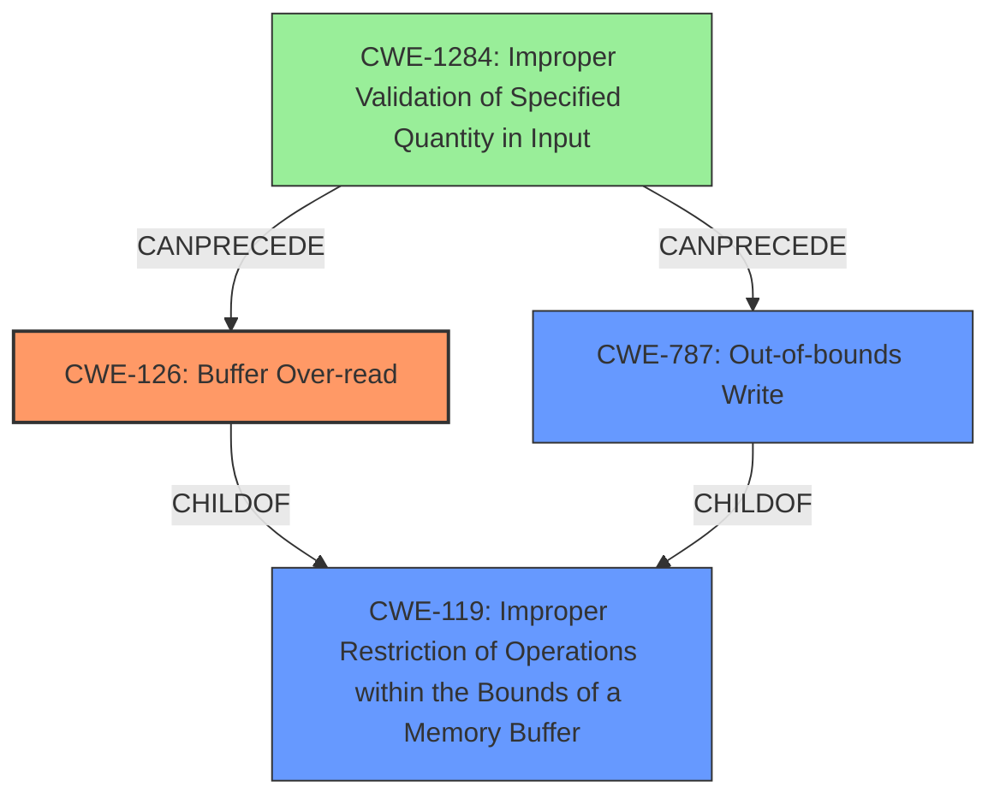

# Final Resolution for CVE-2021-46157

# Summary
| CWE ID | CWE Name | Confidence | CWE Abstraction Level | CWE Vulnerability Mapping Label | CWE-Vulnerability Mapping Notes |
|---|---|---|---|---|---|
| CWE-126 | Buffer Over-read | 0.85 | Variant | Allowed | The vulnerability is a **buffer over-read** while parsing NEU files. |
| CWE-787 | Out-of-bounds Write | 0.70 | Base | Allowed | The vulnerability also exhibits a **memory corruption** issue, which can lead to out-of-bounds writes. |
| CWE-1284 | Improper Validation of Specified Quantity in Input | 0.60 | Base | Cause | A root cause likely lies in the improper validation of quantity fields (e.g., lengths, sizes) within the NEU file format. |

## Evidence and Confidence

*   **Confidence Score:** 0.80
*   **Evidence Strength:** MEDIUM-HIGH

## Relationship Analysis
The primary weakness is a **buffer over-read** (CWE-126), which can lead to **memory corruption** and potential **out-of-bounds writes** (CWE-787). The analysis suggests the root cause is the **improper validation of input quantities** (CWE-1284) within the NEU file.

## Vulnerability Chain
1.  The process receives an NEU file as input.
2.  The file contains quantity specifications (e.g., lengths, sizes).
3.  The application fails to properly validate these quantities (CWE-1284).
4.  The application uses these invalid quantities to access a buffer, resulting in an over-read (CWE-126).
5.  The over-read leads to memory corruption, which can then cause an out-of-bounds write (CWE-787) if the read data is used to calculate subsequent buffer accesses and sizes.
6.  The attacker can then execute code within the context of the process.

## Summary of Analysis
The initial analysis correctly identified CWE-126 and CWE-787 but didn't explicitly consider the **root cause**. The criticism highlighted the potential role of CWE-1284 (Improper Validation of Specified Quantity in Input). Given that NEU files likely contain size or length parameters, the lack of validation of these parameters is a plausible **root cause** leading to the **buffer over-read** and subsequent **memory corruption**.

The vulnerability description states: "Affected application contains a **memory corruption** vulnerability while parsing NEU files." and "This could allow an attacker to execute code in the context of the current process."

The inclusion of CWE-1284 addresses the **root cause**, providing a more comprehensive view of the vulnerability. The confidence level for CWE-1284 is lower due to the need to infer its presence, but the evidence from the CVE summary supports this.

CWE-126 is at the optimal level of specificity as it directly describes the **buffer over-read**.
CWE-787 describes the **memory corruption** issue.
CWE-1284 is included to highlight the **lack of input validation** as a potential cause.