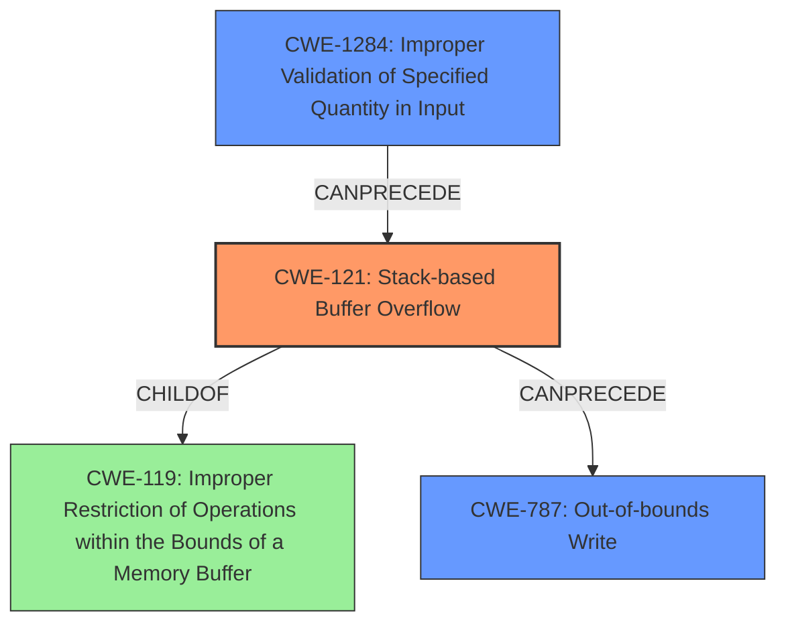

# Final Resolution for CVE-2021-46158

# Summary
| CWE ID | CWE Name | Confidence | CWE Abstraction Level | CWE Vulnerability Mapping Label | CWE-Vulnerability Mapping Notes |
|---|---|---|---|---|---|
| CWE-121 | Stack-based Buffer Overflow | 0.95 | Variant | Primary | Allowed |
| CWE-787 | Out-of-bounds Write | 0.75 | Base | Secondary Candidate | Allowed, Direct consequence of CWE-121 |
| CWE-1284 | Improper Validation of Specified Quantity in Input | 0.70 | Base | Contributing Factor | Allowed |

## Evidence and Confidence

*   **Confidence Score:** 0.90
*   **Evidence Strength:** HIGH

## Relationship Analysis
The primary weakness is **CWE-121 (Stack-based Buffer Overflow)**, a variant of **CWE-119 (Improper Restriction of Operations within the Bounds of a Memory Buffer)**. **CWE-787 (Out-of-bounds Write)** is a direct consequence of **CWE-121**, as the overflow leads to writing beyond the allocated buffer. **CWE-1284 (Improper Validation of Specified Quantity in Input)** is a contributing factor because the vulnerability occurs due to the lack of proper validation of the size of the input being parsed.

## Vulnerability Chain
The vulnerability chain starts with **CWE-1284 (Improper Validation of Specified Quantity in Input)**, where the size of the input is not properly validated. This leads to **CWE-121 (Stack-based Buffer Overflow)**, allowing an attacker to write data beyond the allocated buffer on the stack. Finally, this results in **CWE-787 (Out-of-bounds Write)**, where adjacent memory locations on the stack are overwritten, potentially allowing the attacker to execute arbitrary code.

## Summary of Analysis
The initial analysis correctly identified **CWE-121 (Stack-based Buffer Overflow)** as the primary weakness, supported by the explicit mention of "stack-based buffer overflow" in the vulnerability description. The criticism highlighted the importance of including **CWE-1284 (Improper Validation of Specified Quantity in Input)** as a contributing factor, as the lack of input validation is a key element of the vulnerability. The addition of **CWE-1284** strengthens the analysis and provides a more complete picture of the vulnerability. I agree with the assessment that **CWE-787 (Out-of-bounds Write)** is a consequence of **CWE-121**.

The vulnerability description states, "Affected application contains a **stack based buffer overflow** vulnerability while parsing NEU files." This statement provides direct evidence for selecting **CWE-121**. The lack of proper validation of the size of the input being parsed supports the inclusion of **CWE-1284**.

The graph relationships influenced the final selection by highlighting the chain of weaknesses, starting with the lack of input validation (**CWE-1284**), leading to the stack-based buffer overflow (**CWE-121**), and ultimately resulting in an out-of-bounds write (**CWE-787**).

The selected CWEs are at the optimal level of specificity. **CWE-121** is a Variant that directly describes the stack-based nature of the buffer overflow. **CWE-787** is a Base CWE that accurately represents the consequence of writing beyond the allocated buffer. **CWE-1284** is a Base CWE that identifies the root cause of the vulnerability as improper validation of the input quantity.