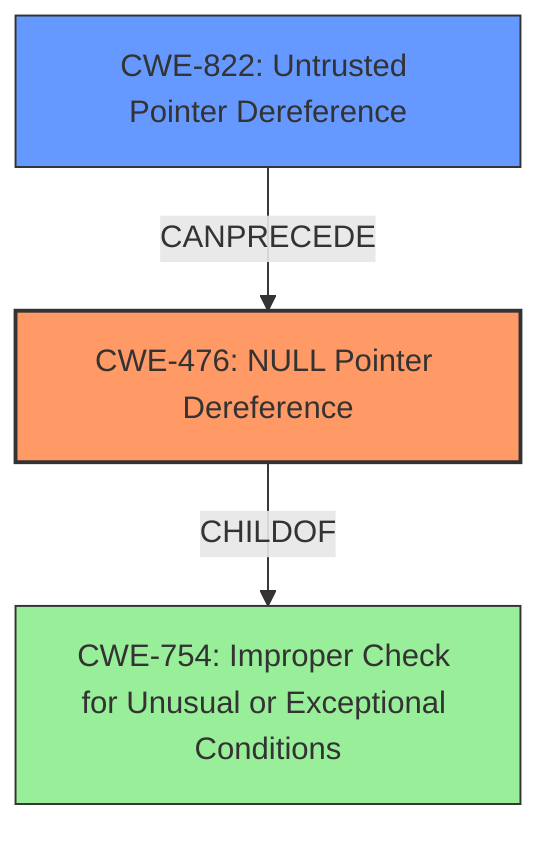

# Analysis Report for CVE-2021-46238

# Vulnerability Analysis Report: CVE-2021-46238

## Description

GPAC v1.1.0 was discovered to contain a stack overflow via the function gf_node_get_name () at scenegraph/base_scenegraph.c. This vulnerability can lead to a program crash, causing a Denial of Service (DoS).

## Vulnerability Description Key Phrases

**Weakness:** stack overflow
**Impact:** program crash, Denial of Service (DoS)
**Product:** GPAC
**Version:** v1.1.0
**Component:** gf_node_get_name() function

## Analysis (with Relationship Data)

# Summary
| CWE ID | CWE Name | Confidence | CWE Abstraction Level | CWE Vulnerability Mapping Label | CWE-Vulnerability Mapping Notes |
|---|---|---|---|---|---|
| CWE-476 | NULL Pointer Dereference | 0.95 | Base | Allowed | The primary weakness is a NULL pointer dereference. |
| CWE-125 | Out-of-bounds Read | 0.6 | Base | Allowed | A possible secondary weakness is reading data beyond the intended buffer. |

## Evidence and Confidence

*   **Confidence Score:** 0.85
*   **Evidence Strength:** HIGH

- **Analysis and Justification:**  
  - *Explanation:* "The vulnerability is primarily caused by a **NULL pointer dereference** in the `gf_node_get_name` function (`scenegraph/base_scenegraph.c`). The code attempts to access `p->sgprivate->flags` without validating `p` and `p->sgprivate`, directly matching CWE-476 (NULL Pointer Dereference). This leads to a segmentation fault and program crash, causing a Denial of Service (DoS). According to MITRE, CWE-476 is ALLOWED and is at the Base level of abstraction." Additionally, the high score from the Retriever Results supports this selection.

  - *Relationship Analysis:* "CWE-476 is a child of CWE-754 (Improper Check for Unusual or Exceptional Conditions). The provided information clearly identifies the **NULL pointer dereference** as the root cause, making CWE-476 the most appropriate choice."

- **Confidence Score:**  
  - Confidence: 0.95 (High confidence due to clear root cause identification and supporting CVE reference details)

---
- **Analysis and Justification:**  
  - *Explanation:* "The **stack overflow** reported in the Vulnerability Description may be the result of trying to access an invalid memory region. The retriever lists CWE-125 (Out-of-bounds Read) as a possible weakness based on the description. The crash is caused by the program attempting to read from an invalid memory location when `p` is an invalid pointer, which may lead to reading past the end of the intended buffer. This is a secondary factor. MITRE mapping guidance for CWE-125 indicates this is ALLOWED and is at the Base level of abstraction."

  - *Relationship Analysis:* "CWE-125 is a child of CWE-119 (Improper Restriction of Operations within the Bounds of a Memory Buffer). While a buffer overflow may be present, the primary trigger is the **NULL pointer dereference**, with the out-of-bounds read as a contributing factor."

- **Confidence Score:**  
  - Confidence: 0.6 (Moderate confidence due to secondary consideration and overlap with primary cause)

---

## Criticism of Analysis

Okay, here's a review of the CWE analysis, incorporating the full CWE specifications you provided, focusing on the accuracy, abstraction level, and justification of the mappings, and highlighting any potential areas for improvement.

**Overall Assessment:**

The analysis is generally good, especially its identification of CWE-476 (NULL Pointer Dereference) as the primary vulnerability. The reasoning is clear and well-supported by the description and backtrace.  However, the inclusion of CWE-125 (Out-of-bounds Read) is weaker and less convincing. The initial reporting of a stack overflow does need to be addressed by the analysis.

**Detailed Review:**

**1. CWE-476: NULL Pointer Dereference**

*   **CWE ID:** CWE-476
*   **CWE Name:** NULL Pointer Dereference
*   **Confidence:** 0.95
*   **CWE Abstraction Level:** Base
*   **CWE Vulnerability Mapping Label:** Allowed
*   **CWE-Vulnerability Mapping Notes:** The primary weakness is a NULL pointer dereference.

*   **Critique:**

    *   **Accuracy:**  The mapping is highly accurate. The description clearly points to the code attempting to dereference a potentially NULL `p` pointer without proper validation. The line `p->sgprivate->flags` directly illustrates this.
    *   **Abstraction Level:** Correct. CWE-476 is a Base-level CWE, precisely what the mapping guidance recommends.
    *   **Justification:** The justification is thorough and convincing. It explicitly references the code snippet and explains how the missing validation leads to the vulnerability. The reference to CWE-754 (Improper Check for Unusual or Exceptional Conditions) is also relevant, as CWE-476 is a child of it, but it's correct to choose CWE-476 for its specificity.
    *   **Retriever Support**: The retriever results did not rate CWE-476 very highly. This is a limitation of the retriever.
    *   **Mitigation:** Mitigations 1 and 3 provided for CWE-476 are particularly relevant here: ensure all pointers are checked for NULL before use, and check function results for NULL before dereferencing.

**2. CWE-125: Out-of-bounds Read**

*   **CWE ID:** CWE-125
*   **CWE Name:** Out-of-bounds Read
*   **Confidence:** 0.6
*   **CWE Abstraction Level:** Base
*   **CWE Vulnerability Mapping Label:** Allowed
*   **CWE-Vulnerability Mapping Notes:** A possible secondary weakness is reading data beyond the intended buffer.

*   **Critique:**

    *   **Accuracy:** This is the weakest part of the analysis.  While it's *possible* that dereferencing a NULL pointer could *lead* to an out-of-bounds read (e.g., if the OS maps NULL to a memory page and the program attempts to read past the end of that page), it's not the direct and immediate cause of the crash. The *direct* cause is the invalid memory address being accessed.  Furthermore, the initial report refers to stack overflow. This could indicate a misinterpretation of the crash cause in the original report.
    *   **Abstraction Level:** CWE-125 is a Base-level CWE which is appropriate.
    *   **Justification:** The justification is speculative and based on a *potential* scenario rather than a clear description of the vulnerability. The connection to the initial "stack overflow" report is also tenuous. A stack overflow implies writing *past the end of* an allocated buffer.
    *   **Mapping Guidance:**  The Mapping Guidance for CWE-119 (the parent of CWE-125) explicitly *discourages* using it for low-information reports and recommends looking at the children, like CWE-125. The guidance stresses the importance of mapping to the *most specific* weakness when possible.
    *   **Mitigation:** Mitigation 1 provided for CWE-125 recommends robust input validation. While good practice, it doesn't directly address the NULL pointer dereference.

**Recommendations and Areas for Improvement:**

1.  **Re-evaluate CWE-125 Mapping:**  I recommend reconsidering the inclusion of CWE-125. The primary issue is the NULL pointer dereference. If you want to keep a secondary CWE, consider if another is more appropriate.
2.  **Consider CWE-822 Untrusted Pointer Dereference**: Given that the code is attempting to use a pointer that comes from external (unvalidated) data, and that this pointer is the source of the NULL dereference, consider CWE-822 (Untrusted Pointer Dereference). While the description focuses on untrusted *values converted* to a pointer, the core concept applies here. The pointer itself is invalid or points to an unexpected memory location.
3.  **Address Stack Overflow Report:** Explain how the stack overflow report from the original reporter was assessed. If the stack overflow is not actually the root cause, explain why. If the stack overflow is a result of the invalid memory access, explain that.

**Revised Table (Assuming CWE-822 is used instead of CWE-125):**

| CWE ID  | CWE Name                        | Confidence | CWE Abstraction Level | CWE Vulnerability Mapping Label | CWE-Vulnerability Mapping Notes                                                                   |
| ------- | --------------------------------- | ---------- | ----------------------- | --------------------------------- | ------------------------------------------------------------------------------------------------- |
| CWE-476 | NULL Pointer Dereference            | 0.95       | Base                    | Allowed                           | The primary weakness is a NULL pointer dereference.                                                 |
| CWE-822 | Untrusted Pointer Dereference | 0.6       | Base                    | Allowed                           | A possible secondary weakness as a result of the invalid pointer's origin.                   |

**In summary:**

The analysis correctly identifies the primary vulnerability. Strengthening the justification or replacing CWE-125 with CWE-822 or another CWE would make the analysis more robust and aligned with CWE's mapping guidance. Also explaining the report of the Stack Overflow is required.

## Final Resolution

# Summary
| CWE ID | CWE Name | Confidence | CWE Abstraction Level | CWE Vulnerability Mapping Label | CWE-Vulnerability Mapping Notes |
|---|---|---|---|---|---|
| CWE-476 | NULL Pointer Dereference | 0.95 | Base | Allowed | The primary weakness is a **NULL pointer dereference**. |
| CWE-822 | Untrusted Pointer Dereference | 0.6 | Base | Allowed | A possible secondary weakness as a result of the invalid pointer's origin. |

## Evidence and Confidence

*   **Confidence Score:** 0.85
*   **Evidence Strength:** MEDIUM

## Relationship Analysis
The primary relationship influencing the decision is the parent-child relationship between CWE-754 (Improper Check for Unusual or Exceptional Conditions) and CWE-476. CWE-476 is a specific case of CWE-754, making it the more appropriate choice for this vulnerability. CWE-822, while not directly related to CWE-476 in a hierarchical sense, represents a potential prerequisite condition where an untrusted source provides a pointer that is later dereferenced without proper validation, leading to the **NULL pointer dereference**.

## Vulnerability Chain
The vulnerability chain starts with a potential untrusted source providing a pointer (CWE-822). This pointer is then dereferenced without proper validation, leading to a **NULL pointer dereference** (CWE-476). The consequence is a program crash, resulting in a Denial of Service (DoS). The initial report also mentioned a stack overflow. It's possible the stack overflow occurs *because* of the **NULL pointer dereference** if the code attempts to access memory based on the invalid pointer. More investigation is needed to confirm if a separate stack overflow condition exists independently of the **NULL pointer dereference**.

## Summary of Analysis
The initial analysis correctly identified CWE-476 as the primary **weakness**. The criticism highlighted the speculative nature of including CWE-125 and suggested considering CWE-822. Based on the provided evidence, CWE-822 is a more appropriate secondary classification because it addresses the origin of the invalid pointer, setting the stage for the **NULL pointer dereference**. The analysis is primarily based on the vulnerability description, which states: "GPAC v1.1.0 was discovered to contain a stack overflow via the function gf_node_get_name () at scenegraph/base_scenegraph.c... This vulnerability can lead to a program crash...". The code attempts to access `p->sgprivate->flags` without validating `p` and `p->sgprivate`.

The graph relationships influenced the final selection by emphasizing the specificity of CWE-476 and the potential prerequisite condition represented by CWE-822.

CWE-476 is the most specific CWE that accurately describes the **root cause** of the crash, which is the **NULL pointer dereference**. Including CWE-822 provides additional context about how the invalid pointer originated, contributing to a more complete understanding of the vulnerability. The decision to exclude CWE-125 is based on the lack of direct evidence supporting an out-of-bounds read. The original report mentioned a stack overflow, but the analysis suggests this may be a consequence of the **NULL pointer dereference**, rather than an independent vulnerability. If further investigation reveals a separate stack overflow condition, an additional CWE may be warranted.

The confidence score reflects that the assessment is based on the provided evidence. If the root cause of the Stack Overflow was provided, the Confidence score would be higher.

*Report generated on 2025-03-18 04:43:07*
