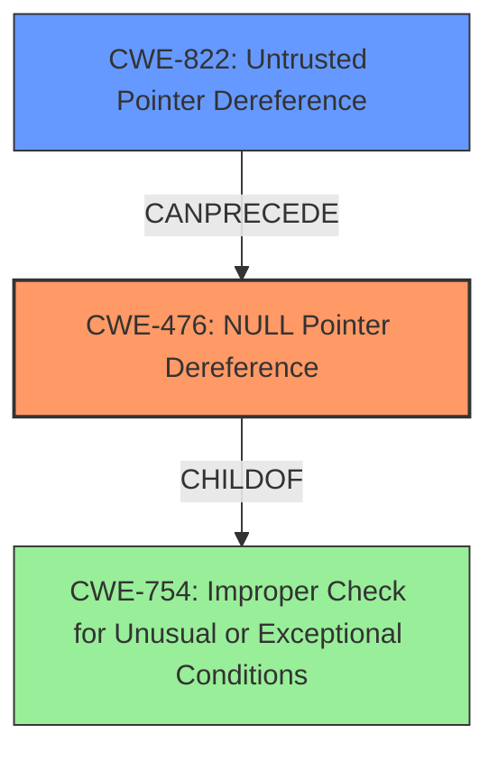

# Final Resolution for CVE-2021-46238

# Summary
| CWE ID | CWE Name | Confidence | CWE Abstraction Level | CWE Vulnerability Mapping Label | CWE-Vulnerability Mapping Notes |
|---|---|---|---|---|---|
| CWE-476 | NULL Pointer Dereference | 0.95 | Base | Allowed | The primary weakness is a **NULL pointer dereference**. |
| CWE-822 | Untrusted Pointer Dereference | 0.6 | Base | Allowed | A possible secondary weakness as a result of the invalid pointer's origin. |

## Evidence and Confidence

*   **Confidence Score:** 0.85
*   **Evidence Strength:** MEDIUM

## Relationship Analysis
The primary relationship influencing the decision is the parent-child relationship between CWE-754 (Improper Check for Unusual or Exceptional Conditions) and CWE-476. CWE-476 is a specific case of CWE-754, making it the more appropriate choice for this vulnerability. CWE-822, while not directly related to CWE-476 in a hierarchical sense, represents a potential prerequisite condition where an untrusted source provides a pointer that is later dereferenced without proper validation, leading to the **NULL pointer dereference**.

## Vulnerability Chain
The vulnerability chain starts with a potential untrusted source providing a pointer (CWE-822). This pointer is then dereferenced without proper validation, leading to a **NULL pointer dereference** (CWE-476). The consequence is a program crash, resulting in a Denial of Service (DoS). The initial report also mentioned a stack overflow. It's possible the stack overflow occurs *because* of the **NULL pointer dereference** if the code attempts to access memory based on the invalid pointer. More investigation is needed to confirm if a separate stack overflow condition exists independently of the **NULL pointer dereference**.

## Summary of Analysis
The initial analysis correctly identified CWE-476 as the primary **weakness**. The criticism highlighted the speculative nature of including CWE-125 and suggested considering CWE-822. Based on the provided evidence, CWE-822 is a more appropriate secondary classification because it addresses the origin of the invalid pointer, setting the stage for the **NULL pointer dereference**. The analysis is primarily based on the vulnerability description, which states: "GPAC v1.1.0 was discovered to contain a stack overflow via the function gf_node_get_name () at scenegraph/base_scenegraph.c... This vulnerability can lead to a program crash...". The code attempts to access `p->sgprivate->flags` without validating `p` and `p->sgprivate`.

The graph relationships influenced the final selection by emphasizing the specificity of CWE-476 and the potential prerequisite condition represented by CWE-822.

CWE-476 is the most specific CWE that accurately describes the **root cause** of the crash, which is the **NULL pointer dereference**. Including CWE-822 provides additional context about how the invalid pointer originated, contributing to a more complete understanding of the vulnerability. The decision to exclude CWE-125 is based on the lack of direct evidence supporting an out-of-bounds read. The original report mentioned a stack overflow, but the analysis suggests this may be a consequence of the **NULL pointer dereference**, rather than an independent vulnerability. If further investigation reveals a separate stack overflow condition, an additional CWE may be warranted.

The confidence score reflects that the assessment is based on the provided evidence. If the root cause of the Stack Overflow was provided, the Confidence score would be higher.