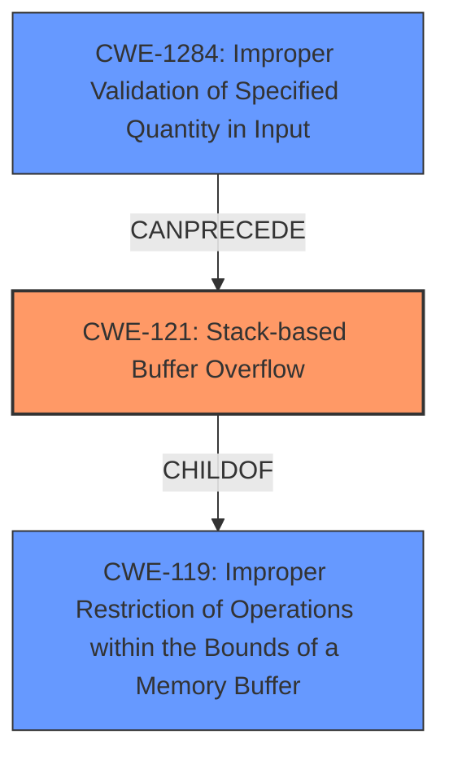

# Final Resolution for CVE-2021-46263

# Summary
| CWE ID   | CWE Name                                                                       | Confidence | CWE Abstraction Level | CWE Vulnerability Mapping Label | CWE-Vulnerability Mapping Notes                                                                                                                                     |
| :--------- | :----------------------------------------------------------------------------- | :---------- | :----------------------- | :------------------------------ | :------------------------------------------------------------------------------------------------------------------------------------------------------------------ |
| CWE-121    | **Stack-based Buffer Overflow**                                                | 0.95       | Variant                 | Allowed                         | Primary CWE; overflow occurs on the stack.                                                                                                                          |
| CWE-1284   | **Improper Validation of Specified Quantity in Input**                         | 0.80       | Base                    | Allowed                         | Contributory; lack of input validation on `wifiTimeClose` enables overflow.                                                                                        |
| CWE-119    | **Improper Restriction of Operations within the Bounds of a Memory Buffer**    | 0.60       | Class                   | Discouraged                     | Supporting; Parent of CWE-121 and CWE-787, providing broader context; use discouraged due to availability of more specific CWEs.                                 |

## Evidence and Confidence

*   **Confidence Score:** 0.90
*   **Evidence Strength:** HIGH

## Relationship Analysis
The primary weakness is **CWE-121 (Stack-based Buffer Overflow)**, a variant of the more general **CWE-119 (Improper Restriction of Operations within the Bounds of a Memory Buffer)**. The overflow occurs because the input `wifiTimeClose` is not properly validated for length, leading to **CWE-1284 (Improper Validation of Specified Quantity in Input)**. The relationship between these CWEs is that **CWE-1284** allows the condition for **CWE-121** to occur.

## Vulnerability Chain
The vulnerability chain starts with **CWE-1284 (Improper Validation of Specified Quantity in Input)**. The `wifiTimeClose` input is not validated for length, which allows an attacker to provide an overly long string. This leads to **CWE-121 (Stack-based Buffer Overflow)** when the overly long input is copied to a stack-allocated buffer. The consequence is a Denial of Service (DoS), and potentially Remote Code Execution (RCE) if the attacker overwrites return addresses on the stack.

## Summary of Analysis
The initial analysis correctly identified **CWE-121 (Stack-based Buffer Overflow)** as the primary weakness. However, it failed to consider the root cause of the overflow, which is the lack of input validation. The criticism correctly pointed out that the absence of input validation on the `wifiTimeClose` parameter (leading to **CWE-1284**) is a critical contributing factor. The relationship analysis shows that **CWE-1284** enables the condition for **CWE-121** to occur. The provided evidence from the vulnerability description confirms that the `wifiTimeClose` input is copied to a stack-allocated buffer without proper bounds checking, leading to the overflow.

The inclusion of **CWE-1284** provides a more complete picture of the vulnerability. It highlights the importance of input validation in preventing buffer overflows. The final classification reflects the optimal level of specificity by identifying both the type of buffer overflow (**CWE-121**) and the root cause (**CWE-1284**). The confidence score is high due to the clear evidence from the vulnerability description and the CVE reference materials.

The retriever results also hinted at alternative CWEs such as **CWE-120 (Buffer Copy without Checking Size of Input)** and **CWE-805 (Buffer Access with Incorrect Length Value)**, but the explicit mention of a stack buffer and the lack of information about incorrect length values being retrieved from `nvram_get` makes **CWE-121** and **CWE-1284** a better fit.