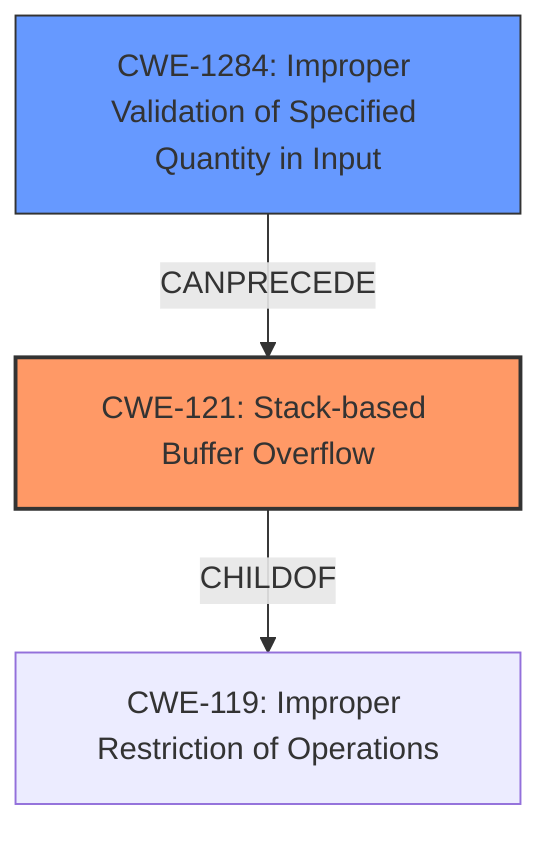

# Final Resolution for CVE-2021-46321

# Summary
| CWE ID | CWE Name | Confidence | CWE Abstraction Level | CWE Vulnerability Mapping Label | CWE-Vulnerability Mapping Notes |
|---|---|---|---|---|---|
| CWE-121 | Stack-based Buffer Overflow | 0.95 | Variant | Primary | Allowed |
| CWE-1284 | Improper Validation of Specified Quantity in Input | 0.75 | Base | Secondary | Allowed |

## Evidence and Confidence

*   **Confidence Score:** 0.95
*   **Evidence Strength:** HIGH

## Relationship Analysis
The primary weakness is **CWE-121 (Stack-based Buffer Overflow)**, which is a variant of the more general **CWE-119 (Improper Restriction of Operations within the Bounds of a Memory Buffer)**. The analysis correctly identifies this hierarchical relationship. The secondary weakness, **CWE-1284 (Improper Validation of Specified Quantity in Input)**, is a root cause that **CanPrecede** **CWE-121**, as the lack of input validation directly leads to the buffer overflow. There are no significant peer relationships that suggest alternative classifications. The selection of CWEs at the Variant (CWE-121) and Base (CWE-1284) abstraction levels ensures appropriate specificity.

## Vulnerability Chain
The vulnerability chain starts with **CWE-1284 (Improper Validation of Specified Quantity in Input)**, where the `wifiSSID` parameter is not length-checked. This leads to **CWE-121 (Stack-based Buffer Overflow)** when the unchecked input is used in `sprintf` or `strcpy` functions, resulting in a Denial of Service (DoS). The root cause is the lack of input validation, and the impact is a buffer overflow on the stack, causing a DoS. There are no missing links in the chain based on the provided information.

## Summary of Analysis
The initial analysis and criticism both agree that the primary weakness is **CWE-121 (Stack-based Buffer Overflow)** and the secondary weakness is **CWE-1284 (Improper Validation of Specified Quantity in Input)**. The vulnerability description clearly states a stack buffer overflow, and the CVE reference confirms the missing length check. The graph relationships support this classification, with **CWE-1284** leading to **CWE-121**.

The selection of CWEs is based on the provided evidence, specifically the vulnerability description and the CVE reference summary. The abstraction levels are appropriate, with **CWE-121** at the Variant level and **CWE-1284** at the Base level.

The analysis is well-justified, considering both the content and relationships between CWEs. The final decision reflects the optimal level of specificity based on available evidence.