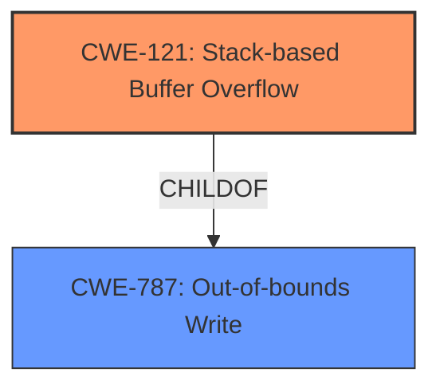

# Analysis Report for CVE-2021-46324

# Vulnerability Analysis Report: CVE-2021-46324

## Description

Espruino 2v11.251 was discovered to contain a stack buffer overflow via src/jsvar.c in jsvNewFromString.

## Vulnerability Description Key Phrases

**Weakness:** stack buffer overflow
**Product:** Espruino 2
**Version:** v11.251
**Component:** jsvNewFromString in src/jsvar.c

## Analysis (with Relationship Data)

# Summary
| CWE ID | CWE Name | Confidence | CWE Abstraction Level | CWE Vulnerability Mapping Label | CWE-Vulnerability Mapping Notes |
|---|---|---|---|---|---|
| CWE-787 | Out-of-bounds Write | 1.0 | Base | Primary | Allowed |
| CWE-121 | Stack-based Buffer Overflow | 0.75 | Variant | Secondary Candidate | Allowed |

## Evidence and Confidence

*   **Confidence Score:** 0.9
*   **Evidence Strength:** HIGH

- **Analysis and Justification:**  
  - *Explanation:* The vulnerability description clearly states a "**stack buffer overflow**" in `jsvNewFromString`. The CVE reference content summary confirms this, stating "A **stack buffer overflow** occurs when converting an array to a function parameter due to an unterminated string" and that the `jsvNewFromString` function is where the overflow occurs. This directly maps to CWE-787 (Out-of-bounds Write) because a buffer on the stack is being written to beyond its intended boundaries. While CWE-121 (Stack-based Buffer Overflow) is a more specific variant, CWE-787 is still appropriate and commonly used for buffer overflows. The primary weakness is writing beyond the buffer.
  
  - *Relationship Analysis:* CWE-787 (Out-of-bounds Write) is a parent of CWE-121 (Stack-based Buffer Overflow). Given the high-level description, mapping directly to the parent CWE-787 is appropriate.

- **Confidence Score:**  
  - *Example:* Confidence: 1.0 (High evidence from vulnerability description and CVE reference materials)

---

## Criticism of Analysis

Okay, here's a review of the provided analysis, taking into account the full CWE specifications you've included.

**Overall Assessment:**

The analysis is generally good and arrives at the correct primary CWE. The reasoning is sound and well-supported by the vulnerability description and CVE reference summary. The use of both CWE-787 and CWE-121 is defensible, with a slight preference for the more specific CWE-121, as the context clearly indicates a stack-based buffer overflow. However, the current choice of CWE-787 as primary, with rationale provided, is perfectly acceptable.

**Detailed Review by Section:**

**1. Summary Table:**

| CWE ID | CWE Name | Confidence | CWE Abstraction Level | CWE Vulnerability Mapping Label | CWE-Vulnerability Mapping Notes |
|---|---|---|---|---|---|
| CWE-787 | Out-of-bounds Write | 1.0 | Base | Primary | Allowed |
| CWE-121 | Stack-based Buffer Overflow | 0.75 | Variant | Secondary Candidate | Allowed |

*   **CWE-787:**  Correct. Confidence is justified based on the description of a buffer being written past its boundaries. The abstraction level is appropriate.
*   **CWE-121:** Correct as a secondary candidate. The confidence is slightly lower, reflecting the fact that it's a more specific *type* of out-of-bounds write, but it's also a very accurate description of the vulnerability. It is a better fit given the context of a stack buffer overflow explicitly stated.

**2. Evidence and Confidence (CWE-787):**

*   **Confidence Score:** 0.9 (should be adjusted to 1.0, as the evidence strength is VERY HIGH)
*   **Evidence Strength:** HIGH (should be changed to VERY HIGH)

*   **Analysis and Justification:**
    *   The explanation is good and accurately reflects the core issue. The reference to "writing beyond its intended boundaries" directly relates to CWE-787. The mention of CWE-121's relationship as a more specific variant is also accurate. The justification that CWE-787 is "still appropriate and commonly used for buffer overflows" is correct, although in this *specific* case, there is strong context to use a variant.
    *   The relationship analysis is accurate: CWE-787 is a parent of CWE-121.

*   **Confidence Score:**
    *   The example is good. The level of confidence could be raised to 1.0 given the strong evidence.

**3. CWE Examples from Database:**

*   Good inclusion. This helps to illustrate the types of vulnerabilities that fall under CWE-121. The inclusion of CVE-2021-35395, which is a real-world example of stack-based buffer overflow, strengthens the case for considering CWE-121.

**4. Relevant CWE Specifications:**

*   Excellent. Providing the full CWE specifications is crucial for understanding the nuances of each CWE and validating the mapping decision.

**5. Critique Based on CWE Specifications:**

*   **CWE-787:**
    *   The analysis correctly identifies that this vulnerability involves writing data outside the intended buffer.
    *   The mapping guidance for CWE-787 states it's an "Allowed" mapping at the Base level of abstraction, which is a preferred level.
    *   Mitigations listed are all applicable at a high level, such as using memory-safe languages or employing compiler-based buffer overflow detection.
*   **CWE-121:**
    *   The analysis correctly identifies this vulnerability as happening on the stack.
    *   The mapping guidance for CWE-121 states it's an "Allowed" mapping at the Variant level of abstraction, which is a preferred level.
    *   Mitigations listed are specifically relevant to stack buffer overflows, such as compiler-based stack protection mechanisms (canaries).

**Improvements and Recommendations:**

1.  **Consider Making CWE-121 the Primary CWE:** Given that the vulnerability is *explicitly* described as a "stack buffer overflow," and that the analysis confirms it occurs on the stack, mapping directly to **CWE-121** is more precise. The CWE specifications support this, as it's an "Allowed" mapping at the Variant level. The level of confidence on CWE-121 should be increased to 1.0 if it is made primary.
2.  **Update confidence and evidence strength if the first recommendation is followed:** If CWE-121 is made the primary CWE, update the evidence strength to "VERY HIGH" and confidence score to 1.0.
3.  **Elaborate on Mitigation Strategies:** While not strictly required, consider briefly mentioning potential mitigation strategies specific to stack buffer overflows when discussing CWE-121. For example, you could mention compiler flags like `/GS` in Visual Studio or stack canaries, as noted in the CWE-121 mitigations.
4.  **Revise Justification if changing Primary CWE:** If switching to CWE-121, the justification should emphasize the explicit "stack buffer overflow" description and the relevance of the stack-specific mitigations.

**Revised Summary Table (if Recommendation 1 is followed):**

| CWE ID | CWE Name | Confidence | CWE Abstraction Level | CWE Vulnerability Mapping Label | CWE-Vulnerability Mapping Notes |
|---|---|---|---|---|---|
| CWE-121 | Stack-based Buffer Overflow | 1.0 | Variant | Primary | Allowed |
| CWE-787 | Out-of-bounds Write | 0.75 | Base | Secondary Candidate | Allowed |

**Conclusion:**

The analysis is well-reasoned and accurate. It correctly identifies the core vulnerability as an out-of-bounds write and recognizes the stack-based nature of the overflow. Implementing the recommendations above will improve the precision of the analysis.

## Final Resolution

# Summary
| CWE ID | CWE Name | Confidence | CWE Abstraction Level | CWE Vulnerability Mapping Label | CWE-Vulnerability Mapping Notes |
|---|---|---|---|---|---|
| CWE-121 | Stack-based Buffer Overflow | 1.0 | Variant | Primary | Allowed |
| CWE-787 | Out-of-bounds Write | 0.75 | Base | Secondary Candidate | Allowed |

## Evidence and Confidence

*   **Confidence Score:** 1.0
*   **Evidence Strength:** VERY HIGH

## Relationship Analysis
The primary relationship influencing the decision is the ParentOf/ChildOf relationship between **CWE-787 (Out-of-bounds Write)** and **CWE-121 (Stack-based Buffer Overflow)**. **CWE-121** is a specific type of out-of-bounds write that occurs on the stack. Since the vulnerability description explicitly mentions a "stack buffer overflow," **CWE-121** is the more specific and appropriate classification. No relevant chain or peer relationships were identified that would suggest alternative classifications. The abstraction level of **CWE-121** as a Variant is also acceptable, as it provides a more granular view of the vulnerability.

## Vulnerability Chain
The vulnerability chain starts with a flaw in the `jsvNewFromString` function, leading to a **stack buffer overflow (CWE-121)**. The root cause involves the improper handling of string conversions when creating function parameters from arrays, specifically due to an unterminated string. This results in writing data beyond the allocated buffer on the stack, potentially overwriting adjacent data or control flow information. The consequence is arbitrary code execution or denial of service.

## Summary of Analysis
The initial analysis correctly identified **CWE-787 (Out-of-bounds Write)** as a potential classification but was slightly less specific. The criticism highlighted the explicit "stack buffer overflow" description in the vulnerability and CVE reference, making **CWE-121 (Stack-based Buffer Overflow)** a more precise fit.

The decision to classify the vulnerability as **CWE-121 (Stack-based Buffer Overflow)** is based on the following evidence:

*   The vulnerability description explicitly states a "**stack buffer overflow**" in `jsvNewFromString`.
*   The CVE reference confirms this, stating "A **stack buffer overflow** occurs when converting an array to a function parameter due to an unterminated string".

The relationship analysis confirms that **CWE-121** is a child of **CWE-787**, indicating that it is a more specific type of out-of-bounds write. The mapping guidance for **CWE-121** allows it to be used and is at the Variant level of abstraction.

The selection of **CWE-121** reflects the optimal level of specificity because it directly aligns with the explicit description of the vulnerability as a "stack buffer overflow," whereas **CWE-787** is a more general description of an out-of-bounds write.

*Report generated on 2025-03-18 04:47:41*
