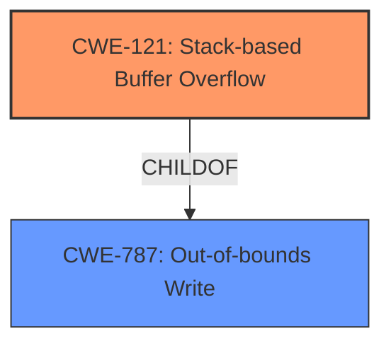

# Final Resolution for CVE-2021-46324

# Summary
| CWE ID | CWE Name | Confidence | CWE Abstraction Level | CWE Vulnerability Mapping Label | CWE-Vulnerability Mapping Notes |
|---|---|---|---|---|---|
| CWE-121 | Stack-based Buffer Overflow | 1.0 | Variant | Primary | Allowed |
| CWE-787 | Out-of-bounds Write | 0.75 | Base | Secondary Candidate | Allowed |

## Evidence and Confidence

*   **Confidence Score:** 1.0
*   **Evidence Strength:** VERY HIGH

## Relationship Analysis
The primary relationship influencing the decision is the ParentOf/ChildOf relationship between **CWE-787 (Out-of-bounds Write)** and **CWE-121 (Stack-based Buffer Overflow)**. **CWE-121** is a specific type of out-of-bounds write that occurs on the stack. Since the vulnerability description explicitly mentions a "stack buffer overflow," **CWE-121** is the more specific and appropriate classification. No relevant chain or peer relationships were identified that would suggest alternative classifications. The abstraction level of **CWE-121** as a Variant is also acceptable, as it provides a more granular view of the vulnerability.

## Vulnerability Chain
The vulnerability chain starts with a flaw in the `jsvNewFromString` function, leading to a **stack buffer overflow (CWE-121)**. The root cause involves the improper handling of string conversions when creating function parameters from arrays, specifically due to an unterminated string. This results in writing data beyond the allocated buffer on the stack, potentially overwriting adjacent data or control flow information. The consequence is arbitrary code execution or denial of service.

## Summary of Analysis
The initial analysis correctly identified **CWE-787 (Out-of-bounds Write)** as a potential classification but was slightly less specific. The criticism highlighted the explicit "stack buffer overflow" description in the vulnerability and CVE reference, making **CWE-121 (Stack-based Buffer Overflow)** a more precise fit.

The decision to classify the vulnerability as **CWE-121 (Stack-based Buffer Overflow)** is based on the following evidence:

*   The vulnerability description explicitly states a "**stack buffer overflow**" in `jsvNewFromString`.
*   The CVE reference confirms this, stating "A **stack buffer overflow** occurs when converting an array to a function parameter due to an unterminated string".

The relationship analysis confirms that **CWE-121** is a child of **CWE-787**, indicating that it is a more specific type of out-of-bounds write. The mapping guidance for **CWE-121** allows it to be used and is at the Variant level of abstraction.

The selection of **CWE-121** reflects the optimal level of specificity because it directly aligns with the explicit description of the vulnerability as a "stack buffer overflow," whereas **CWE-787** is a more general description of an out-of-bounds write.