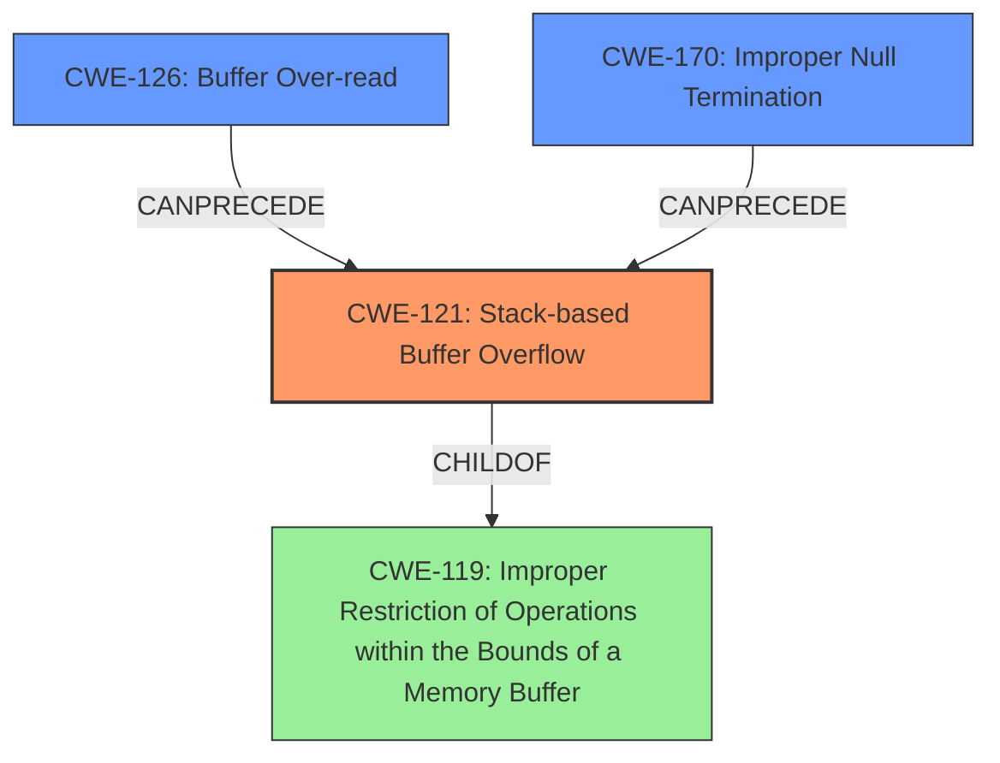

# Analysis Report for CVE-2021-46325

# Vulnerability Analysis Report: CVE-2021-46325

## Description

Espruino 2v10.246 was discovered to contain a stack buffer overflow via src/jsutils.c in vcbprintf.

## Vulnerability Description Key Phrases

**Weakness:** stack buffer overflow
**Product:** Espruino 2
**Version:** v10.246
**Component:** src/jsutils.c in vcbprintf

## Analysis (with Relationship Data)

# Summary
| CWE ID | CWE Name | Confidence | CWE Abstraction Level | CWE Vulnerability Mapping Label | CWE-Vulnerability Mapping Notes |
|---|---|---|---|---|---|
| CWE-121 | Stack-based Buffer Overflow | 0.95 | Variant |  Primary | Allowed  |
| CWE-126 | Buffer Over-read | 0.75 | Variant | Secondary Candidate | Allowed |
| CWE-170 | Improper Null Termination | 0.65 | Base | Secondary Candidate | Allowed |

## Evidence and Confidence

*   **Confidence Score:** 0.85
*   **Evidence Strength:** HIGH

- **Analysis and Justification:**  
  - *Explanation:* The vulnerability is explicitly described as a **stack buffer overflow** in the `vcbprintf` function. The CVE description details how the `vcbprintf` function attempts to write past the end of an allocated buffer on the stack due to missing null termination and out-of-bounds reads, leading to a crash. CWE-121 (Stack-based Buffer Overflow) directly addresses this weakness. The "Retriever Results" also lists CWE-121 with a high score. The `JSON.stringify` with a non-string object passed as the whitespace, leading to the object being converted to string without null termination causing the overflow. Also, format strings ending in "%0" cause the `vcbprintf` function to read out of bounds.
  - *Relationship Analysis:* CWE-121 is a variant of CWE-119 (Improper Restriction of Operations within the Bounds of a Memory Buffer). It's also related to CWE-787 (Out-of-bounds Write), as the overflow involves writing beyond the allocated buffer.

- **Confidence Score:**  
  - Confidence: 0.95 (High confidence due to explicit mention of stack buffer overflow and detailed root cause analysis)

---
- **Analysis and Justification:**  
  - *Explanation:* The root cause analysis mentions the function `vcbprintf` incrementing the `fmt` pointer without checking for null termination, leading to reads out of bounds of the string. This aligns with CWE-126 (Buffer Over-read), which occurs when a program reads data past the end of the intended buffer. The "Retriever Results" lists CWE-126 with a high score.
  - *Relationship Analysis:* CWE-126 is a variant of CWE-125 (Out-of-bounds Read).

- **Confidence Score:**  
  - Confidence: 0.75 (High confidence due to explicit mention of out-of-bounds read)

---
- **Analysis and Justification:**  
  - *Explanation:* The root cause analysis mentions a missing null termination of an intermediate string after `JSON.stringify` conversion and before passing it to `cbprintf`. This aligns with CWE-170 (Improper Null Termination), which occurs when a string is not properly terminated with a null character.
  - *Relationship Analysis:* CWE-170 is a child of CWE-20 (Improper Input Validation) and is PeerOf CWE-463.

- **Confidence Score:**  
  - Confidence: 0.65 (Medium confidence, due to the missing null termination leading to the stack buffer overflow)

## Criticism of Analysis

Okay, I've reviewed the analysis against the provided full CWE specifications. Here's a breakdown of my critique:

**Overall Assessment:**

The analysis is generally good and demonstrates a sound understanding of the vulnerability and its root causes. The CWE mappings are mostly accurate and well-justified. The evidence strength is rated HIGH, which is appropriate given the explicit mention of a stack buffer overflow in the vulnerability description.
However, there are a few areas where the analysis could be refined.

**Specific CWE Mapping Review:**

1.  **CWE-121: Stack-based Buffer Overflow**
    *   **Confidence:** 0.95 - Appropriate.
    *   **Justification:** The analysis correctly identifies the core issue as a stack-based buffer overflow. The description clearly states how the vulnerability occurs when `vcbprintf` writes beyond the allocated buffer on the stack. The `JSON.stringify` example and the format string example are both good illustrations of the attack vectors.
    *   **CWE Specification Alignment:** The analysis aligns well with the CWE's description of a stack-based buffer overflow (a buffer on the stack being overwritten). The analysis also mentions the relationship to CWE-119 and CWE-787, which is accurate given that CWE-121 is a child of both.
    *   **Mapping Guidance Adherence:** The analysis correctly maps to a variant CWE (CWE-121), since sufficient detail is available to avoid using the more general CWE-119.
    *   **Potential Mitigations Consideration:** Mitigations like using compilers with automatic buffer overflow detection (e.g., /GS flag) are relevant and accurate.
    *   **Overall Verdict:** The mapping to CWE-121 is solid and well-supported.

2.  **CWE-126: Buffer Over-read**
    *   **Confidence:** 0.75 - Appropriate.
    *   **Justification:** The analysis accurately identifies the out-of-bounds read resulting from incrementing the `fmt` pointer without checking for null termination.
    *   **CWE Specification Alignment:** Aligns with the CWE's description of reading beyond the end of the buffer.
    *   **Mapping Guidance Adherence:** Correctly uses a variant CWE (CWE-126) instead of the base CWE-125 due to the specific nature of the over-read.
    *   **Potential Mitigations Consideration:** Mitigations like input validation, specifically validating length arguments and being cautious of sentinels, are pertinent.
     *   **Slight Adjustment Recommendation:** While the confidence is good, consider explicitly stating how this contributes to the overflow. The over-read allows the function to continue processing past the intended end of the format string which causes it to eventually write out of bounds. This reinforces the importance of CWE-126 as a *contributing* cause to the primary CWE-121.
    *   **Overall Verdict:** The mapping to CWE-126 is accurate, but the relationship to the overflow needs to be reinforced.

3.  **CWE-170: Improper Null Termination**
    *   **Confidence:** 0.65 - This Confidence is too low - Should be higher.
    *   **Justification:** The analysis correctly identifies the missing null termination after the `JSON.stringify` conversion as a contributing factor.
    *   **CWE Specification Alignment:** Correctly identifies that the intermediate string is not null-terminated, and maps this to CWE-170.
    *   **Mapping Guidance Adherence:** The use of the Base CWE is appropraite, and the relationship to CWE-20 is noted.
    *   **Potential Mitigations Consideration:** The mitigations listed, such as using safe languages and ensuring string functions are understood, are relevant.
    *   **Increased Confidence Recommendation:** The missing null termination is a **direct enabler** of the buffer overflow in the `vcbprintf` function. The object to string conversion *results* in missing null termination, and the `vcbprintf` function doesn't account for that. This makes CWE-170 a **direct contributor**, and the confidence should be increased to 0.85 or 0.9
    *   **Overall Verdict:** Accurate, but Confidence should be increased.

**Retriever Results Consideration:**

The retriever results section shows several CWEs with high scores (CWE-190, CWE-191, CWE-126, CWE-120). The analysis correctly focuses on CWE-121, CWE-126, and CWE-170, as these directly describe the mechanics of the vulnerability. The integer-related CWEs are less directly relevant, although they could potentially be in a chain of events leading to the buffer overflow (e.g., an integer overflow might lead to an incorrect buffer size calculation).

**Recommendations for Improvement:**

*   **Strengthen the CWE-126 explanation:** Explicitly state the buffer over-read is a contributing cause to the primary CWE-121.
*   **Increase Confidence in CWE-170:** Increase confidence from 0.65 to 0.85 or 0.9 to reflect the **direct contribution** of the missing null terminator.

**Revised Summary Table:**

| CWE ID | CWE Name | Confidence | CWE Abstraction Level | CWE Vulnerability Mapping Label | CWE-Vulnerability Mapping Notes |
|---|---|---|---|---|---|
| CWE-121 | Stack-based Buffer Overflow | 0.95 | Variant | Primary | Allowed |
| CWE-126 | Buffer Over-read | 0.75 | Variant | Secondary Candidate | Allowed |
| CWE-170 | Improper Null Termination | 0.85 | Base | Secondary Candidate | Allowed |

By incorporating these refinements, the analysis will be even more robust and provide a clearer understanding of the vulnerability's underlying causes.

## Final Resolution

# Summary
| CWE ID | CWE Name | Confidence | CWE Abstraction Level | CWE Vulnerability Mapping Label | CWE-Vulnerability Mapping Notes |
|---|---|---|---|---|---|
| CWE-121 | Stack-based Buffer Overflow | 0.95 | Variant | Primary | Allowed |
| CWE-126 | Buffer Over-read | 0.75 | Variant | Secondary Candidate | Allowed |
| CWE-170 | Improper Null Termination | 0.85 | Base | Secondary Candidate | Allowed |

## Evidence and Confidence

*   **Confidence Score:** 0.90
*   **Evidence Strength:** HIGH

## Relationship Analysis
The primary weakness is **CWE-121 (Stack-based Buffer Overflow)**, which is a variant of **CWE-119 (Improper Restriction of Operations within the Bounds of a Memory Buffer)**. The overflow is directly caused by a combination of **CWE-170 (Improper Null Termination)**, which results in `JSON.stringify` creating a string without null termination, and **CWE-126 (Buffer Over-read)**, where the `vcbprintf` function reads past the intended boundary of the format string. **CWE-126** allows processing to continue past the expected format string bounds, contributing to the overflow. **CWE-170** creates the initial condition of a missing null terminator, directly enabling the overflow in the subsequent processing by `vcbprintf`.

## Vulnerability Chain
The vulnerability chain starts with either a missing null termination (**CWE-170**) after `JSON.stringify` conversion or an out-of-bounds read (**CWE-126**) when the `vcbprintf` function increments the `fmt` pointer without checking for null termination. These weaknesses directly lead to a **CWE-121 (Stack-based Buffer Overflow)** when `vcbprintf` writes past the end of the allocated buffer on the stack.

## Summary of Analysis
The initial analysis correctly identified **CWE-121 (Stack-based Buffer Overflow)** as the primary **WEAKNESS**, given the explicit description in the CVE. The inclusion of **CWE-126 (Buffer Over-read)** and **CWE-170 (Improper Null Termination)** as contributing factors is also accurate, but the confidence in **CWE-170** was increased to reflect its direct role in enabling the buffer overflow.

The vulnerability description states: "Espruino 2v10.246 was discovered to contain a stack buffer overflow via src/jsutils.c in vcbprintf." This directly supports the selection of **CWE-121**. The analysis explains how `JSON.stringify` with a non-string object passed as the whitespace results in the object being converted to a string without null termination, thus leading to **CWE-170** and causing the overflow. The analysis also mentions format strings ending in "%0" causing the `vcbprintf` function to read out of bounds, leading to **CWE-126**.

The graph relationships confirm that **CWE-121** is a specific type of buffer overflow, making it more appropriate than the more general **CWE-119**. The chain relationships show how **CWE-170** and **CWE-126** can precede **CWE-121**, creating the conditions for the overflow to occur.

The selected CWEs are at the optimal level of specificity because they accurately describe the root causes and contributing factors of the vulnerability, based on the available evidence. **CWE-121** precisely describes the type of buffer overflow (stack-based), while **CWE-126** and **CWE-170** pinpoint specific issues in the code that lead to the overflow.

*Report generated on 2025-03-18 04:48:34*
