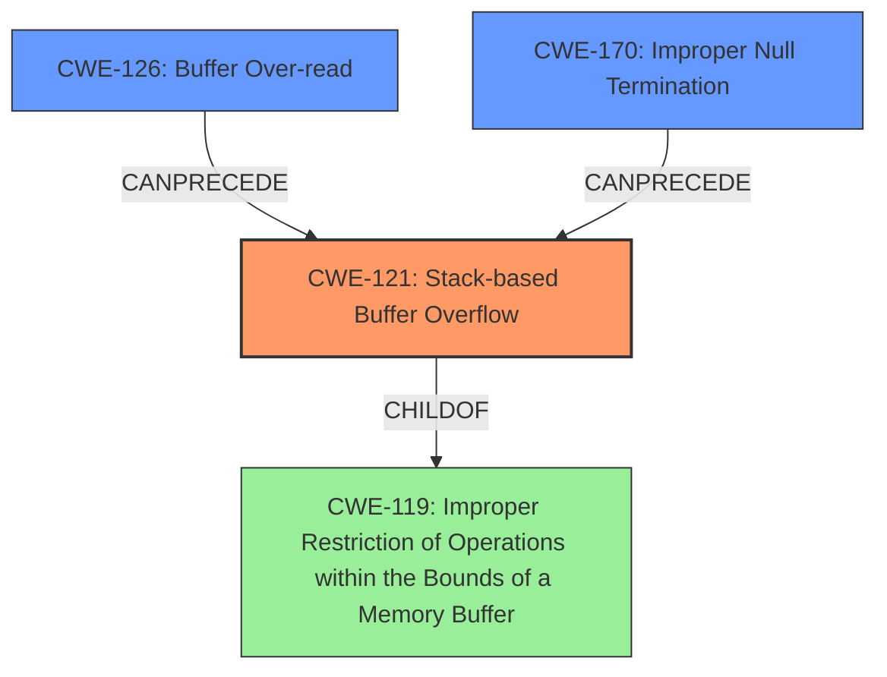

# Final Resolution for CVE-2021-46325

# Summary
| CWE ID | CWE Name | Confidence | CWE Abstraction Level | CWE Vulnerability Mapping Label | CWE-Vulnerability Mapping Notes |
|---|---|---|---|---|---|
| CWE-121 | Stack-based Buffer Overflow | 0.95 | Variant | Primary | Allowed |
| CWE-126 | Buffer Over-read | 0.75 | Variant | Secondary Candidate | Allowed |
| CWE-170 | Improper Null Termination | 0.85 | Base | Secondary Candidate | Allowed |

## Evidence and Confidence

*   **Confidence Score:** 0.90
*   **Evidence Strength:** HIGH

## Relationship Analysis
The primary weakness is **CWE-121 (Stack-based Buffer Overflow)**, which is a variant of **CWE-119 (Improper Restriction of Operations within the Bounds of a Memory Buffer)**. The overflow is directly caused by a combination of **CWE-170 (Improper Null Termination)**, which results in `JSON.stringify` creating a string without null termination, and **CWE-126 (Buffer Over-read)**, where the `vcbprintf` function reads past the intended boundary of the format string. **CWE-126** allows processing to continue past the expected format string bounds, contributing to the overflow. **CWE-170** creates the initial condition of a missing null terminator, directly enabling the overflow in the subsequent processing by `vcbprintf`.

## Vulnerability Chain
The vulnerability chain starts with either a missing null termination (**CWE-170**) after `JSON.stringify` conversion or an out-of-bounds read (**CWE-126**) when the `vcbprintf` function increments the `fmt` pointer without checking for null termination. These weaknesses directly lead to a **CWE-121 (Stack-based Buffer Overflow)** when `vcbprintf` writes past the end of the allocated buffer on the stack.

## Summary of Analysis
The initial analysis correctly identified **CWE-121 (Stack-based Buffer Overflow)** as the primary **WEAKNESS**, given the explicit description in the CVE. The inclusion of **CWE-126 (Buffer Over-read)** and **CWE-170 (Improper Null Termination)** as contributing factors is also accurate, but the confidence in **CWE-170** was increased to reflect its direct role in enabling the buffer overflow.

The vulnerability description states: "Espruino 2v10.246 was discovered to contain a stack buffer overflow via src/jsutils.c in vcbprintf." This directly supports the selection of **CWE-121**. The analysis explains how `JSON.stringify` with a non-string object passed as the whitespace results in the object being converted to a string without null termination, thus leading to **CWE-170** and causing the overflow. The analysis also mentions format strings ending in "%0" causing the `vcbprintf` function to read out of bounds, leading to **CWE-126**.

The graph relationships confirm that **CWE-121** is a specific type of buffer overflow, making it more appropriate than the more general **CWE-119**. The chain relationships show how **CWE-170** and **CWE-126** can precede **CWE-121**, creating the conditions for the overflow to occur.

The selected CWEs are at the optimal level of specificity because they accurately describe the root causes and contributing factors of the vulnerability, based on the available evidence. **CWE-121** precisely describes the type of buffer overflow (stack-based), while **CWE-126** and **CWE-170** pinpoint specific issues in the code that lead to the overflow.