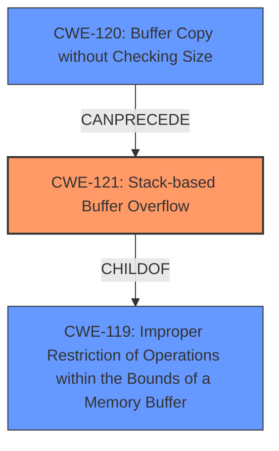

# Final Resolution for CVE-2021-46334

# Summary
| CWE ID  | CWE Name                       | Confidence | CWE Abstraction Level | CWE Vulnerability Mapping Label | CWE-Vulnerability Mapping Notes |
|---------|--------------------------------|------------|-----------------------|---------------------------------|---------------------------------|
| CWE-121 | Stack-based Buffer Overflow    | 0.95       | Variant               | Allowed                         | Primary CWE                     |
| CWE-120 | Buffer Copy without Checking Size of Input ('Classic Buffer Overflow') | 0.75       | Base             | Allowed-with-Review                         | Secondary Candidate. The `strcat` function copies data to the stack without checking size, leading to the overflow. |

## Evidence and Confidence

*   **Confidence Score:** 0.95
*   **Evidence Strength:** HIGH

## Relationship Analysis
The primary relationship is that CWE-121 (Stack-based Buffer Overflow) is a variant of CWE-119 (Improper Restriction of Operations within the Bounds of a Memory Buffer). CWE-120 (Buffer Copy without Checking Size) can precede CWE-121 because the lack of input size validation during the buffer copy operation using `strcat` leads to the stack overflow. The abstraction levels (Variant for CWE-121 and Base for CWE-120) guided the selection, providing specificity where possible while also acknowledging contributing factors.

## Vulnerability Chain
The vulnerability chain starts with the usage of `strcat` without proper bounds checking (CWE-120). This leads to copying data onto a stack buffer without validating the input size. Because the destination buffer resides on the stack, the overflow is classified as CWE-121 (Stack-based Buffer Overflow). The root cause is the unbounded copy via `strcat`, and the impact is a **stack buffer overflow**.

## Summary of Analysis
The initial analysis and the criticism both agree on CWE-121 as the primary weakness due to the explicit mention of a **stack buffer overflow**. The criticism suggests strengthening the connection to CWE-120 by emphasizing that `strcat` directly copies the data onto the stack without size validation, leading to the overflow. I agree with the criticism and have incorporated this into my analysis. The evidence from the vulnerability description, specifically "Moddable SDK v11.5.0 was discovered to contain a **stack buffer overflow** via the component __interceptor_strcat," directly supports the selection of CWE-121. The relationships between CWEs, particularly the CANPRECEDE relationship between CWE-120 and CWE-121, further solidify the classification. The selected CWEs are at the optimal level of specificity because CWE-121 is a variant that accurately describes the type of **buffer overflow**, while CWE-120 explains the root cause, which is a **buffer copy** without checking the size of the input. The decision is also based on the usage recommendations, allowing CWE-121 and CWE-120 with review.