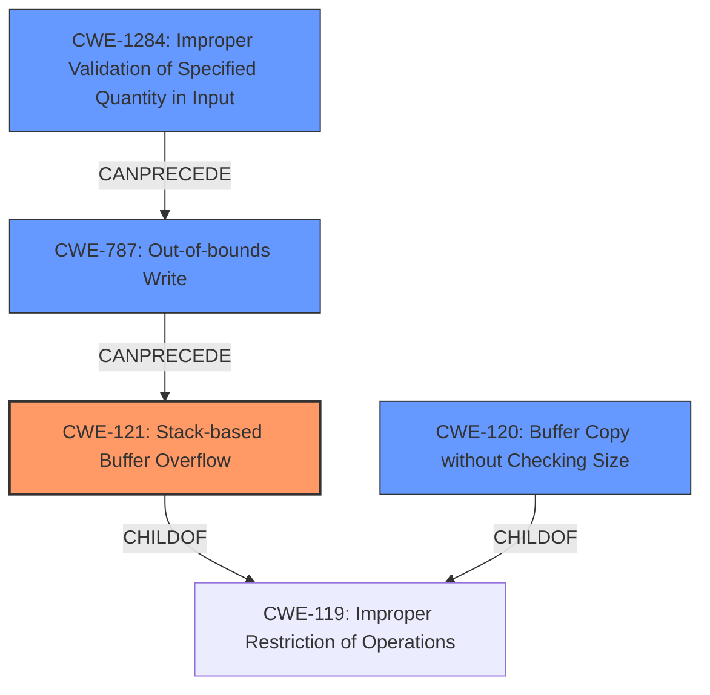

# Analysis Report for CVE-2021-46393

# Vulnerability Analysis Report: CVE-2021-46393

## Description

There is a stack buffer overflow vulnerability in the formSetPPTPServer function of Tenda-AX3 router V16.03.12.10_CN. The v10 variable is directly retrieved from the http request parameter startIp. Then v10 will be splice to stack by function sscanf without any security check,which causes stack overflow. By POSTing the page /goform/SetPptpServerCfg with proper startIp, the attacker can easily perform remote code execution with carefully crafted overflow data.

## Vulnerability Description Key Phrases

**Weakness:** stack buffer overflow
**Impact:** remote code execution
**Vector:** POSTing to /goform/SetPptpServerCfg with proper startIp
**Product:** Tenda-AX3 router
**Version:** V16.03.12.10_CN
**Component:** formSetPPTPServer function

## Analysis (with Relationship Data)

# Summary
| CWE ID | CWE Name | Confidence | CWE Abstraction Level | CWE Vulnerability Mapping Label | CWE-Vulnerability Mapping Notes |
|---|---|---|---|---|---|
| CWE-121 | Stack-based Buffer Overflow | 0.95 | Variant | Allowed | The vulnerability involves a stack buffer overflow. |
| CWE-120 | Buffer Copy without Checking Size of Input ('Classic Buffer Overflow') | 0.6 | Base | Allowed-with-Review | While CWE-121 is more specific, CWE-120 could also apply if the sscanf function is viewed as a buffer copy without size checking, but this is less precise. |
| CWE-787 | Out-of-bounds Write | 0.5 | Base | Allowed | Could be considered as a more general case of out-of-bounds write, but CWE-121 is more specific to the stack. |

## Evidence and Confidence

*   **Confidence Score:** 0.9
*   **Evidence Strength:** HIGH

- **Analysis and Justification:**  
  - *Explanation:* "The vulnerability description explicitly states a **stack buffer overflow** in the `formSetPPTPServer` function of the Tenda-AX3 router. The `v10` variable, taken directly from the `startIp` HTTP request parameter, is spliced onto the stack using the `sscanf` function without any size checks. This aligns directly with CWE-121 (Stack-based Buffer Overflow). The vulnerability allows for remote code execution. The retriever results also rank CWE-121 highly. CWE-120 (Buffer Copy without Checking Size of Input) is a potential secondary mapping if viewing sscanf as copying a buffer without checking the size. CWE-787 (Out-of-bounds Write) is more general but applicable."
  
  - *Relationship Analysis:* "CWE-121 is a variant of the more general CWE-119 (Improper Restriction of Operations within the Bounds of a Memory Buffer). The vulnerability allows remote code execution, potentially leading to privilege escalation (CWE-269), although this isn't explicitly stated. CWE-120 is related as a 'classic' buffer overflow due to missing size checks during the 'copy' operation."

- **Confidence Score:**  
  - *Example:* Confidence: 0.95 (High confidence due to explicit description of stack buffer overflow and corroborating retriever results)

---

## Criticism of Analysis

Okay, let's review the analysis of the provided vulnerability in light of the full CWE specifications.

**Overall Assessment:**

The primary mapping of CWE-121 (Stack-based Buffer Overflow) is accurate and well-justified.  The secondary mappings of CWE-120 (Buffer Copy without Checking Size of Input) and CWE-787 (Out-of-bounds Write) are reasonable, but less precise, as the analysis indicates.  The confidence scores are also appropriate.  The explanation of the relationship between the CWEs is helpful.

**Detailed Critique:**

*   **CWE-121 (Stack-based Buffer Overflow):**

    *   **Accuracy:** The description explicitly states a stack buffer overflow due to unchecked input to `sscanf`. This directly aligns with CWE-121. The attack vector (HTTP POST to `/goform/SetPptpServerCfg` with a malicious `startIp`) confirms external influence. The high confidence of 0.95 is warranted.
    *   **Mapping Guidance:** The analysis correctly notes that CWE-121 is a variant, which is a preferred level of abstraction.
    *   **Potential Mitigations:**  The mitigations listed in the CWE specification are all relevant:
        *   Using compiler-based overflow detection mechanisms (/GS flag, FORTIFY_SOURCE, etc.).
        *   Using abstraction libraries to abstract away risky APIs (less complete).
        *   Implementing bounds checking on input (most important).

*   **CWE-120 (Buffer Copy without Checking Size of Input):**

    *   **Accuracy:** The analysis correctly states this is a possible, but less precise mapping.  `sscanf` *is* performing a copy, and there is no explicit size check. However, CWE-121 is more specific about the location (stack). The Allowed-with-Review usage is accurate.
    *   **Mapping Guidance:** The analysis correctly points out the usage rationale: "There are some indications that this CWE ID might be misused and selected simply because it mentions "buffer overflow" - an increasingly vague term. This CWE entry is only appropriate for "Buffer Copy" operations (not buffer reads), in which where there is no "Checking [the] Size of Input", and (by implication of the copy) writing past the end of the buffer."
    *   **Potential Mitigations:** The suggested mitigations are relevant:
        *   Language selection (using a memory-safe language).
        *   Using vetted libraries or frameworks (SafeStr, Strsafe.h).
        *   Compiler-based buffer overflow detection.

*   **CWE-787 (Out-of-bounds Write):**

    *   **Accuracy:** This is a more general case of writing outside of allocated memory, and the analysis correctly notes that CWE-121 is more specific.  It's technically correct, but less informative.
    *   **Mapping Guidance:** The analysis correctly indicates that the usage is allowed, as it is a Base level CWE. It is correctly stated that this is a more general case.
    *   **Potential Mitigations:** The provided mitigations are applicable, albeit at a higher level:
        *   Language selection.
        *   Safe libraries.
        *   Compiler-based defenses.

**Points for Potential Improvement/Consideration:**

*   **CWE-1284 (Improper Validation of Specified Quantity in Input):** Although it isn't explicitly used in the analysis, CWE-1284 could be considered because the `startIp` parameter is not validated for its size, leading to the overflow. The description matches the situation: "The product receives input that is expected to specify a quantity (such as size or length), but it does not validate or incorrectly validates that the quantity has the required properties." If sscanf had a format string that limited input size, this wouldn't be an issue.
*   **CWE-20 (Improper Input Validation):** While discouraged, the root cause is arguably the complete *lack* of input validation.  However, CWE-1284 is a more specific type of input validation failure (quantity).
*   **Chain analysis:** A weakness chain could be proposed as follows: CWE-20 (Improper Input Validation) -> CWE-787 (Out-of-bounds Write) -> CWE-121 (Stack Based Buffer Overflow).
*   **Mitigation Specificity:** While the analysis mentions general mitigations, it would be valuable to emphasize the importance of input validation *before* calling `sscanf`.  A format string that limits the size of the string read into the buffer would prevent the overflow. `strncpy` is a safer alternative than `strcpy`

**Revised Analysis Snippet:**

```
# Analysis to Review
# Summary
| CWE ID | CWE Name | Confidence | CWE Abstraction Level | CWE Vulnerability Mapping Label | CWE-Vulnerability Mapping Notes |
|---|---|---|---|---|---|
| CWE-121 | Stack-based Buffer Overflow | 0.95 | Variant | Allowed | The vulnerability involves a stack buffer overflow. |
| CWE-120 | Buffer Copy without Checking Size of Input ('Classic Buffer Overflow') | 0.6 | Base | Allowed-with-Review | While CWE-121 is more specific, CWE-120 could also apply if the sscanf function is viewed as a buffer copy without size checking, but this is less precise. |
| CWE-787 | Out-of-bounds Write | 0.5 | Base | Allowed | Could be considered as a more general case of out-of-bounds write, but CWE-121 is more specific to the stack. |
| CWE-1284 | Improper Validation of Specified Quantity in Input | 0.3 | Base | Allowed | The `startIp` parameter is not validated for size before being used in `sscanf`. |

## Evidence and Confidence

*   **Confidence Score:** 0.9
*   **Evidence Strength:** HIGH

- **Analysis and Justification:**  
  - *Explanation:* "The vulnerability description explicitly states a **stack buffer overflow** in the `formSetPPTPServer` function of the Tenda-AX3 router. The `v10` variable, taken directly from the `startIp` HTTP request parameter, is spliced onto the stack using the `sscanf` function without any size checks. This aligns directly with CWE-121 (Stack-based Buffer Overflow). The vulnerability allows for remote code execution. The retriever results also rank CWE-121 highly. CWE-120 (Buffer Copy without Checking Size of Input) is a potential secondary mapping if viewing sscanf as copying a buffer without checking the size. CWE-787 (Out-of-bounds Write) is more general but applicable. CWE-1284 is related as the startIp parameter is not validated for size."
  
  - *Relationship Analysis:* "CWE-121 is a variant of the more general CWE-119 (Improper Restriction of Operations within the Bounds of a Memory Buffer). The vulnerability allows remote code execution, potentially leading to privilege escalation (CWE-269), although this isn't explicitly stated. CWE-120 is related as a 'classic' buffer overflow due to missing size checks during the 'copy' operation.  A weakness chain could be proposed as follows: CWE-20 (Improper Input Validation) -> CWE-787 (Out-of-bounds Write) -> CWE-121 (Stack Based Buffer Overflow)."

- **Confidence Score:**  
  - *Example:* Confidence: 0.95 (High confidence due to explicit description of stack buffer overflow and corroborating retriever results)

- **Mitigation Summary:**
    - The most effective mitigation is to validate the size of the `startIp` parameter *before* using it in the `sscanf` function. For example, use `strncmp` to copy at most `n` characters into the stack variable.
    - Other valid mitigations include using a memory-safe language, compiler-based overflow protection, and safe string handling libraries.
```

**In summary, the original analysis is generally very good.  Adding a note about CWE-1284 and emphasizing input validation and safer alternatives to `sscanf` in the mitigation section would further strengthen it.**

## Final Resolution

# Summary
| CWE ID | CWE Name | Confidence | CWE Abstraction Level | CWE Vulnerability Mapping Label | CWE-Vulnerability Mapping Notes |
|---|---|---|---|---|---|
| CWE-121 | Stack-based Buffer Overflow | 0.95 | Variant | Allowed | Primary CWE. The vulnerability involves a stack buffer overflow due to unchecked input to `sscanf`. |
| CWE-1284 | Improper Validation of Specified Quantity in Input | 0.7 | Base | Allowed | Secondary CWE. The `startIp` parameter is not validated for size before being used in `sscanf`. |
| CWE-787 | Out-of-bounds Write | 0.5 | Base | Allowed | Secondary CWE. Could be considered as a more general case of out-of-bounds write, but CWE-121 is more specific to the stack. |
| CWE-120 | Buffer Copy without Checking Size of Input ('Classic Buffer Overflow') | 0.4 | Base | Allowed-with-Review | Secondary CWE. Could apply if the sscanf function is viewed as a buffer copy without size checking, but this is less precise than CWE-121 and CWE-1284. |

## Evidence and Confidence

*   **Confidence Score:** 0.9
*   **Evidence Strength:** HIGH

## Relationship Analysis
The primary classification is CWE-121, which is a variant of CWE-119 (Improper Restriction of Operations within the Bounds of a Memory Buffer). CWE-1284 highlights the lack of input validation for the size of the input, which leads to the overflow. CWE-787 and CWE-120 are more general cases, but less precise. The vulnerability chain starts with CWE-1284 leading to CWE-787 and then CWE-121.



## Vulnerability Chain
The vulnerability chain starts with the **ROOTCAUSE** CWE-1284 (Improper Validation of Specified Quantity in Input), because the `startIp` parameter's size isn't validated. This leads to CWE-787 (Out-of-bounds Write) because `sscanf` writes beyond the allocated buffer. Finally, this results in CWE-121 (Stack-based Buffer Overflow) as the overflow occurs on the stack. The chain is: CWE-1284 -> CWE-787 -> CWE-121.

## Summary of Analysis
The initial analysis correctly identified CWE-121 as the primary **WEAKNESS**. The criticism correctly points out the relevance of CWE-1284 (Improper Validation of Specified Quantity in Input). The vulnerability description clearly states: "The v10 variable is directly retrieved from the http request parameter startIp. Then v10 will be splice to stack by function sscanf without any security check,which causes stack overflow."

The graph relationships highlight that CWE-121 is a specific type of buffer overflow (stack-based), making it more precise than CWE-787 or CWE-120. CWE-1284 represents the initial **ROOTCAUSE**, the lack of input validation.

The selected CWEs are at the optimal level of specificity because CWE-121 accurately describes the type of overflow (stack-based), while CWE-1284 identifies the missing input validation that enables the overflow.


*Report generated on 2025-03-18 04:50:11*
