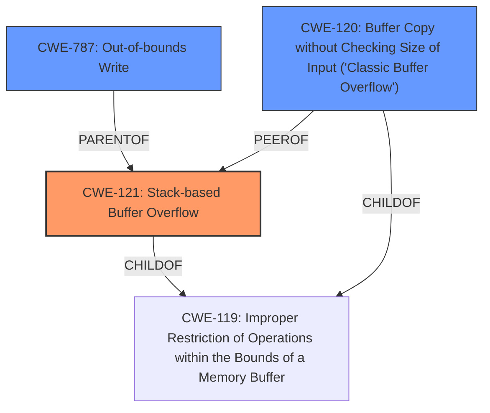

# Final Resolution for CVE-2021-46408

# Summary
| CWE ID | CWE Name | Confidence | CWE Abstraction Level | CWE Vulnerability Mapping Label | CWE-Vulnerability Mapping Notes |
|---|---|---|---|---|---|
| CWE-121 | Stack-based Buffer Overflow | 0.95 | Variant | Primary | Allowed |
| CWE-787 | Out-of-bounds Write | 0.70 | Base | Secondary | Allowed. Represents the general mechanism of writing beyond buffer boundaries, with CWE-121 specifying the stack location. |
| CWE-120 | Buffer Copy without Checking Size of Input ('Classic Buffer Overflow') | 0.50 | Base | Secondary | Allowed-with-Review. Applicable as `strcpy` performs a buffer copy without checking the size of the input. |

## Evidence and Confidence

*   **Confidence Score:** 0.95
*   **Evidence Strength:** HIGH

## Relationship Analysis
The primary weakness is CWE-121 (**Stack-based Buffer Overflow**), which is a variant of CWE-119 (**Improper Restriction of Operations within the Bounds of a Memory Buffer**). CWE-787 (**Out-of-bounds Write**) is a parent of CWE-121 representing the more general case of writing outside buffer boundaries. CWE-120 (**Buffer Copy without Checking Size of Input ('Classic Buffer Overflow')**) is a child of CWE-119 and a peer of CWE-121. The analysis selected CWE-121 for its specificity, as it is a **stack-based buffer overflow**.

## Vulnerability Chain
The vulnerability chain starts with the use of `strcpy` without proper bounds checking, which leads to a **stack-based buffer overflow** (CWE-121), resulting in an **out-of-bounds write** (CWE-787). The final impact is a Denial of Service (DoS).

## Summary of Analysis
The initial analysis and criticism both accurately identify the primary **weakness** as CWE-121 (**Stack-based Buffer Overflow**). The vulnerability description explicitly mentions a "**stack buffer overflow**" due to the use of `strcpy`. The choice of CWE-121 is further supported by the evidence from the CVE reference materials. While CWE-787 (**Out-of-bounds Write**) is a valid secondary mapping, it's a broader category, and CWE-121 provides more specific information about the location of the buffer (stack). Furthermore, since `strcpy` performs a buffer copy without checking the size of the input, CWE-120 is included as a secondary CWE.

The graph relationships confirm that CWE-121 is the optimal choice due to its specificity as a variant of CWE-119, whereas CWE-787 is a more general base class. The addition of CWE-120 as a secondary CWE further strengthens the analysis.

The selected CWEs are at the optimal level of specificity because CWE-121 accurately reflects the type of buffer overflow, and CWE-787 and CWE-120 represent the general mechanism of writing beyond buffer boundaries and the buffer copy operation, respectively.