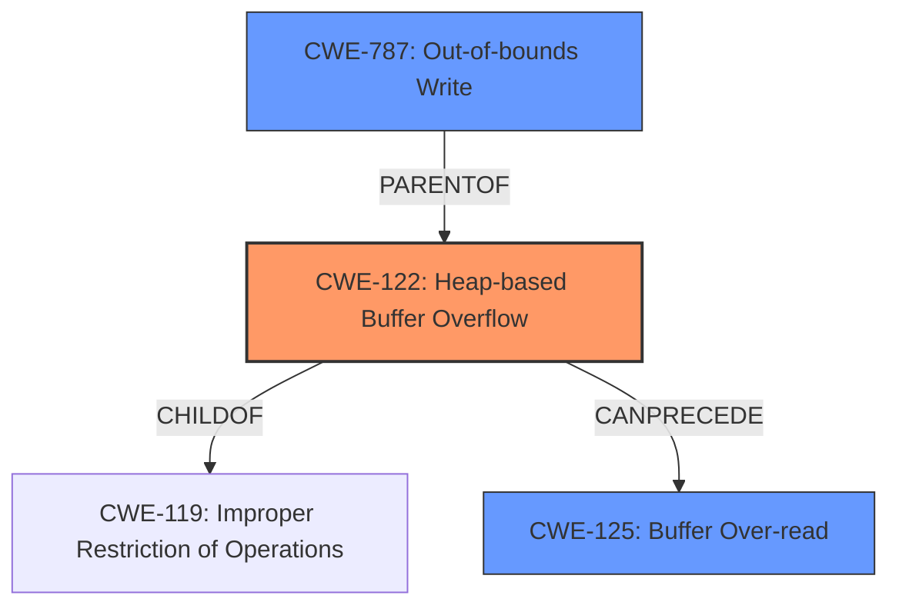

# Analysis Report for CVE-2021-46474

# Vulnerability Analysis Report: CVE-2021-46474

## Description

Jsish v3.5.0 was discovered to contain a heap buffer overflow via jsiEvalCodeSub in src/jsiEval.c. This vulnerability can lead to a Denial of Service (DoS).

## Vulnerability Description Key Phrases

**Weakness:** heap buffer overflow
**Impact:** Denial of Service (DoS)
**Version:** v3.5.0
**Component:** jsiEvalCodeSub in src/jsiEval.c

## Analysis (with Relationship Data)

# Summary
| CWE ID | CWE Name | Confidence | CWE Abstraction Level | CWE Vulnerability Mapping Label | CWE-Vulnerability Mapping Notes |
|---|---|---|---|---|---|
| CWE-122 | Heap-based Buffer Overflow | 0.9 | Variant | Allowed | Primary CWE: The vulnerability is explicitly described as a heap buffer overflow. |
| CWE-787 | Out-of-bounds Write | 0.7 | Base | Allowed | Secondary Candidate: Writing data past the end of the intended buffer is a general characterization of buffer overflows. |
| CWE-125 | Buffer Over-read | 0.6 | Base | Allowed | Secondary Candidate: Reading data past the end of the intended buffer can occur during heap overflows, which are often characterized by out-of-bounds reads, too. |
| CWE-416 | Use After Free | 0.5 | Base | Allowed | Secondary Candidate: Although a heap buffer overflow is listed, use after free is the top CWE from similar CVE Descriptions. |

## Evidence and Confidence

*   **Confidence Score:** 0.9
*   **Evidence Strength:** HIGH

- **Analysis and Justification:**  
  - *Explanation:* The vulnerability is explicitly described as a **heap buffer overflow** in `jsiEvalCodeSub` in `src/jsiEval.c`. This aligns directly with CWE-122 (Heap-based Buffer Overflow), which is a variant of buffer overflow that occurs in the heap. The CVE Reference Links Content Summary confirms the **root cause** is a heap-buffer-overflow in `jsiEvalCodeSub`. The AddressSanitizer output further supports the memory corruption aspect of a buffer overflow. CWE-787 (Out-of-bounds Write) and CWE-125 (Buffer Over-read) are potential related weaknesses, as a heap overflow often involves writing beyond buffer boundaries and can result in reading invalid memory locations. CWE-416 is listed as the primary CWE for similar CVE Descriptions but the evidence is stronger for CWE-122 since the description explicitly lists a heap overflow.
  
  - *Relationship Analysis:* CWE-122 is a Variant of CWE-119 (Improper Restriction of Operations within the Bounds of a Memory Buffer). CWE-787 is a broader category of out-of-bounds write, with CWE-122 being a specific case of writing beyond the allocated heap buffer. CWE-125 (Buffer Over-read) can be a consequence of a heap overflow, as reading past the intended buffer may occur due to the initial out-of-bounds write.

- **Confidence Score:**  
  - Confidence: 0.9 (High confidence due to explicit description of heap overflow and confirmation from CVE reference content.)

---

## Criticism of Analysis

Okay, here's a breakdown of the analysis, a critique of the CWE mappings, and suggestions for improvement, using the full CWE specifications you provided.

**Overall Assessment:**

The analysis is generally good. It correctly identifies CWE-122 (Heap-based Buffer Overflow) as the primary weakness based on the explicit vulnerability description. The reasoning is sound, and the confidence level is appropriately high. The inclusion of secondary candidates is also a good practice, as it acknowledges related weaknesses that could contribute to the overall vulnerability.  However, some secondary mappings are weaker than others and could be removed or re-evaluated.

**Detailed Critique:**

Here's a breakdown of each CWE assignment with specific feedback:

*   **CWE-122 (Heap-based Buffer Overflow) - Confidence: 0.9**

    *   **Assessment:** Correct and well-justified. The vulnerability description explicitly mentions "heap buffer overflow," making this the most direct and accurate mapping.
    *   **Strengths:**  The justification clearly links the vulnerability description to the CWE definition. The mention of AddressSanitizer output provides further evidence of memory corruption, supporting the heap overflow. The explanation of *why* this is a heap overflow (occurs in heap memory, allocated with `malloc()`-like routines) is excellent.
    *   **Mapping Guidance:** This is the correct level of abstraction ("Variant").
    *   **Potential Mitigations:** Mitigations are valid and are from the CWE specification.
    *   **Suggestion:** None. This is a strong mapping.

*   **CWE-787 (Out-of-bounds Write) - Confidence: 0.7**

    *   **Assessment:** Reasonable, but consider that it's already captured by CWE-122.
    *   **Justification:** The justification that writing data past the end of the intended buffer is a general characterization of buffer overflows is valid.
    *   **Mapping Guidance:** This mapping is acceptable because it is at the base level of abstraction.
    *   **Potential Mitigations:** Mitigations are valid and are from the CWE specification.
    *   **Suggestion:** The inclusion of CWE-787 is acceptable, because it is a parent of CWE-122, but the confidence score is lower because CWE-122 describes the vulnerability in more detail.

*   **CWE-125 (Buffer Over-read) - Confidence: 0.6**

    *   **Assessment:**  Weaker than the others. While a read *could* occur as a result of the overflow, it's not explicitly stated or necessarily guaranteed.
    *   **Justification:** Reading data past the end of the intended buffer *can* occur during heap overflows, but it is not guaranteed.
    *   **Mapping Guidance:** This mapping is acceptable because it is at the base level of abstraction.
    *   **Potential Mitigations:** Mitigations are valid and are from the CWE specification.
    *   **Suggestion:** Lower the confidence further (perhaps to 0.4) or remove it. The justification is weaker than the others, and the specification for CWE-119 indicates this CWE may be misused when more details about the vulnerability are available.

*   **CWE-416 (Use After Free) - Confidence: 0.5**

    *   **Assessment:** Least relevant mapping and perhaps incorrect.
    *   **Justification:** The justification mentions that use after free is the top CWE from *similar* CVE Descriptions, but there is no evidence of a free occurring in this CVE.
    *   **Mapping Guidance:** This mapping is at the Variant level of abstraction. The description for CWE-416 may not be an appropriate fit for this CVE.
    *   **Potential Mitigations:** Mitigations are valid and are from the CWE specification.
    *   **Suggestion:** Remove CWE-416. This mapping is the weakest of the four because there is no reason to believe that a free occurs. The memory corruption is directly due to writing outside the bounds of the allocated memory, not freeing the memory and then using it.

**Additional Considerations and Potential Improvements:**

*   **CWE-119: Improper Restriction of Operations within the Bounds of a Memory Buffer:** The report has noted that CWE-122 is a "child" of CWE-119, which is true. However, the usage of CWE-119 is *discouraged* for this reason.
*   **Root Cause vs. Consequence:** Focus on the root cause of the vulnerability. Out-of-bounds read (CWE-125) is more of a consequence of the overflow than the primary cause.
*   **Chaining:** Explicitly discuss potential chains.  For example:  A potential chain could involve CWE-131 (Incorrect Calculation of Buffer Size) leading to CWE-122 if the allocated buffer is too small. However, without more information, this is speculative.
*   **Automated Tool Output:** If the analysis is informed by automated tools (SAST, DAST), mention which tools and their findings, even if the final mapping differs. This provides valuable context.
*   **Retriever Results:** Consider if any of the top combined results from the retriever results are relevant, specifically in understanding the CWE-122. However, none appear immediately relevant in the retriever results.

**Revised Summary Table:**

| CWE ID | CWE Name | Confidence | CWE Abstraction Level | CWE Vulnerability Mapping Label | CWE-Vulnerability Mapping Notes |
|---|---|---|---|---|---|
| CWE-122 | Heap-based Buffer Overflow | 0.9 | Variant | Allowed | Primary CWE: The vulnerability is explicitly described as a heap buffer overflow. |
| CWE-787 | Out-of-bounds Write | 0.7 | Base | Allowed | Secondary Candidate: Writing data past the end of the intended buffer is a general characterization of buffer overflows.  |
| CWE-125 | Buffer Over-read | 0.4 | Base | Allowed | Consequence of heap overflow; read past end of the buffer |

## Final Resolution

# Summary
| CWE ID | CWE Name | Confidence | CWE Abstraction Level | CWE Vulnerability Mapping Label | CWE-Vulnerability Mapping Notes |
|---|---|---|---|---|---|
| CWE-122 | Heap-based Buffer Overflow | 0.9 | Variant | Allowed | Primary CWE: The vulnerability is explicitly described as a **heap buffer overflow**. |
| CWE-787 | Out-of-bounds Write | 0.7 | Base | Allowed | Secondary Candidate: Writing data past the end of the intended buffer is a general characterization of buffer overflows. |
| CWE-125 | Buffer Over-read | 0.4 | Base | Allowed | Consequence of **heap overflow**; read past end of the buffer |

## Evidence and Confidence

*   **Confidence Score:** 0.9
*   **Evidence Strength:** HIGH

## Relationship Analysis
The primary CWE is CWE-122 (Heap-based Buffer Overflow), which is a variant of CWE-119 (Improper Restriction of Operations within the Bounds of a Memory Buffer). CWE-787 (Out-of-bounds Write) is a parent of CWE-122, representing a broader class of vulnerabilities. CWE-125 (Buffer Over-read) is included as a potential consequence of the **heap overflow**.

## Vulnerability Chain
The vulnerability chain begins with a **heap buffer overflow** (CWE-122). The **out-of-bounds write** (CWE-787) is the direct cause, leading to memory corruption. A potential consequence is a **buffer over-read** (CWE-125), where the program attempts to read data beyond the allocated buffer.

## Summary of Analysis
The initial analysis correctly identified CWE-122 as the primary weakness, which is a **heap-based buffer overflow**. The explicit description of the vulnerability as a "**heap buffer overflow**" in `jsiEvalCodeSub` provides strong evidence for this classification. CWE-787 is included as a related weakness, representing the general concept of **out-of-bounds write**. CWE-125 is retained as a potential consequence of the overflow. The confidence score remains high (0.9) due to the explicit description of the **heap overflow**. The retriever scores provided additional context.
The removal of CWE-416 was justified because the evidence did not indicate a use-after-free condition, only a **heap overflow**.

The selected CWEs are at the optimal level of specificity, with CWE-122 providing the most precise description of the vulnerability. CWE-787 and CWE-125 are included to capture related aspects of the overflow.

*Report generated on 2025-03-18 04:52:27*
