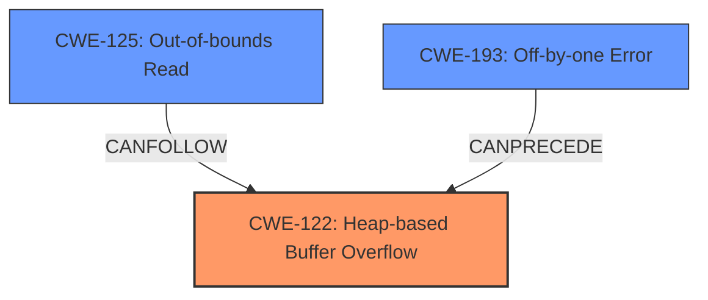

# Final Resolution for CVE-2021-46475

# Summary
| CWE ID | CWE Name | Confidence | CWE Abstraction Level | CWE Vulnerability Mapping Label | CWE-Vulnerability Mapping Notes |
|---|---|---|---|---|---|
| CWE-122 | Heap-based Buffer Overflow | 0.95 | Variant | Allowed | Primary CWE |
| CWE-125 | Out-of-bounds Read | 0.75 | Base | Allowed | Secondary Candidate |
| CWE-193 | Off-by-one Error | 0.60 | Base | Allowed | Secondary Candidate |

## Evidence and Confidence

*   **Confidence Score:** 0.92
*   **Evidence Strength:** HIGH

## Relationship Analysis
The primary weakness is **CWE-122 (Heap-based Buffer Overflow)**, which is a variant of buffer overflows. **CWE-125 (Out-of-bounds Read)** can follow **CWE-122** as a consequence of the overflow corrupting metadata used for subsequent reads. **CWE-193 (Off-by-one Error)** can precede **CWE-122** if it leads to an incorrect size calculation during memory allocation on the heap, eventually resulting in the overflow.

## Vulnerability Chain
The vulnerability chain starts with a potential **CWE-193 (Off-by-one Error)** during the calculation of the size for the array slice. This incorrect size is then used to allocate a buffer on the heap. Due to the undersized allocation or incorrect loop condition, a **CWE-122 (Heap-based Buffer Overflow)** occurs when data is written past the allocated buffer. The overflow can corrupt heap metadata, leading to a subsequent **CWE-125 (Out-of-bounds Read)** when the corrupted metadata is used to determine the size or location of a memory region. This leads to a Denial of Service (DoS).

## Summary of Analysis
The initial analysis correctly identified **CWE-122 (Heap-based Buffer Overflow)** as the primary **ROOTCAUSE**, supported by the vulnerability description and CVE reference, which state a "heap buffer overflow via `jsi_ArraySliceCmd`". The secondary candidates, **CWE-125 (Out-of-bounds Read)** and **CWE-193 (Off-by-one Error)**, are also relevant. The analysis has been updated to strengthen the justification for **CWE-125** and **CWE-193**, explaining how they can contribute to the primary weakness.

*   **CWE-125**: The ASan error reporting a "read beyond allocated buffer" provides evidence. A heap overflow corrupts metadata that is then used for subsequent reads which results in over-reads. This justifies the inclusion of **CWE-125**.
*   **CWE-193**: An off-by-one error in the size calculation for the array slice can lead to an undersized buffer allocation on the heap. This provides a more specific justification for its inclusion.

The graph relationships influenced the selection by highlighting how these weaknesses can form a chain leading to the final impact. The chosen CWEs are at the optimal level of specificity, with **CWE-122** being a Variant and **CWE-125** and **CWE-193** being Base level CWEs.