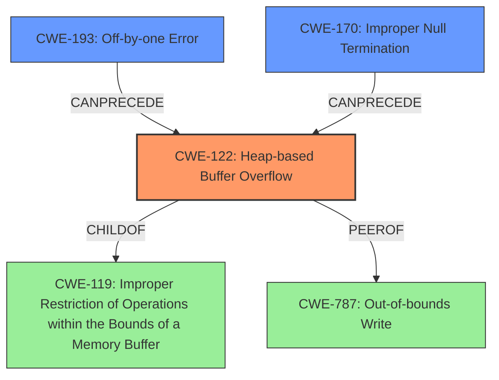

# Final Resolution for CVE-2021-46477

# Summary
| CWE ID | CWE Name | Confidence | CWE Abstraction Level | CWE Vulnerability Mapping Label | CWE-Vulnerability Mapping Notes |
|---|---|---|---|---|---|
| CWE-122 | Heap-based Buffer Overflow | 0.9 | Variant | Allowed | **Primary CWE**. Direct match with the vulnerability description. The overflow occurs on the heap. |
| CWE-193 | Off-by-one Error | 0.6 | Base | Allowed | Secondary candidate. May contribute to the overflow by incorrectly calculating buffer size or placement of the null terminator. |
| CWE-170 | Improper Null Termination | 0.5 | Base | Allowed | Secondary candidate. Potentially connected to the 'off-by-null-byte' **rootcause**, but not the primary driver of the overflow. It can **precede** CWE-122. |
| CWE-787 | Out-of-bounds Write | 0.4 | Base | Allowed | Considered but less specific. CWE-122 is a variant of this. |

## Evidence and Confidence

*   **Confidence Score:** 0.85
*   **Evidence Strength:** HIGH

## Relationship Analysis
The primary CWE is CWE-122 (Heap-based Buffer Overflow), which is a variant of the class CWE-119 (Improper Restriction of Operations within the Bounds of a Memory Buffer). CWE-193 (Off-by-one Error) and CWE-170 (Improper Null Termination) are considered as secondary candidates that may contribute to the heap overflow. CWE-170 can **precede** CWE-122. The analysis moves from the general CWE-119 to the more specific CWE-122 due to the vulnerability description explicitly mentioning a heap buffer overflow. The off-by-one error (CWE-193) and improper null termination (CWE-170) can be related to the **rootcause** "off-by-null-byte on heap".

## Vulnerability Chain
The vulnerability chain starts with a potential **rootcause** of an **off-by-one error (CWE-193)** or **Improper Null Termination (CWE-170)** on the heap. This leads to a **heap-based buffer overflow (CWE-122)**, where data is written beyond the allocated buffer on the heap. The consequence of this overflow is a Denial of Service (DoS), as stated in the vulnerability description.

## Summary of Analysis
The initial analysis correctly identified CWE-122 as the primary weakness, given the explicit mention of a heap buffer overflow in the vulnerability description: "Jsish v3.5.0 was discovered to contain a heap buffer overflow via RegExp_constructor in src/jsiRegexp.c. This vulnerability can lead to a Denial of Service (DoS)."
The criticism provided valuable suggestions for exploring alternative CWEs and clarifying relationships. The inclusion of CWE-170 as a secondary candidate, along with CWE-193, strengthens the analysis by acknowledging the potential contribution of improper null termination to the heap overflow, especially given the "off-by-null-byte on heap" information. The analysis also considered and ruled out CWE-787 as being less specific than CWE-122.

The selection of CWEs is at the optimal level of specificity, with CWE-122 directly addressing the heap buffer overflow and CWE-193 and CWE-170 providing potential contributing factors. The relationships between these CWEs are clarified, and the vulnerability chain is mapped from **rootcause** to impact.
The final confidence score reflects the high degree of confidence in the primary CWE and the supporting role of the secondary CWEs.