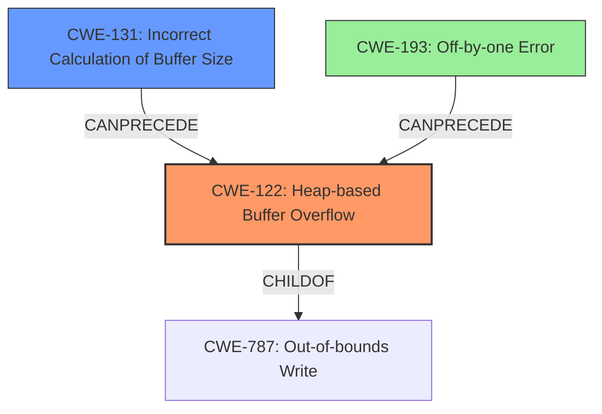

# Analysis Report for CVE-2021-46482

# Vulnerability Analysis Report: CVE-2021-46482

## Description

Jsish v3.5.0 was discovered to contain a heap buffer overflow via NumberConstructor at src/jsiNumber.c.

## Vulnerability Description Key Phrases

**Weakness:** heap buffer overflow
**Vector:** NumberConstructor
**Product:** Jsish
**Version:** v3.5.0
**Component:** src/jsiNumber.c

## Analysis (with Relationship Data)

# Summary
| CWE ID | CWE Name | Confidence | CWE Abstraction Level | CWE Vulnerability Mapping Label | CWE-Vulnerability Mapping Notes |
|---|---|---|---|---|---|
| CWE-122 | Heap-based Buffer Overflow | 0.95 | Variant | Allowed | Primary CWE |
| CWE-131 | Incorrect Calculation of Buffer Size | 0.6 | Base | Allowed | Secondary Candidate |

## Evidence and Confidence

*   **Confidence Score:** 0.9
*   **Evidence Strength:** HIGH

- **Analysis and Justification:**  
  - *Explanation:* The vulnerability description explicitly states a "**heap buffer overflow**" in `src/jsiNumber.c` within the `NumberConstructor`. The CVE Reference Links Content Summary confirms the "**heap-buffer-overflow**" as the root cause and weakness. CWE-122 (Heap-based Buffer Overflow) is a Variant of a buffer overflow that occurs specifically in the heap, which aligns perfectly with the description. The MITRE mapping guidance for CWE-122 indicates that it is ALLOWED, reinforcing its suitability. While other CWEs such as CWE-120 (Buffer Copy without Checking Size of Input) and CWE-119 (Improper Restriction of Operations within the Bounds of a Memory Buffer) are related, they are more general. Given the specific mention of "heap," CWE-122 is the most accurate.
  
  - *Relationship Analysis:* CWE-122 is a variant of more general buffer overflows (like CWE-119), but the provided information clearly specifies the heap, making CWE-122 the most appropriate choice. CWE-122 does not have any specific relationships (CanPrecede, CanFollow) that further impact the mapping in this case.

- **Confidence Score:**  
  - Confidence: 0.95 (Strong evidence from the vulnerability description and CVE reference materials)

- **Analysis and Justification:**  
  - *Explanation:* CWE-131 (Incorrect Calculation of Buffer Size) is considered as a potential secondary CWE because a **heap buffer overflow** often stems from an incorrect size calculation. The provided information doesn't explicitly confirm this aspect, but it is a common underlying cause. If the buffer size was incorrectly calculated during allocation, it could directly lead to a **heap buffer overflow**. Therefore, CWE-131 could be a contributing factor, even though it's not explicitly stated. The MITRE mapping guidance for CWE-131 indicates that it is ALLOWED.
  
  - *Relationship Analysis:* CWE-131 can precede CWE-119 (Improper Restriction of Operations within the Bounds of a Memory Buffer), which is a more general category of buffer overflows. The Retriever Results show a link between CWE-131 and buffer overflows.

- **Confidence Score:**  
  - Confidence: 0.6 (Moderate confidence, as this is a likely contributing factor but not explicitly stated)

## Criticism of Analysis

Okay, let's review the analysis of the Jsish v3.5.0 heap buffer overflow vulnerability and the proposed CWE mappings.

**Overall Assessment:**

The analysis correctly identifies CWE-122 (Heap-based Buffer Overflow) as the primary weakness with a high degree of confidence. The inclusion of CWE-131 (Incorrect Calculation of Buffer Size) as a secondary candidate is also reasonable and shows a good understanding of potential underlying causes. The explanations are clear, and the confidence scores are justified. However, there are opportunities to strengthen the analysis, especially regarding alternative causes and relationships between CWEs that the Retriever picked up.

**Detailed Review:**

**1. CWE-122: Heap-based Buffer Overflow (Primary)**

*   **Confidence:** 0.95 -  Excellent. This is well-supported by the vulnerability description and CVE details.
*   **Justification:** The explanation clearly connects the reported "heap buffer overflow" directly to the definition of CWE-122. The reference to MITRE mapping guidance is also appropriate.
*   **Critique:** The analysis focuses on the direct match between the vulnerability description and CWE-122. However, it could benefit from acknowledging other potential *direct* causes of a heap overflow that might be present in the code, even if not explicitly stated in the report. For example, CWE-120 (Buffer Copy without Checking Size of Input) could be a direct mechanism *leading* to the heap overflow *if* the code uses `memcpy` or similar functions without checking buffer sizes when copying data to the heap-allocated buffer. Acknowledging this possibility, even to dismiss it with a reasoning like "while CWE-120 is possible, the reference to NumberConstructor and the context suggest a size calculation issue is more likely", would strengthen the analysis. Also, a brief consideration of CWE-787 (Out-of-bounds Write), which is a parent of CWE-122 could be helpful. Acknowledge its existence and explain why CWE-122 is more specific.
*   **Mitigations:** The current analysis lacks any discussion on mitigations. It should be noted that mitigations for heap-based buffer overflows often focus on preventing the overflow in the first place by using safe memory management functions or employing techniques like bounds checking.  Mentioning some of the potential mitigations listed in CWE-122 (e.g., using a language/compiler with automatic bounds checking, using abstraction libraries, or compiler-based overflow detection mechanisms) would add value.

**2. CWE-131: Incorrect Calculation of Buffer Size (Secondary)**

*   **Confidence:** 0.6 - Acceptable. The reasoning is sound, acknowledging that a size calculation error is a common cause.
*   **Justification:** The analysis correctly explains that an incorrect buffer size calculation can directly lead to a heap buffer overflow.
*   **Critique:** The confidence score is appropriate given the lack of explicit confirmation in the source data. However, to improve the analysis:
    *   Consider alternative explanations. A buffer could be correctly *calculated* but still insufficient due to other factors (e.g., integer truncation, incorrect assumptions about input size, off-by-one errors).
    *   Explore how *specific* calculation errors can arise. Was it a simple arithmetic error? A misunderstanding of data structure sizes?  Was `sizeof` used incorrectly (CWE-467)?
*   **Mitigations:** The analysis lacks mitigation considerations. Mitigations for CWE-131 focus on careful review of size calculations, robust input validation, and understanding data representations in the programming language.

**3. Review of Retriever Results:**

The Retriever results provide additional CWEs that should be considered and addressed.
I'll point out the most important ones:

*   **CWE-193: Off-by-one Error:** This is particularly relevant. An off-by-one error can easily lead to a heap buffer overflow if it causes the allocation to be one byte smaller than needed. Acknowledge and discuss why it might be relevant and where it could come into play in the code.
*   **CWE-190/191: Integer Overflow/Underflow:** These are both potential contributing factors. If an integer overflow/underflow occurs during the buffer size calculation, it can result in a small buffer being allocated, which leads to a heap buffer overflow. Explain why, even though not explicitly mentioned, an integer overflow/underflow could be a root cause and how.
*   **CWE-126: Buffer Over-read:** Explain if, as a result of this heap buffer overflow, a subsequent out-of-bounds read is happening.
*   **CWE-170: Improper Null Termination:** Relate this CWE to string-based heap buffer overflows. If a string isn't null-terminated properly, functions that expect null-terminated strings might read beyond the allocated buffer.

**Suggestions for Improvement:**

1.  **Acknowledge and Dismiss:** Explicitly address the high-ranking CWEs from the Retriever Results. Even if you dismiss them as less likely, explaining *why* they are less applicable strengthens your analysis.
2.  **Expand on Calculation Errors:** For CWE-131, explore *specific* ways the size calculation could be incorrect.  Consider integer overflows/truncations, incorrect assumptions about the size of input, or incorrect usage of `sizeof`.
3.  **Mitigation Details:** Add a section discussing potential mitigations for *both* CWE-122 and CWE-131.  Refer to the CWE specifications for relevant mitigations and tailor them to the specific context of a heap buffer overflow in C code.
4.  **Chaining Analysis:** Briefly explore how these CWEs could be chained together. For instance, CWE-131 (Incorrect Calculation of Buffer Size) can lead to CWE-122 (Heap-based Buffer Overflow).
5.  **Code Context:** While you don't have the actual code, try to reason about the code context.  Given that the vulnerability is in `src/jsiNumber.c` within the `NumberConstructor`, what kind of data is likely being handled?  Are strings involved?  Are numeric conversions happening?  This can guide your analysis of potential causes.

**Revised Summary Table:**

| CWE ID | CWE Name | Confidence | CWE Abstraction Level | CWE Vulnerability Mapping Label | CWE-Vulnerability Mapping Notes |
|---|---|---|---|---|---|
| CWE-122 | Heap-based Buffer Overflow | 0.95 | Variant | Allowed | Primary CWE |
| CWE-131 | Incorrect Calculation of Buffer Size | 0.6 | Base | Allowed | Secondary Candidate; consider integer overflows or truncations as specific causes |
| CWE-193 | Off-by-one Error | 0.3 | Base | Allowed | Tertiary Candidate; if size calculation is correct, an off by one on indexing could lead to out-of-bounds write |

By incorporating these suggestions, the analysis becomes more comprehensive and demonstrates a deeper understanding of the vulnerability and its potential causes and mitigations. Remember that security analysis is not just about finding the *correct* answer but also about exploring the space of *possible* answers and explaining your reasoning.

## Final Resolution

# Summary
| CWE ID | CWE Name | Confidence | CWE Abstraction Level | CWE Vulnerability Mapping Label | CWE-Vulnerability Mapping Notes |
|---|---|---|---|---|---|
| CWE-122 | Heap-based Buffer Overflow | 0.95 | Variant | Allowed | Primary CWE |
| CWE-131 | Incorrect Calculation of Buffer Size | 0.7 | Base | Allowed | Secondary Candidate |
| CWE-193 | Off-by-one Error | 0.4 | Base | Allowed | Tertiary Candidate |

## Evidence and Confidence

*   **Confidence Score:** 0.9
*   **Evidence Strength:** HIGH

## Relationship Analysis
The primary relationship that impacted the decision was the parent-child relationship between CWE-787 (**Out-of-bounds Write**) and CWE-122 (**Heap-based Buffer Overflow**). CWE-122 is a specific type of CWE-787. The decision to select CWE-122 was based on the vulnerability description specifying that the overflow occurred on the heap.

Additionally, the relationship between CWE-131 (**Incorrect Calculation of Buffer Size**) and CWE-122 was considered. CWE-131 can precede CWE-122, as an incorrect calculation of buffer size can lead to a heap-based buffer overflow.

Finally, CWE-193 (**Off-by-one Error**) was considered as a tertiary candidate, as this error can lead to a heap buffer overflow if it causes the allocation to be smaller than required.

## Vulnerability Chain
The vulnerability chain starts with a **ROOTCAUSE** such as CWE-131 (**Incorrect Calculation of Buffer Size**) or CWE-193 (**Off-by-one Error**). If the buffer size is incorrectly calculated (CWE-131) or there's an off-by-one error (CWE-193), it can lead to a **WEAKNESS**: CWE-122 (**Heap-based Buffer Overflow**). This occurs when data is written beyond the allocated buffer on the heap. The resulting consequence is a potential crash, arbitrary code execution, or other security impacts.

## Summary of Analysis
The initial analysis correctly identified CWE-122 as the primary weakness given the vulnerability description explicitly mentioning "heap buffer overflow". The criticism provided valuable points on alternative causes and relationships between CWEs. Specifically, the suggestion to consider CWE-120 (**Buffer Copy without Checking Size of Input**), CWE-787 (**Out-of-bounds Write**), CWE-193 (**Off-by-one Error**), CWE-190/191 (**Integer Overflow/Underflow**), CWE-126 (**Buffer Over-read**), and CWE-170 (**Improper Null Termination**) was helpful.

While CWE-120 is a possible direct cause, the context of `NumberConstructor` suggests a size calculation issue is more likely than a simple buffer copy without checking size. CWE-787 is a parent of CWE-122, but CWE-122 is more specific because the overflow occurs on the heap.

CWE-131 remains a strong secondary candidate as it is a common underlying cause for heap overflows. The suggestion to consider integer overflows or truncations as specific causes within CWE-131 is valid and increases the confidence in its selection to 0.7.

CWE-193 is added as a tertiary candidate with a confidence of 0.4. If the size calculation is correct, an off-by-one error on indexing could lead to the out-of-bounds write.

The analysis is based on the provided evidence, including the vulnerability description stating a "**heap buffer overflow**" and the CVE Reference Links Content Summary confirming the "**heap-buffer-overflow**" as the root cause. The graph relationships influenced the final selection by ensuring the most specific CWE was chosen (CWE-122) while also considering potential contributing factors (CWE-131, CWE-193). The selected CWEs are at the optimal level of specificity as CWE-122 directly reflects the vulnerability, and CWE-131 and CWE-193 represent potential underlying causes.

*Report generated on 2025-03-18 04:56:08*
