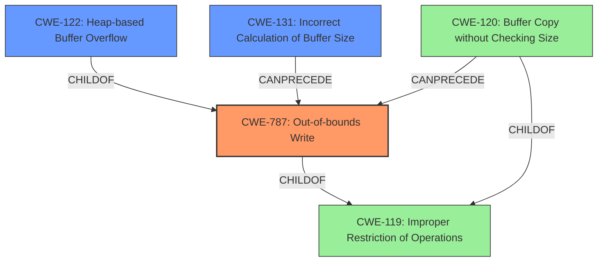

# Final Resolution for CVE-2021-46483

# Summary
| CWE ID | CWE Name | Confidence | CWE Abstraction Level | CWE Vulnerability Mapping Label | CWE-Vulnerability Mapping Notes |
|---|---|---|---|---|---|
| CWE-787 | Out-of-bounds Write | 0.8 | Base | Allowed | Primary CWE |
| CWE-122 | Heap-based Buffer Overflow | 0.7 | Variant | Allowed | Secondary CWE |
| CWE-131 | Incorrect Calculation of Buffer Size | 0.6 | Base | Allowed | Secondary CWE |
  
## Evidence and Confidence

*   **Confidence Score:** 0.75
*   **Evidence Strength:** MEDIUM

## Relationship Analysis
The primary relationship is that CWE-122 (Heap-based Buffer Overflow) is a variant of CWE-787 (Out-of-bounds Write). CWE-131 (Incorrect Calculation of Buffer Size) can precede CWE-787, leading to the overflow. The abstraction levels influenced the selection by favoring the base CWE-787 to capture the general out-of-bounds write, while acknowledging the heap-specific overflow with CWE-122.

## Vulnerability Chain
The vulnerability chain starts with potentially an **incorrect calculation of buffer size** (**CWE-131**). This **incorrect size** then leads to an **out-of-bounds write** (**CWE-787**). Since the vulnerability description specifies a **heap buffer overflow**, the **CWE-787** results in **CWE-122**. The final impact is a potential crash or arbitrary code execution.

## Summary of Analysis
The initial analysis correctly identified **CWE-122 (Heap-based Buffer Overflow)** as the primary weakness based on the vulnerability description stating "heap buffer overflow". The CVE reference further confirmed the out-of-bounds write. However, the analysis can be improved by considering the root cause and related weaknesses.

The retriever results indicated several potential contributing factors. I agree with the criticism that **CWE-131 (Incorrect Calculation of Buffer Size)** should be considered, as an incorrect size calculation can directly lead to a buffer overflow. I also agree that since there is an out-of-bounds write happening, **CWE-787 (Out-of-bounds Write)** should be included as the primary weakness.

The graph relationships influenced my selection by highlighting the parent-child relationship between **CWE-787** and **CWE-122**, and the potential for **CWE-131** to precede **CWE-787**.

The final classification includes **CWE-787** as the primary weakness to represent the general out-of-bounds write, **CWE-122** as a secondary weakness to specify that the overflow occurs on the heap, and **CWE-131** as a secondary weakness as the root cause of the incorrect buffer size. These CWEs are at the optimal level of specificity because they accurately describe the vulnerability based on the available evidence, including the vulnerability description and the CVE reference.