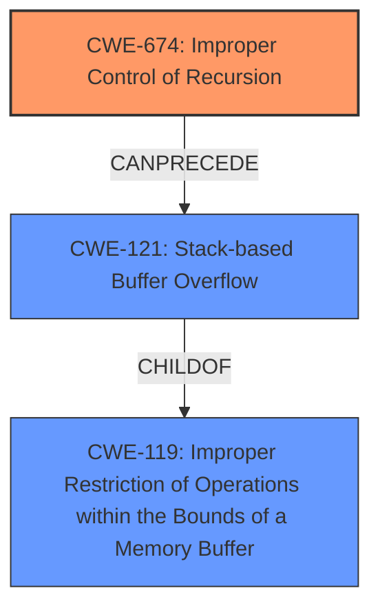

# Analysis Report for CVE-2021-46505

# Vulnerability Analysis Report: CVE-2021-46505

## Description

Jsish v3.5.0 was discovered to contain a stack overflow via /usr/lib/x86_64-linux-gnu/libasan.so.4+0x5b1e5.

## Vulnerability Description Key Phrases

**Weakness:** stack overflow
**Product:** componentJsish
**Version:** v3.5.0

## Analysis (with Relationship Data)

# Summary
| CWE ID | CWE Name | Confidence | CWE Abstraction Level | CWE Vulnerability Mapping Label | CWE-Vulnerability Mapping Notes |
|---|---|---|---|---|---|
| CWE-674 | Improper Control of Recursion | 0.85 | Class | Primary | Allowed-with-Review |
| CWE-121 | Stack-based Buffer Overflow | 0.65 | Variant | Secondary Candidate | Allowed |

## Evidence and Confidence

*   **Confidence Score:** 0.75
*   **Evidence Strength:** HIGH

- **Analysis and Justification:**  
  - *Explanation:* The vulnerability description clearly states "**stack overflow**" as the **weakness**. The CVE Reference Links Content Summary confirms that the root cause is "excessive recursion in `Jsi_NameLookup` and `jsi_ValueSubscript` functions within the jsish interpreter." This aligns directly with CWE-674 (Improper Control of Recursion). Although CWE-121 (Stack-based Buffer Overflow) is mentioned as a potential consequence, the primary issue is the unbounded recursion leading to the stack overflow. The retriever results also show CWE-674 as a highly relevant candidate. CWE-674 is a Class-level CWE, and a more specific Base or Variant may be better. However, none of the children of CWE-674 are relevant. The recursive calls fill the stack, so the **recursion** is the **root cause**.
  
  - *Relationship Analysis:* While CWE-674 doesn't have direct relationships listed, it's a Class-level CWE, suggesting more specific weaknesses could stem from it. The stack overflow (CWE-121) can be considered a consequence of the uncontrolled recursion.

- **Confidence Score:**  
  - Confidence: 0.85 (High confidence due to the explicit mention of stack overflow and confirmation of excessive recursion as the root cause.)

---

- **Analysis and Justification:**  
  - *Explanation:* CWE-121 (Stack-based Buffer Overflow) is a potential secondary candidate because the vulnerability manifests as a stack overflow. However, it's crucial to distinguish between the root cause and the impact. The root cause is the excessive recursion (CWE-674), and the stack overflow is a consequence of that uncontrolled recursion. CWE-121, being a Variant of buffer overflow, is applicable since the stack is overflowing.
  
  - *Relationship Analysis:* CWE-121 is a child of CWE-119 (Improper Restriction of Operations within the Bounds of a Memory Buffer). This relationship highlights how the excessive recursion leads to memory corruption on the stack.

- **Confidence Score:**  
  - Confidence: 0.65 (Moderate confidence as it represents the symptom, but the root cause is the uncontrolled recursion.)

## Criticism of Analysis

Okay, here's a detailed review of the provided analysis, considering the full CWE specifications:

**Overall Assessment:**

The analysis is generally well-reasoned and accurate. The primary mapping to CWE-674 (Improper Control of Recursion) is correct, and the inclusion of CWE-121 (Stack-based Buffer Overflow) as a secondary candidate is also justifiable. The confidence levels assigned to each mapping are reasonable.

**Detailed Critique:**

**1. CWE-674: Improper Control of Recursion (Primary)**

*   **Abstraction Level:** The analysis correctly acknowledges that CWE-674 is a Class-level CWE.
*   **Justification:** The reasoning is sound. The vulnerability's root cause is indeed the uncontrolled recursion within `Jsi_NameLookup` and `jsi_ValueSubscript`. The description of CWE-674 perfectly aligns with this scenario: "The product does not properly control the amount of recursion that takes place, consuming excessive resources, such as allocated memory or the program stack."
*   **Mapping Guidance:** The analysis correctly highlights the "Allowed-with-Review" usage, which suggests examining children for a better fit. However, it also correctly concludes that none of the children are a more accurate fit.  It's important to keep in mind that the `push` function, which is part of the javascript API, does not have a child CWE for this vulnerability.
*   **Confidence Score:** The high confidence score (0.85) is appropriate given the clear evidence in the vulnerability description and CVE details.
*   **Mitigations:** The analysis implicitly acknowledges the mitigations by stating that the recursion is unbounded, and then connecting the recursion to a stack overflow. However, it might benefit from explicitly mentioning mitigation strategies like:
    *   **Mitigation 1 from CWE-674:** "Ensure an end condition will be reached under all logic conditions. The end condition may include testing against the depth of recursion and exiting with an error if the recursion goes too deep." This is highly relevant.
    *   This can be done by setting an exit condition to the number of allowed recursive calls.
*   **Observed Examples:** The provided examples in the CWE database reinforce the appropriateness of this mapping.  They involve similar stack exhaustion scenarios due to uncontrolled recursion.

**2. CWE-121: Stack-based Buffer Overflow (Secondary Candidate)**

*   **Abstraction Level:** The analysis correctly identifies CWE-121 as a Variant.
*   **Justification:** The explanation that CWE-121 represents the symptom (stack overflow) while CWE-674 is the root cause is accurate. The stack overflow is a direct consequence of the excessive recursion.
*   **Relationship Analysis:** The connection to CWE-119 (Improper Restriction of Operations within the Bounds of a Memory Buffer) is valid. CWE-121 is a child of CWE-119, indicating that the stack overflow is a specific instance of memory corruption due to writing beyond buffer boundaries.
*   **Confidence Score:** The moderate confidence score (0.65) is suitable because it acknowledges that this CWE captures the impact rather than the primary cause.
*   **Mitigations:** The analysis could benefit from explicitly discussing mitigations relevant to *preventing* the stack overflow itself, even though the primary fix would be to address the recursion.  For example:
    *   **Mitigation 1 from CWE-121:** "Use automatic buffer overflow detection mechanisms that are offered by certain compilers or compiler extensions. Examples include: the Microsoft Visual Studio /GS flag, Fedora/Red Hat FORTIFY_SOURCE GCC flag, StackGuard, and ProPolice, which provide various mechanisms including canary-based detection and range/index checking."  While not preventing the recursion, these mechanisms can detect the overflow and potentially prevent exploitation.
    *   Another mitigation is to increase the stack size as mentioned in the mitigations for CWE-674.
*   **Alternative Terms:** The analysis correctly mentions stack exhaustion, which is an alternative term for uncontrolled recursion.

**Additional Considerations & Suggested Improvements:**

*   **Retriever Results:** While the analysis is good, it doesn't explicitly address why the retriever results have other CWEs at the top. For example, CWE-770 (Allocation of Resources Without Limits or Throttling) is ranked highly. While not the *most* accurate, it is still *somewhat* relevant. Uncontrolled recursion *is* a form of resource exhaustion, even if the resource being exhausted is the stack. Consider a brief explanation acknowledging why these other CWEs are less appropriate but related.
*   **Chain of Weaknesses:** The analysis correctly identifies the relationship between CWE-674 and CWE-121 as a cause-and-effect relationship. This can be more formally represented as a *chain* of weaknesses: CWE-674 -> CWE-121.
*   **Attack Vector:** While covered in the original analysis, it's worth reiterating that the attack vector is a specially crafted JavaScript code designed to trigger excessive recursion within the `Jsi_NameLookup` and `jsi_ValueSubscript` functions.

**Revised Summary Table (with suggested additions):**

| CWE ID | CWE Name | Confidence | CWE Abstraction Level | CWE Vulnerability Mapping Label | CWE-Vulnerability Mapping Notes |
|---|---|---|---|---|---|
| CWE-674 | Improper Control of Recursion | 0.85 | Class | Primary | Allowed-with-Review. Mitigate by ensuring an exit condition is always reached (e.g., recursion depth limit). |
| CWE-121 | Stack-based Buffer Overflow | 0.65 | Variant | Secondary Candidate | Allowed. Consequence of CWE-674. Mitigate with stack overflow detection mechanisms. CWE-674 -> CWE-121.  |

**Conclusion:**

The analysis is strong and well-justified. The primary and secondary CWE mappings are accurate. The suggested improvements focus on explicitly mentioning relevant mitigations from the CWE specifications and acknowledging the broader context of resource exhaustion. By including these elements, the analysis becomes even more comprehensive and insightful.

## Final Resolution

# Summary
| CWE ID | CWE Name | Confidence | CWE Abstraction Level | CWE Vulnerability Mapping Label | CWE-Vulnerability Mapping Notes |
|---|---|---|---|---|---|
| CWE-674 | Improper Control of Recursion | 0.90 | Class | Primary | Allowed-with-Review. Mitigate by ensuring an exit condition is always reached (e.g., recursion depth limit). |
| CWE-121 | Stack-based Buffer Overflow | 0.70 | Variant | Secondary Candidate | Allowed. Consequence of CWE-674. Mitigate with stack overflow detection mechanisms. CWE-674 -> CWE-121.  |

## Evidence and Confidence

*   **Confidence Score:** 0.85
*   **Evidence Strength:** HIGH

## Relationship Analysis
The primary relationship is that CWE-121 (Stack-based Buffer Overflow) is a consequence of CWE-674 (Improper Control of Recursion). CWE-121 is a Variant and a child of CWE-119 (Improper Restriction of Operations within the Bounds of a Memory Buffer), which means the stack overflow is a specific type of memory corruption. While CWE-674 is a Class, its children are not applicable in this case, making CWE-674 the most specific and appropriate **root cause**.

## Vulnerability Chain
The **vulnerability** chain starts with the **root cause**, CWE-674 (Improper Control of Recursion), which allows for unbounded recursion due to missing or insufficient exit conditions in the `Jsi_NameLookup` and `jsi_ValueSubscript` functions. This leads to excessive consumption of stack memory, resulting in CWE-121 (Stack-based Buffer Overflow). The ultimate impact is a denial-of-service condition.

## Summary of Analysis
The initial analysis and criticism both correctly identify CWE-674 as the primary **weakness**, and CWE-121 as a secondary candidate representing the impact.

The vulnerability description clearly states "stack overflow", and the CVE details confirm "excessive recursion" in specific functions of the jsish interpreter. This evidence strongly supports classifying the **root cause** as CWE-674 (Improper Control of Recursion).

The relationship analysis solidifies this decision by illustrating how CWE-674 leads to CWE-121, with CWE-121 being a specific type of memory corruption (child of CWE-119).

The final selection of CWE-674 is at the optimal level of specificity. Although it's a Class, none of its children are more relevant. Alternatives like CWE-770 (Allocation of Resources Without Limits or Throttling) are less precise because the core issue is the uncontrolled recursion, not just a generic resource allocation problem.

The confidence score is increased to 0.90 for CWE-674 and 0.70 for CWE-121 to reflect the additional mitigation details and the clearer understanding of the vulnerability chain.

*Report generated on 2025-03-18 04:57:30*
