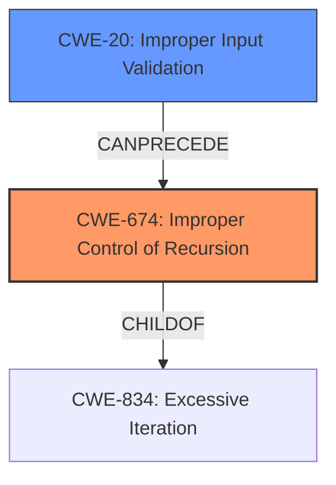

# Analysis Report for CVE-2021-46507

# Vulnerability Analysis Report: CVE-2021-46507

## Description

Jsish v3.5.0 was discovered to contain a stack overflow via Jsi_LogMsg at src/jsiUtils.c.

## Vulnerability Description Key Phrases

**Weakness:** stack overflow
**Product:** Jsish
**Version:** v3.5.0
**Component:** src/jsiUtils.c

## Analysis (with Relationship Data)

# Summary
| CWE ID | CWE Name | Confidence | CWE Abstraction Level | CWE Vulnerability Mapping Label | CWE-Vulnerability Mapping Notes |
|---|---|---|---|---|---|
| CWE-674 | Improper Control of Recursion | 0.9 | Class | Primary | Allowed-with-Review |

## Evidence and Confidence

*   **Confidence Score:** 0.9
*   **Evidence Strength:** HIGH

- **Analysis and Justification:**  
  - *Explanation:* The vulnerability description clearly states a **stack overflow** condition, which is triggered by excessive recursion within the `Jsi_LogMsg` function in `src/jsiUtils.c`. The CVE Reference Links Content Summary reinforces this, highlighting "Stack overflow due to unbounded recursion" and "Improper handling of specific input data, causing infinite recursion". CWE-674 (Improper Control of Recursion) directly addresses the scenario where a product "does not properly control the amount of recursion that takes place, consuming excessive resources, such as allocated memory or the program stack." The attack involves crafted Javascript, which triggers recursive calls between `Jsi_LogMsg` and `Jsi_ValueToString`. CWE-674 is a Class-level CWE, and while a more specific Base-level child might be ideal, none of the retriever results provide a better fit given the root cause is the lack of recursion control rather than a specific type of buffer overflow. The usage is "Allowed-with-Review", which acknowledges the need to check for more specific children. Given the evidence, CWE-674 is the most appropriate primary mapping.

  - *Relationship Analysis:* Although CWE-674 does not have direct relationships listed in the provided data, it is conceptually related to resource management issues. The stack overflow is a direct consequence of the uncontrolled recursion.

- **Confidence Score:**
  - Confidence: 0.9 (High confidence due to clear description of stack overflow caused by uncontrolled recursion and supporting evidence from the CVE Reference Links Content Summary)

## Criticism of Analysis

Okay, here's a review of the analysis, focusing on the CWE mapping and using the full CWE specifications provided.

**Overall Assessment:**

The analysis is well-structured and provides a detailed justification for selecting CWE-674 (Improper Control of Recursion).  The confidence level of 0.9 is appropriate given the evidence. The analyzer has considered the "Allowed-with-Review" usage for CWE-674 and correctly identified the need to consider more specific children. However, the review can be strengthened by considering the broader context of the attack vector, and potential secondary weaknesses, especially regarding resource management.

**Detailed Critique:**

1.  **CWE-674 (Improper Control of Recursion) - Primary Mapping:**

    *   **Strengths:**
        *   The analysis correctly identifies the core issue: the lack of control over recursion leading to stack exhaustion. The description from the vulnerability information strongly supports this.
        *   The justification is clear and well-reasoned, citing evidence from both the vulnerability description and the CVE Reference Links Content Summary.
        *   The analyzer acknowledges that CWE-674 is a Class-level CWE and that a more specific Base-level child might be preferable.
        *   The "Observed Examples" provided for CWE-674 are relevant, as they also involve stack exhaustion due to uncontrolled recursion.

    *   **Areas for Improvement:**
        *   While CWE-674 accurately captures the *technical* root cause, it might be beneficial to consider the *architectural* context. The vulnerability arises from processing user-provided input (malicious JavaScript) that triggers the recursion.  This aspect could be highlighted more explicitly.
        *   **Mitigations:** While the provided mitigations for CWE-674 are relevant (ensure an end condition, increase stack size), they are relatively generic. Discussing mitigations specific to the Jsi framework and JavaScript interaction would be more useful. For example: implementing a call depth limit within `Jsi_ValueToString` or `Jsi_LogMsg`, or better input validation to prevent the crafted input from ever reaching the vulnerable functions.

2.  **Consideration of Retriever Results:**

    *   **CWE-121 (Stack-based Buffer Overflow):**
        *   The vulnerability description *mentions* "stack overflow" but not in the typical sense of writing past the bounds of a buffer. The stack overflow is a *consequence* of the uncontrolled recursion, not the root cause. Therefore, dismissing CWE-121 is correct in this context.  The important thing is to differentiate between the *cause* and the *effect.*
    *   **CWE-770 (Allocation of Resources Without Limits or Throttling):**
        *   While the stack is a limited resource, CWE-770 is perhaps a bit too broad. The uncontrolled recursion directly leads to stack exhaustion, making CWE-674 a more precise fit. However, it's worth acknowledging the resource consumption aspect, potentially as a secondary weakness.
        *   **Mitigations:** The mitigations for CWE-770 (limiting resources, throttling) are relevant to the overall security posture of the application. Consider that even if the recursion issue were fixed, other vulnerabilities could lead to similar resource exhaustion problems.
    *   **Other Buffer Overflow CWEs (120, 122, 126):** These are not relevant because the core of the issue is with unbounded recursion, not copying or writing data outside buffer boundaries.
    *   **Integer Overflow/Underflow CWEs (190, 191):** The problem description does not suggest any type of integer issue.

3.  **Potential Secondary Weaknesses:**

    *   **CWE-20 (Improper Input Validation):** The crafted JavaScript input is the trigger for the vulnerability. While the *direct* cause is uncontrolled recursion, the *underlying* issue is the failure to properly validate or sanitize the input. Specifically, input validation to prevent values such as NaN/null from being involved in string conversions may prevent the issue. This could be added as a secondary CWE.
        *   **Mitigations:** A strong input validation strategy, using an "accept known good" approach, could prevent the malicious input from ever reaching the vulnerable functions.

4.  **CWE Relationships and Abstraction Levels:**

    *   The analysis correctly notes that CWE-674 is a Class-level CWE. Exploring its children (although none are explicitly listed in the provided data) could potentially lead to a more specific mapping. However, without further information about potential child CWEs, CWE-674 remains the most appropriate choice.
    *   The relationships (ChildOf -> CWE-834) are conceptually relevant. CWE-834 (Excessive Iteration) is a parent of CWE-674 and represents a broader category of resource consumption issues.

**Revised Summary Table:**

| CWE ID | CWE Name | Confidence | CWE Abstraction Level | CWE Vulnerability Mapping Label | CWE-Vulnerability Mapping Notes |
|---|---|---|---|---|---|
| CWE-674 | Improper Control of Recursion | 0.9 | Class | Primary | Allowed-with-Review |
| CWE-20 | Improper Input Validation | 0.6 | Base | Secondary | Contributes to vulnerability by allowing malicious input to reach the vulnerable function. |

**Conclusion:**

The initial analysis is strong. The choice of CWE-674 is well-justified. By incorporating the suggested improvements, the analysis can be further enhanced by:

*   Explicitly mentioning the role of user-provided input (malicious JavaScript) in triggering the recursion.
*   Discussing input validation as a secondary weakness (CWE-20).
*   Proposing more specific mitigations tailored to the Jsi framework and the nature of the crafted input.

By addressing these points, the analysis will provide a more complete and actionable understanding of the vulnerability.

## Final Resolution

# Summary
| CWE ID | CWE Name | Confidence | CWE Abstraction Level | CWE Vulnerability Mapping Label | CWE-Vulnerability Mapping Notes |
|---|---|---|---|---|---|
| CWE-674 | Improper Control of Recursion | 0.9 | Class | Primary | Allowed-with-Review |
| CWE-20 | Improper Input Validation | 0.6 | Base | Secondary | Contributes to vulnerability by allowing malicious input to reach the vulnerable function. |

## Evidence and Confidence

*   **Confidence Score:** 0.9
*   **Evidence Strength:** HIGH

## Relationship Analysis
The primary weakness, **CWE-674 (Improper Control of Recursion)**, is a Class-level CWE. While it doesn't have direct relationships listed in the provided data, it is conceptually related to resource management issues. The **stack overflow** is a direct consequence of the uncontrolled recursion. A potential parent is **CWE-834 (Excessive Iteration)**, representing a broader category of resource consumption issues. The secondary weakness, **CWE-20 (Improper Input Validation)**, highlights that the vulnerability is triggered by crafted input. The relationship between these CWEs is that the **lack of input validation** allows malicious input to reach the vulnerable function, triggering the uncontrolled recursion and leading to a **stack overflow**.

## Vulnerability Chain
The vulnerability chain starts with **CWE-20 (Improper Input Validation)**, allowing crafted JavaScript input to reach the `Jsi_LogMsg` function. This triggers **CWE-674 (Improper Control of Recursion)** within the `Jsi_ValueToString` and `Jsi_LogMsg` functions, leading to unbounded recursion. The consequence of this recursion is a **stack overflow**, which causes the application to crash.

## Summary of Analysis
The initial analysis correctly identified **CWE-674 (Improper Control of Recursion)** as the primary weakness, given the **stack overflow** caused by uncontrolled recursion within the `Jsi_LogMsg` function. The vulnerability description clearly states a "**stack overflow** via Jsi_LogMsg at src/jsiUtils.c" which is reinforced by CVE Reference Links Content Summary, highlighting "Stack overflow due to unbounded recursion" and "Improper handling of specific input data, causing infinite recursion".

The criticism suggested adding **CWE-20 (Improper Input Validation)** as a secondary weakness, which is appropriate because the crafted JavaScript input is the trigger for the vulnerability. The **lack of input validation** allows malicious input to reach the vulnerable function, triggering the uncontrolled recursion.

The graph relationships support this decision by illustrating how **CWE-20** can precede **CWE-674**.

The selected CWEs are at the optimal level of specificity. **CWE-674** directly addresses the uncontrolled recursion, while **CWE-20** highlights the role of user-provided input.

*Report generated on 2025-03-18 04:58:06*
