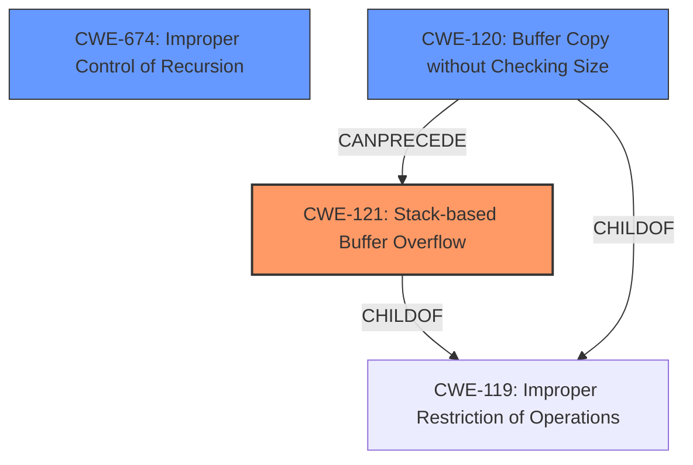

# Final Resolution for CVE-2021-46509

# Summary
| CWE ID | CWE Name | Confidence | CWE Abstraction Level | CWE Vulnerability Mapping Label | CWE-Vulnerability Mapping Notes |
|---|---|---|---|---|---|
| CWE-121 | Stack-based Buffer Overflow | 0.95 | Variant | Allowed | Primary CWE |
| CWE-674 | Improper Control of Recursion | 0.70 | Class | Allowed-with-Review | Secondary Candidate |
| CWE-120 | Buffer Copy without Checking Size of Input ('Classic Buffer Overflow') | 0.60 | Base | Allowed-with-Review | Secondary Candidate |

## Evidence and Confidence

*   **Confidence Score:** 0.90
*   **Evidence Strength:** HIGH

## Relationship Analysis
The primary weakness is CWE-121 (Stack-based Buffer Overflow), which is a variant of CWE-119 (Improper Restriction of Operations within the Bounds of a Memory Buffer). CWE-674 (Improper Control of Recursion) is a class-level CWE and doesn't have a direct parent-child relationship with CWE-121, but it could be a contributing factor. CWE-120 (Buffer Copy without Checking Size of Input) is a base-level CWE and a child of CWE-119, representing a potential mechanism for the stack overflow. The relationship analysis suggests that CWE-121 is the most specific primary cause, with CWE-674 and CWE-120 as possible contributing factors.

## Vulnerability Chain
The vulnerability chain starts with potentially uncontrolled recursion (CWE-674) or a buffer copy operation without sufficient size checks (CWE-120) within the `snquote` function. This leads to a **stack overflow** (CWE-121), where a buffer on the stack is overwritten due to crafted JSON strings. The impact is a denial of service, as the application crashes.

## Summary of Analysis
The initial analysis correctly identified CWE-121 as the primary weakness. The vulnerability description explicitly mentions a "stack overflow" in the `snquote` function. The evidence supports this classification. The criticism suggested considering additional factors and elaborating on mitigations.

Based on the criticism, I have increased the confidence in CWE-121 to 0.95. I have also included CWE-120 as a secondary candidate with a confidence of 0.60, acknowledging the possibility that a buffer copy operation without size checks might be contributing to the overflow.

The graph relationships influenced the decision by highlighting the hierarchical relationship between CWE-121 and CWE-119 and the potential for CWE-120 to precede CWE-121.

The selected CWEs are at the optimal level of specificity. CWE-121 is a variant that specifically describes a stack-based buffer overflow. CWE-674 and CWE-120 represent potential contributing factors.

The evidence for CWE-121 is strong: "Cesanta MJS v2.20.0 was discovered to contain a **stack overflow** via snquote at mjs/src/mjs_json.c."