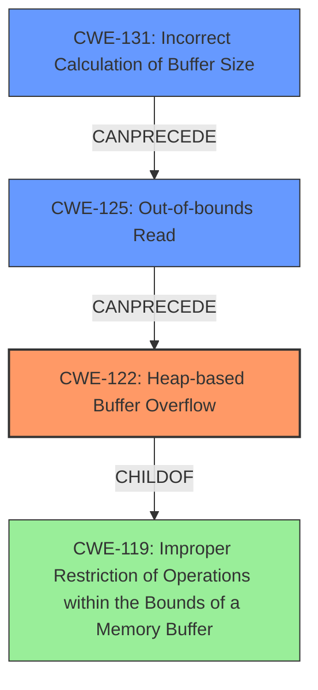

# Final Resolution for CVE-2021-46518

# Summary
| CWE ID | CWE Name | Confidence | CWE Abstraction Level | CWE Vulnerability Mapping Label | CWE-Vulnerability Mapping Notes |
|---|---|---|---|---|---|
| CWE-122 | Heap-based Buffer Overflow | 0.95 | Variant | Allowed | Primary CWE |
| CWE-125 | Out-of-bounds Read | 0.80 | Base | Allowed | Secondary Candidate |
| CWE-131 | Incorrect Calculation of Buffer Size | 0.65 | Base | Allowed | Secondary Candidate |

## Evidence and Confidence

*   **Confidence Score:** 0.92
*   **Evidence Strength:** MEDIUM

## Relationship Analysis
The primary weakness is a **heap buffer overflow (CWE-122)**, which is a variant of **improper restriction of operations within memory buffer (CWE-119)**. The overflow is likely caused by an **out-of-bounds read (CWE-125)**, which occurs because of an **incorrect calculation of the buffer size (CWE-131)**.

## Vulnerability Chain
The vulnerability chain starts with an **incorrect calculation of the buffer size (CWE-131)**. This leads to an **out-of-bounds read (CWE-125)**, which then causes a **heap-based buffer overflow (CWE-122)**. The overflow allows an attacker to overwrite data on the heap, potentially leading to arbitrary code execution.

## Summary of Analysis
The initial analysis correctly identified **CWE-122 (Heap-based Buffer Overflow)** as the primary weakness and **CWE-125 (Out-of-bounds Read)** as a contributing factor. The criticism suggested exploring deeper into the root cause, which led to the inclusion of **CWE-131 (Incorrect Calculation of Buffer Size)**.

The vulnerability description explicitly states a "heap buffer overflow", which aligns perfectly with **CWE-122**. The CVE Reference Links Content Summary confirms the "heap-buffer-overflow" occurs in the `mjs_disown` function, specifically during a read operation. This supports both **CWE-122** and **CWE-125**.

The suggestion to look deeper into the root cause, specifically the calculation of buffer sizes, is well-founded. The `poc.js` suggests a potential problem with how the MJS engine handles `JSON.stringify` and mathematical operations. This makes **CWE-131** a relevant contributing factor.

The evidence strength is rated as medium. While the heap overflow is clear, the exact root cause related to size calculation needs further investigation for definitive confirmation.

The chosen CWEs are at the optimal level of specificity. **CWE-122** is a variant that accurately describes the heap allocation context. **CWE-125** and **CWE-131** are base-level CWEs that contribute to the vulnerability chain.