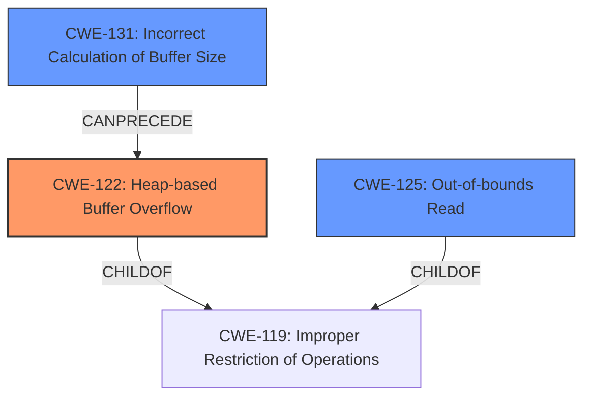

# Final Resolution for CVE-2021-46519

# Summary
| CWE ID | CWE Name | Confidence | CWE Abstraction Level | CWE Vulnerability Mapping Label | CWE-Vulnerability Mapping Notes |
|---|---|---|---|---|---|
| CWE-122 | Heap-based Buffer Overflow | 0.95 | Variant | Allowed | **Primary CWE**: The vulnerability is explicitly described as a **heap buffer overflow**. Allows attacker to write outside the buffer, potentially leading to arbitrary code execution. Mitigation: Use languages with automatic bounds checking or libraries to abstract away risky APIs.|
| CWE-125 | Out-of-bounds Read | 0.65 | Base | Allowed | Secondary Candidate: The vulnerability involves reading memory beyond the allocated buffer (a consequence of the overflow), potentially leaking sensitive information. Mitigation: Implement strict input validation. |
| CWE-131 | Incorrect Calculation of Buffer Size | 0.45 | Base | Allowed | Secondary Candidate: Possible root cause. The buffer overflow *could* be caused by an incorrect calculation of buffer size, however, no direct evidence from the description. Mitigation: Implement thorough checks to ensure the accuracy of all buffer size calculations.|

## Evidence and Confidence

*   **Confidence Score:** 0.90
*   **Evidence Strength:** HIGH

## Relationship Analysis
The primary relationship that influenced the decision was the parent-child relationship between CWE-119 (Improper Restriction of Operations within the Bounds of a Memory Buffer) and its variants, CWE-122 (Heap-based Buffer Overflow) and CWE-125 (Out-of-bounds Read). The analysis appropriately selected the more specific CWE-122 over the more general CWE-119. The potential chain relationship starting from CWE-131 (Incorrect Calculation of Buffer Size) and leading to CWE-122 was also considered.

## Vulnerability Chain
The vulnerability chain can be visualized as follows:

1.  Possible **ROOTCAUSE**: CWE-131 (Incorrect Calculation of Buffer Size).
2.  **WEAKNESS**: CWE-122 (Heap-based Buffer Overflow) occurs due to the undersized buffer.
3.  **CONSEQUENCE**: CWE-125 (Out-of-bounds Read) may occur as a result of the overflow, potentially leading to information disclosure or arbitrary code execution if attacker controlled data overwrites memory.

## Summary of Analysis
The initial analysis, along with the criticism, provided a strong foundation for classifying this vulnerability. The primary CWE, CWE-122 (Heap-based Buffer Overflow), is well-supported by the vulnerability description, which explicitly states that a **heap buffer overflow** occurred. This is further confirmed by the CVE summary and the mention of the `mjs_array_length` function.

The selection of CWE-122 is at the optimal level of specificity because it directly reflects the nature of the vulnerability. While CWE-119 (Improper Restriction of Operations within the Bounds of a Memory Buffer) is a parent of CWE-122, choosing CWE-122 provides more precise information about the vulnerability.

The decision to include CWE-125 (Out-of-bounds Read) as a secondary CWE is also justified, as reading memory beyond the allocated buffer is a direct consequence of the overflow. This can lead to information disclosure or other unexpected behaviors.

The confidence score for CWE-131 (Incorrect Calculation of Buffer Size) was reduced to 0.45, as suggested in the criticism, to reflect the lack of direct evidence supporting this as a contributing factor. It remains a possible root cause but is based more on the understanding of how such errors *could* be introduced rather than direct evidence.

The graph relationships influenced the final selection by emphasizing the importance of choosing the most specific CWE available. The child-parent relationship between CWE-119 and its variants guided the selection of CWE-122.

Overall, the final classification is well-justified and reflects the optimal level of specificity based on the available evidence and relationship analysis.