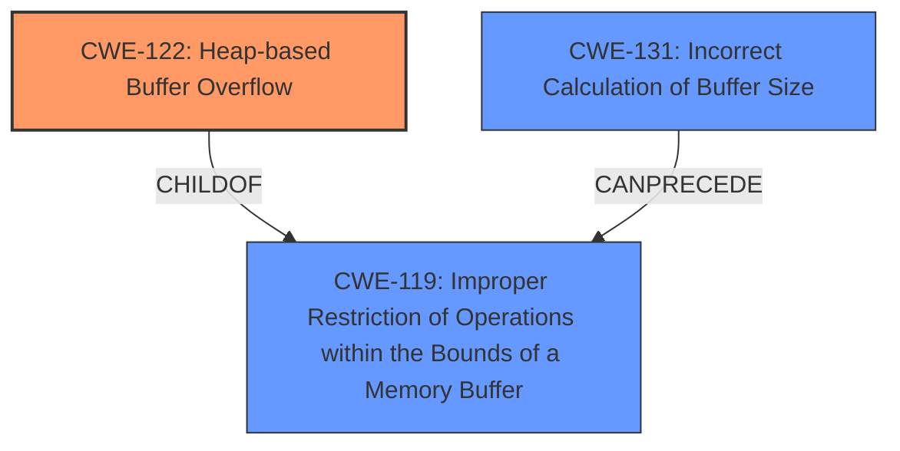

# Final Resolution for CVE-2021-46520

# Summary
| CWE ID | CWE Name | Confidence | CWE Abstraction Level | CWE Vulnerability Mapping Label | CWE-Vulnerability Mapping Notes |
|---|---|---|---|---|---|
| CWE-122 | Heap-based Buffer Overflow | 0.95 | Variant | Allowed | Primary CWE |
| CWE-131 | Incorrect Calculation of Buffer Size | 0.7 | Base | Allowed | Secondary Candidate CWE |

## Evidence and Confidence

*   **Confidence Score:** 0.9
*   **Evidence Strength:** HIGH

## Relationship Analysis
The primary relationship impacting the decision is the parent-child relationship between CWE-119 (Improper Restriction of Operations within the Bounds of a Memory Buffer) and CWE-122 (Heap-based Buffer Overflow). CWE-122 is a variant of CWE-119, providing a more specific classification since the overflow occurs on the heap. CWE-131 (Incorrect Calculation of Buffer Size) can precede CWE-119, potentially explaining the root cause of the buffer overflow. The abstraction levels influenced the selection by favoring the more specific Variant (CWE-122) and the Base (CWE-131).

## Vulnerability Chain
The vulnerability chain starts with a potential **ROOTCAUSE** of **CWE-131** (**Incorrect Calculation of Buffer Size**). This leads to an insufficient buffer being allocated on the heap. Subsequently, when `mjs_jprintf` processes a complex JSON string, it writes beyond the allocated buffer, resulting in **CWE-122** (**Heap-based Buffer Overflow**). The impact is a crash due to memory corruption when the program attempts to read memory outside the allocated buffer.

## Summary of Analysis
The initial analysis and criticism are well-reasoned and supported by the evidence. The conclusion to classify this vulnerability as primarily **CWE-122** (**Heap-based Buffer Overflow**) is correct due to the explicit mention of a heap buffer overflow in the vulnerability description: "Cesanta MJS v2.20.0 was discovered to contain a heap buffer overflow via mjs_jprintf at src/mjs_util.c.".

The choice of **CWE-131** (**Incorrect Calculation of Buffer Size**) as a secondary CWE is also reasonable, given the CVE Reference Links Content Summary mentions "insufficient buffer size." This suggests a potential miscalculation of the required buffer size.

The graph relationships influenced the final selection by highlighting the parent-child relationship between CWE-119 and CWE-122, reinforcing the selection of CWE-122 due to its specificity. The potential chain relationship between CWE-131 and CWE-119 further supports the inclusion of CWE-131 as a contributing factor.

The selected CWEs are at the optimal level of specificity. CWE-122 is a Variant, providing a more precise classification than its parent CWE-119. CWE-131, as a Base CWE, represents a fundamental error in buffer size calculation.

Addressing the points from the criticism:

*   **Alternative CWEs:** While CWE-190 and CWE-193 were considered due to retriever scores, there is no explicit evidence in the vulnerability description to support an integer overflow or off-by-one error. The focus remains on the insufficient buffer size explicitly mentioned.
*   **Mitigations:** Mitigation strategies for CWE-122 and CWE-131 include:
    *   Using safe string handling functions (e.g., `strncpy` instead of `strcpy`, with careful null termination).
    *   Implementing robust input validation to limit the size and complexity of JSON strings.
    *   Employing memory debugging tools during development to detect buffer overflows.
    *   Using languages or compilers with built-in bounds checking.
    *   Careful calculation of buffer sizes based on maximum possible input lengths and potential expansion due to encoding.
*   It's also possible that the buffer size calculation was initially correct, but the data being formatted by `mjs_jprintf` expanded unexpectedly during processing (e.g., due to escaping or encoding), exceeding the allocated buffer size. This is a valid point and is why the confidence in CWE-131 is not higher.