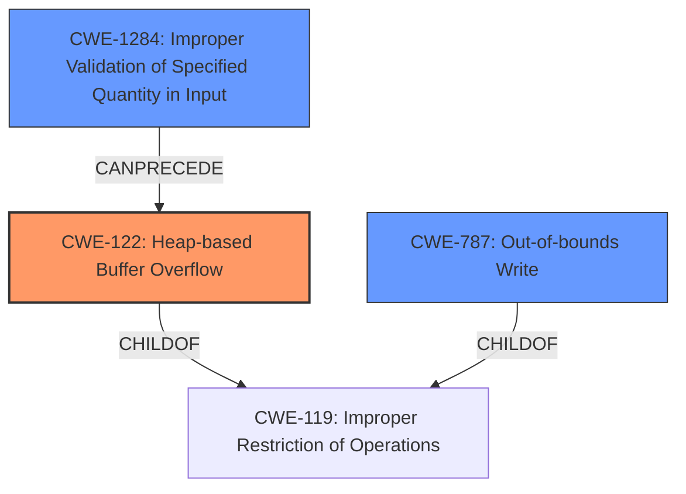

# Final Resolution for CVE-2021-46522

# Summary
| CWE ID | CWE Name | Confidence | CWE Abstraction Level | CWE Vulnerability Mapping Label | CWE-Vulnerability Mapping Notes |
|---|---|---|---|---|---|
| CWE-122 | Heap-based Buffer Overflow | 0.95 | Variant | Allowed | Primary CWE |
| CWE-787 | Out-of-bounds Write | 0.7 | Base | Allowed | Secondary Candidate |
| CWE-1284 | Improper Validation of Specified Quantity in Input | 0.5 | Base | Allowed | Secondary Candidate |
  
## Evidence and Confidence

*   **Confidence Score:** 0.9
*   **Evidence Strength:** HIGH

## Relationship Analysis
The primary weakness is **CWE-122** (Heap-based Buffer Overflow), which is a variant of **CWE-119** (Improper Restriction of Operations within the Bounds of a Memory Buffer). **CWE-787** (Out-of-bounds Write) is a parent and represents the mechanism of the overflow. **CWE-1284** (Improper Validation of Specified Quantity in Input) can precede **CWE-122** if the size of the allocation is based on unvalidated input.

## Vulnerability Chain
The vulnerability chain starts with a potential **CWE-1284** (Improper Validation of Specified Quantity in Input), which leads to an incorrect calculation of buffer size (potentially involving **CWE-190** or **CWE-193**), ultimately resulting in **CWE-122** (Heap-based Buffer Overflow) and **CWE-787** (Out-of-bounds Write).

## Summary of Analysis
The initial analysis and criticism correctly identified **CWE-122** (Heap-based Buffer Overflow) as the primary weakness. The vulnerability description explicitly states "heap buffer overflow," providing strong evidence for this classification. The confidence level of 0.95 is well-justified.

The inclusion of **CWE-787** (Out-of-bounds Write) as a secondary candidate is also appropriate, as it describes the mechanism of the overflow. I am increasing the confidence to 0.7 as it represents a core aspect of the overflow.

I am adding **CWE-1284** (Improper Validation of Specified Quantity in Input) as a secondary candidate with a confidence of 0.5. The criticism correctly pointed out that if the buffer size is determined by user-provided input without proper validation, then **CWE-1284** becomes a contributing factor. Although there is no explicit mention of user-provided input in the vulnerability description, it remains a plausible scenario and should be considered.

The selected CWEs are at the optimal level of specificity. **CWE-122** is a variant that specifically addresses heap-based buffer overflows. **CWE-787** is a base CWE that describes the out-of-bounds write. **CWE-1284** is a base CWE that describes the lack of input validation on specified quantities.

The graph relationships influenced the selection by clarifying the hierarchical relationship between **CWE-122** and **CWE-119**, and by highlighting the potential chain relationship between **CWE-1284** and **CWE-122**.