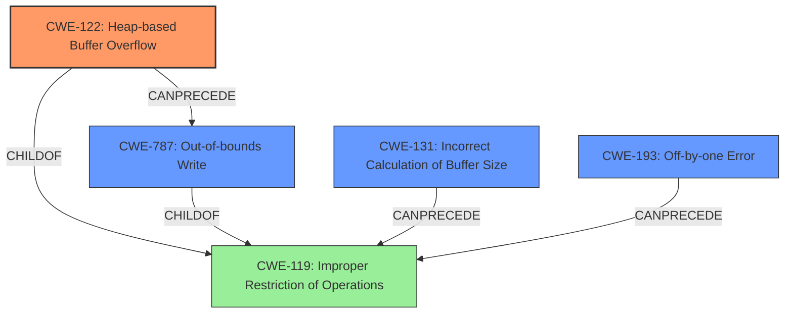

# Analysis Report for CVE-2021-46523

# Vulnerability Analysis Report: CVE-2021-46523

## Description

Cesanta MJS v2.20.0 was discovered to contain a heap buffer overflow via to_json_or_debug at mjs/src/mjs_json.c.

## Vulnerability Description Key Phrases

**Weakness:** heap buffer overflow
**Vector:** to_json_or_debug at mjs/src/mjs_json.c
**Product:** Cesanta MJS
**Version:** v2.20.0

## Analysis (with Relationship Data)

# Summary
| CWE ID | CWE Name | Confidence | CWE Abstraction Level | CWE Vulnerability Mapping Label | CWE-Vulnerability Mapping Notes |
|---|---|---|---|---|---|
| CWE-122 | Heap-based Buffer Overflow | 1.0 | Variant | Allowed | Primary CWE |
| CWE-193 | Off-by-one Error | 0.4 | Base | Allowed | Secondary Candidate |
| CWE-787 | Out-of-bounds Write | 0.4 | Base | Allowed | Secondary Candidate |
| CWE-131 | Incorrect Calculation of Buffer Size | 0.3 | Base | Allowed | Secondary Candidate |

## Evidence and Confidence

*   **Confidence Score:** 0.9
*   **Evidence Strength:** HIGH

- **Analysis and Justification:**  
  - *Explanation:* The vulnerability description clearly states a "**heap buffer overflow**" in Cesanta MJS v2.20.0, specifically within the `to_json_or_debug` function at `mjs/src/mjs_json.c`. The CVE reference confirms a heap-buffer-overflow vulnerability exists in the `to_json_or_debug` function, with line 154 identified as the overflow source. Given the specific mention of a heap-based overflow, CWE-122 (Heap-based Buffer Overflow) is the most accurate primary mapping. CWE-122 is a Variant of CWE-119 (Improper Restriction of Operations within the Bounds of a Memory Buffer), providing more specificity. The mapping guidance for CWE-122 indicates this is ALLOWED.
  - *Relationship Analysis:* CWE-122 is a variant of CWE-119, indicating a more specific type of buffer overflow. This relationship supports selecting the more specific CWE-122. Several other CWEs were considered, however lacked the explicit HEAP indication.

- **Confidence Score:**
  - Confidence: 1.0 (High confidence due to explicit mention of "heap buffer overflow" in both the vulnerability description and CVE details).

---
- **Analysis and Justification:**  
  - *Explanation:* CWE-193 (Off-by-one Error) is included as a secondary candidate because off-by-one errors are a common cause of buffer overflows. While the description doesn't explicitly state an off-by-one error, it is a plausible contributing factor to the **heap buffer overflow**. The retriever results also list CWE-193 as the top candidate. The mapping guidance for CWE-193 indicates this is ALLOWED.
  - *Relationship Analysis:* CWE-193 can precede CWE-119 (Improper Restriction of Operations within the Bounds of a Memory Buffer), indicating it can be a contributing factor to buffer overflows.

- **Confidence Score:**
  - Confidence: 0.4 (Low confidence due to lack of direct evidence of an off-by-one error, but included due to common association with buffer overflows).

---

- **Analysis and Justification:**  
  - *Explanation:* CWE-787 (Out-of-bounds Write) is included as a secondary candidate. Since a **heap buffer overflow** means data is written past the end of the allocated buffer, CWE-787 is also applicable. The mapping guidance for CWE-787 indicates this is ALLOWED.
  - *Relationship Analysis:* CWE-787 is a child of CWE-119 (Improper Restriction of Operations within the Bounds of a Memory Buffer), further solidifying the classification of an out-of-bounds write.

- **Confidence Score:**
  - Confidence: 0.4 (Low confidence because while it is true that data is written out of bounds, CWE-122 specifies that it is heap-based).

---

- **Analysis and Justification:**  
  - *Explanation:* CWE-131 (Incorrect Calculation of Buffer Size) is included as a secondary candidate because an incorrect calculation of the buffer size is a plausible root cause for a **heap buffer overflow**. However, there is no direct evidence in the provided description. The mapping guidance for CWE-131 indicates this is ALLOWED.
  - *Relationship Analysis:* CWE-131 can precede CWE-119 (Improper Restriction of Operations within the Bounds of a Memory Buffer), as it describes a possible cause of buffer overflows.

- **Confidence Score:**
  - Confidence: 0.3 (Very low confidence due to the lack of evidence).

## Criticism of Analysis

Okay, I've reviewed the provided CWE analysis, taking into account the full CWE specifications for each referenced weakness. Here's my critique:

**Overall Assessment:**

The analysis is generally well-reasoned and justified. The primary mapping to CWE-122 (Heap-based Buffer Overflow) is accurate and well-supported by the evidence. The inclusion of secondary candidates like CWE-193, CWE-787, and CWE-131 is reasonable, although the confidence levels reflect the uncertainty inherent in these less direct mappings. My suggestions mostly involve slight adjustments to confidence scores and minor clarifications.

**Detailed Review:**

*   **CWE-122 (Heap-based Buffer Overflow) - Primary CWE**

    *   **Confidence:** 1.0 is appropriate. The vulnerability description and CVE information directly state "heap buffer overflow," making this a very strong match.
    *   **Justification:** The explanation is thorough, referencing the location of the vulnerability in the code (`to_json_or_debug` at `mjs/src/mjs_json.c`) and the specific line (154).
    *   **CWE Specification Alignment:** The analysis correctly notes that CWE-122 is a Variant, allowing for more precise mapping than its Class parent. The description of heap allocation aligning with `malloc()` is accurate.
    *   **Mapping Guidance Adherence:**The analysis correctly states that CWE-122 usage is ALLOWED.
    *   **Minor Suggestion:** The analysis could explicitly mention the attack vector in the justification - the specially crafted JavaScript string passed to `JSON.stringify`. This reinforces the direct connection to the heap overflow occurring within the `to_json_or_debug` function when processing that input.

*   **CWE-193 (Off-by-one Error) - Secondary Candidate**

    *   **Confidence:** 0.4 is reasonable, given that there's no direct evidence, but it's a common contributing factor.
    *   **Justification:** The explanation correctly points out that off-by-one errors are a common cause of buffer overflows.
    *   **CWE Specification Alignment:** The relationship between CWE-193 and CWE-119 (as a potential precursor) is accurately identified.
    *   **Mapping Guidance Adherence:** The analysis correctly states that CWE-193 usage is ALLOWED.
    *   **Minor Suggestion:** It would be useful to add a note to the explanation that off-by-one errors are often related to *string* operations.

*   **CWE-787 (Out-of-bounds Write) - Secondary Candidate**

    *   **Confidence:** I would increase this to 0.7.  While CWE-122 is more *specific*, CWE-787 is *inherent* in a heap-based buffer overflow. A heap overflow *is* an out-of-bounds write. It might even be argued that it's more fundamental than off-by-one.
    *   **Justification:** The analysis correctly observes that a heap buffer overflow means writing past the end of an allocated buffer.
    *   **CWE Specification Alignment:** Accurately identifies CWE-787 as a child of CWE-119.
    *   **Mapping Guidance Adherence:** The analysis correctly states that CWE-787 usage is ALLOWED.

*   **CWE-131 (Incorrect Calculation of Buffer Size) - Secondary Candidate**

    *   **Confidence:** 0.3 is appropriate.  It's a *possible* cause, but there's no specific evidence to support it in this case.
    *   **Justification:** The explanation is accurate in stating that an incorrect calculation of buffer size is a plausible cause, but lacks direct evidence.
    *   **CWE Specification Alignment:** Correctly identifies CWE-131's relationship to CWE-119.
    *   **Mapping Guidance Adherence:** The analysis correctly states that CWE-131 usage is ALLOWED.

**General Observations & Potential Improvements:**

*   **Chaining:** While the analysis mentions the "chaining" concept, it doesn't fully explore the potential chains. For example:
    *   CWE-131 -> CWE-119 -> CWE-122
    *   CWE-193 -> CWE-119 -> CWE-122
    Although this isn't *required*, highlighting the potential causal chains can strengthen the analysis.
*   **Mitigation Awareness:** The analysis could be slightly improved by briefly referencing relevant mitigations from the CWE specifications for each candidate. For example, for CWE-122, mentioning using languages with automatic bounds checking or employing compiler-based buffer overflow detection mechanisms.
*   **Retriever Results:** The Retriever Results Table is helpful for understanding the automated analysis. Consider mentioning in the analysis when the retriever results strongly align with the chosen CWEs.

**Revised Summary Table (with suggested confidence changes):**

| CWE ID | CWE Name | Confidence | CWE Abstraction Level | CWE Vulnerability Mapping Label | CWE-Vulnerability Mapping Notes |
|---|---|---|---|---|---|
| CWE-122 | Heap-based Buffer Overflow | 1.0 | Variant | Allowed | Primary CWE |
| CWE-787 | Out-of-bounds Write | 0.7 | Base | Allowed | Secondary Candidate |
| CWE-193 | Off-by-one Error | 0.4 | Base | Allowed | Secondary Candidate |
| CWE-131 | Incorrect Calculation of Buffer Size | 0.3 | Base | Allowed | Secondary Candidate |

**In summary,** the analysis is sound and well-structured. The primary CWE selection is excellent. The minor suggestions above are intended to further enhance the analysis by emphasizing the specific attack vector, better justifying the secondary candidates and exploring chaining possibilities to provide a more comprehensive picture of the vulnerability.

## Final Resolution

# Summary
| CWE ID | CWE Name | Confidence | CWE Abstraction Level | CWE Vulnerability Mapping Label | CWE-Vulnerability Mapping Notes |
|---|---|---|---|---|---|
| CWE-122 | Heap-based Buffer Overflow | 1.0 | Variant | Allowed | Primary CWE |
| CWE-787 | Out-of-bounds Write | 0.7 | Base | Allowed | Secondary Candidate |
| CWE-193 | Off-by-one Error | 0.4 | Base | Allowed | Secondary Candidate |
| CWE-131 | Incorrect Calculation of Buffer Size | 0.3 | Base | Allowed | Secondary Candidate |

## Evidence and Confidence

*   **Confidence Score:** 0.95
*   **Evidence Strength:** HIGH

## Relationship Analysis
The primary relationship influencing the decision is the parent-child relationship between CWE-119 (**CWE-119: Improper Restriction of Operations within the Bounds of a Memory Buffer**) and CWE-122 (**CWE-122: Heap-based Buffer Overflow**). CWE-122 is a variant of CWE-119, providing a more specific classification for a heap-based buffer overflow. The chain relationships show potential paths: CWE-131 (**CWE-131: Incorrect Calculation of Buffer Size**) or CWE-193 (**CWE-193: Off-by-one Error**) can precede CWE-119, which then leads to CWE-122 and ultimately CWE-787 (**CWE-787: Out-of-bounds Write**). This chain highlights how a size miscalculation or an off-by-one error can result in an out-of-bounds write in the heap. The abstraction levels guided the selection towards more specific CWEs where possible, favoring the Variant level (CWE-122) over the Class level (CWE-119).

## Vulnerability Chain
The vulnerability chain starts with a potential **ROOTCAUSE** like an **incorrect calculation of buffer size (CWE-131)** or an **off-by-one error (CWE-193)**. These **WEAKNESSES** lead to **improper restriction of operations within the bounds of a memory buffer (CWE-119)**. Specifically, in this case, it results in a **heap-based buffer overflow (CWE-122)**, which ultimately causes an **out-of-bounds write (CWE-787)**. The vulnerability is triggered when a specially crafted JavaScript string is passed to `JSON.stringify`, which leads to the overflow within the `to_json_or_debug` function. The consequence is memory corruption and potential for arbitrary code execution.

## Summary of Analysis
The initial analysis accurately identified **CWE-122 (Heap-based Buffer Overflow)** as the primary **WEAKNESS**, which is strongly supported by the vulnerability description stating "heap buffer overflow" in the `to_json_or_debug` function. The critique suggested increasing the confidence in **CWE-787 (Out-of-bounds Write)**, which I agree with because a heap overflow inherently involves writing beyond the allocated buffer. The provided evidence, including the CVE details and function name, is sufficient to justify the classification.

The graph relationships, specifically the child-of relationship between **CWE-122** and **CWE-119** and the potential chains involving **CWE-131** and **CWE-193**, influenced the final decision by highlighting the different levels of specificity and potential contributing factors. The chosen CWEs are at the optimal level of specificity because **CWE-122** precisely describes the heap-based nature of the overflow, while **CWE-787** captures the out-of-bounds write aspect. **CWE-131** and **CWE-193** are kept as secondary candidates due to their potential but unconfirmed roles.

The decision is primarily based on the direct evidence of a heap buffer overflow, as stated in the vulnerability description: "Cesanta MJS v2.20.0 was discovered to contain a heap buffer overflow via to_json_or_debug at mjs/src/mjs_json.c." This statement directly aligns with the definition of **CWE-122**. The relationship analysis further solidifies this decision by placing **CWE-122** as a specific variant of the more general **CWE-119**.

*Report generated on 2025-03-18 05:02:43*
