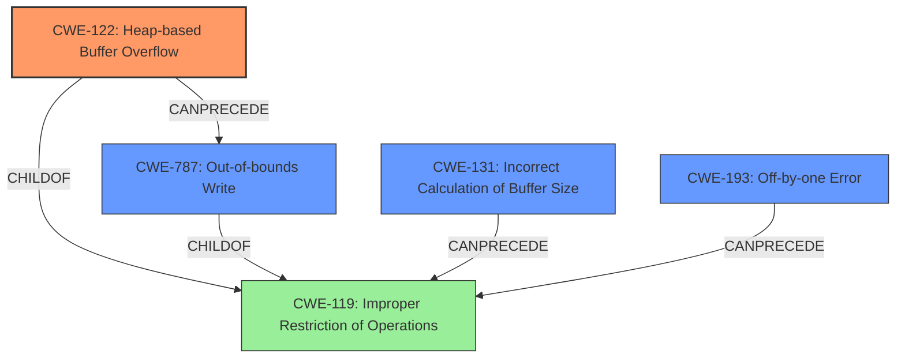

# Final Resolution for CVE-2021-46523

# Summary
| CWE ID | CWE Name | Confidence | CWE Abstraction Level | CWE Vulnerability Mapping Label | CWE-Vulnerability Mapping Notes |
|---|---|---|---|---|---|
| CWE-122 | Heap-based Buffer Overflow | 1.0 | Variant | Allowed | Primary CWE |
| CWE-787 | Out-of-bounds Write | 0.7 | Base | Allowed | Secondary Candidate |
| CWE-193 | Off-by-one Error | 0.4 | Base | Allowed | Secondary Candidate |
| CWE-131 | Incorrect Calculation of Buffer Size | 0.3 | Base | Allowed | Secondary Candidate |

## Evidence and Confidence

*   **Confidence Score:** 0.95
*   **Evidence Strength:** HIGH

## Relationship Analysis
The primary relationship influencing the decision is the parent-child relationship between CWE-119 (**CWE-119: Improper Restriction of Operations within the Bounds of a Memory Buffer**) and CWE-122 (**CWE-122: Heap-based Buffer Overflow**). CWE-122 is a variant of CWE-119, providing a more specific classification for a heap-based buffer overflow. The chain relationships show potential paths: CWE-131 (**CWE-131: Incorrect Calculation of Buffer Size**) or CWE-193 (**CWE-193: Off-by-one Error**) can precede CWE-119, which then leads to CWE-122 and ultimately CWE-787 (**CWE-787: Out-of-bounds Write**). This chain highlights how a size miscalculation or an off-by-one error can result in an out-of-bounds write in the heap. The abstraction levels guided the selection towards more specific CWEs where possible, favoring the Variant level (CWE-122) over the Class level (CWE-119).

## Vulnerability Chain
The vulnerability chain starts with a potential **ROOTCAUSE** like an **incorrect calculation of buffer size (CWE-131)** or an **off-by-one error (CWE-193)**. These **WEAKNESSES** lead to **improper restriction of operations within the bounds of a memory buffer (CWE-119)**. Specifically, in this case, it results in a **heap-based buffer overflow (CWE-122)**, which ultimately causes an **out-of-bounds write (CWE-787)**. The vulnerability is triggered when a specially crafted JavaScript string is passed to `JSON.stringify`, which leads to the overflow within the `to_json_or_debug` function. The consequence is memory corruption and potential for arbitrary code execution.

## Summary of Analysis
The initial analysis accurately identified **CWE-122 (Heap-based Buffer Overflow)** as the primary **WEAKNESS**, which is strongly supported by the vulnerability description stating "heap buffer overflow" in the `to_json_or_debug` function. The critique suggested increasing the confidence in **CWE-787 (Out-of-bounds Write)**, which I agree with because a heap overflow inherently involves writing beyond the allocated buffer. The provided evidence, including the CVE details and function name, is sufficient to justify the classification.

The graph relationships, specifically the child-of relationship between **CWE-122** and **CWE-119** and the potential chains involving **CWE-131** and **CWE-193**, influenced the final decision by highlighting the different levels of specificity and potential contributing factors. The chosen CWEs are at the optimal level of specificity because **CWE-122** precisely describes the heap-based nature of the overflow, while **CWE-787** captures the out-of-bounds write aspect. **CWE-131** and **CWE-193** are kept as secondary candidates due to their potential but unconfirmed roles.

The decision is primarily based on the direct evidence of a heap buffer overflow, as stated in the vulnerability description: "Cesanta MJS v2.20.0 was discovered to contain a heap buffer overflow via to_json_or_debug at mjs/src/mjs_json.c." This statement directly aligns with the definition of **CWE-122**. The relationship analysis further solidifies this decision by placing **CWE-122** as a specific variant of the more general **CWE-119**.