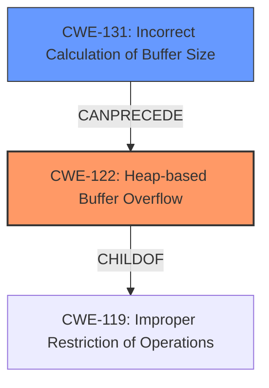

# Final Resolution for CVE-2021-46524

# Summary
| CWE ID | CWE Name | Confidence | CWE Abstraction Level | CWE Vulnerability Mapping Label | CWE-Vulnerability Mapping Notes |
|---|---|---|---|---|---|
| CWE-122 | Heap-based Buffer Overflow | 0.95 | Variant | Allowed | Primary CWE. Root cause of the vulnerability. Exploit occurs during JSON stringification in the `snquote` function. |
| CWE-131 | Incorrect Calculation of Buffer Size | 0.6 | Base | Contributing | Secondary CWE. May be a contributing factor to the heap overflow by allocating a buffer that is too small. |

## Evidence and Confidence

*   **Confidence Score:** 0.9
*   **Evidence Strength:** MEDIUM

## Relationship Analysis
The primary relationship is that CWE-122 is a variant of CWE-119 (Improper Restriction of Operations within the Bounds of a Memory Buffer). The identification of CWE-131 as a contributing factor introduces a potential chain where an incorrect size calculation leads to the heap overflow. CWE-131 can precede CWE-119. The abstraction levels were considered, favoring the more specific Variant for the primary CWE and the Base for the contributing factor.

## Vulnerability Chain
The vulnerability chain starts with a potential **ROOTCAUSE** of **CWE-131 (Incorrect Calculation of Buffer Size)**. This leads to the primary **WEAKNESS**, **CWE-122 (Heap-based Buffer Overflow)**. The consequence is program crashes and potential code execution due to the ability to overwrite memory on the heap. There is evidence to suggest that an incorrect size calculation might be happening, and the overflow is the result.

## Summary of Analysis
The initial analysis correctly identified CWE-122 as the primary weakness. The criticism suggested considering contributing factors, specifically CWE-131.

The vulnerability description states: "Cesanta MJS v2.20.0 was discovered to contain a heap buffer overflow via snquote at mjs/src/mjs_json.c." This evidence directly supports the selection of CWE-122.

Based on the analysis of CWE relationships and the possibility of an incorrect size calculation leading to the overflow, I have included CWE-131 as a secondary, contributing factor.

The selected CWEs are at the optimal level of specificity. CWE-122 is a specific variant of a buffer overflow occurring on the heap, and CWE-131 identifies a potential root cause of the overflow.